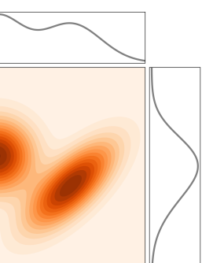

# 附录（Appendix）：补充材料、证明与文献指南

> 原文：[*An Introduction to Flow Matching and Diffusion Models*](https://arxiv.org/abs/2506.02070) by Peter Holderrieth & Ezra Erives
> 章节页码：PDF p.65–84
> 本附录包含**参考文献（51 篇）**、**附录 A 概率复习**、**附录 B Fokker-Planck 证明**、**附录 C CTMC 存在唯一性证明**、**附录 D VAE 补充视角**、**附录 E 扩散模型文献指南**。本附录不构成主线的必要部分，但对**自学者**理解前面章节的数学细节、阅读原始文献非常有帮助。

---

## 8 参考文献（References, p.66–69）

下面按论文原版顺序列出 51 篇参考文献（References [1]–[51]）。每条均保留原始英文信息（作者 / 标题 / 会议或期刊 / arXiv 链接 / 年份），方便查阅。

1. Michael S. Albergo, Nicholas M. Boffi, Eric Vanden-Eijnden. *Stochastic Interpolants: A Unifying Framework for Flows and Diffusions*. arXiv:2303.08797, 2023.
2. Brian D. O. Anderson. *Reverse-time diffusion equation models*. Stochastic Processes and their Applications 12.3 (1982), pp. 313–326.
3. Yogesh Balaji et al. *eDiff-I: Text-to-Image Diffusion Models with an Ensemble of Expert Denoisers*. arXiv:2211.01324, 2023. <https://arxiv.org/abs/2211.01324>
4. Tiwei Bie et al. *LLaDA 2.0: Scaling Up Diffusion Language Models to 100B*. arXiv:2512.15745, 2025.
5. Andrew Campbell et al. *A Continuous Time Framework for Discrete Denoising Models*. NeurIPS 35 (2022), pp. 28266–28279.
6. Andrew Campbell et al. *Generative Flows on Discrete State-Spaces: Enabling Multimodal Flows with Applications to Protein Co-Design*. arXiv:2402.04997, 2024.
7. Andrew Campbell et al. *Trans-dimensional Generative Modeling via Jump Diffusion Models*. NeurIPS 36 (2023), pp. 42217–42257.
8. Ricky T. Q. Chen, Yaron Lipman. *Flow Matching on General Geometries*. arXiv:2302.03660, 2023.
9. Earl A. Coddington, Norman Levinson, T. Teichmann. *Theory of Ordinary Differential Equations*. 1956.
10. Valentin De Bortoli et al. *Riemannian Score-Based Generative Modelling*. NeurIPS 35 (2022), pp. 2406–2422.
11. Prafulla Dhariwal, Alex Nichol. *Diffusion Models Beat GANs on Image Synthesis*. arXiv:2105.05233, 2021. <https://arxiv.org/abs/2105.05233>
12. Alexey Dosovitskiy. *An Image is Worth 16x16 Words: Transformers for Image Recognition at Scale*. arXiv:2010.11929, 2020.
13. Alexey Dosovitskiy et al. *An Image is Worth 16x16 Words: Transformers for Image Recognition at Scale*. arXiv:2010.11929, 2021.
14. Patrick Esser et al. *Scaling Rectified Flow Transformers for High-Resolution Image Synthesis*. arXiv:2403.03206, 2024. <https://arxiv.org/abs/2403.03206>
15. Lawrence C. Evans. *Partial Differential Equations*. Vol. 19. American Mathematical Society, 2022.
16. Itai Gat et al. *Discrete Flow Matching*. NeurIPS 37 (2024), pp. 133345–133385.
17. Jonathan Ho, Ajay Jain, Pieter Abbeel. *Denoising Diffusion Probabilistic Models*. NeurIPS 33 (2020), pp. 6840–6851.
18. Jonathan Ho, Tim Salimans. *Classifier-Free Diffusion Guidance*. arXiv:2207.12598, 2022. <https://arxiv.org/abs/2207.12598>
19. Peter Holderrieth et al. *Generator Matching: Generative Modeling with Arbitrary Markov Processes*. arXiv:2410.20587, 2024.
20. Peter Holderrieth et al. *GLASS Flows: Transition Sampling for Alignment of Flow and Diffusion Models*. arXiv:2509.25170, 2025.
21. Arieh Iserles. *A First Course in the Numerical Analysis of Differential Equations*. Cambridge University Press, 2009.
22. Alexia Jolicoeur-Martineau et al. *Adversarial Score Matching and Improved Sampling for Image Generation*. arXiv:2009.05475, 2020.
23. Tero Karras et al. *Elucidating the Design Space of Diffusion-Based Generative Models*. NeurIPS 35 (2022), pp. 26565–26577.
24. Samuel Lavoie et al. *Modeling Caption Diversity in Contrastive Vision-Language Pretraining*. arXiv:2405.00740, 2024. <https://arxiv.org/abs/2405.00740>
25. Yaron Lipman et al. *Flow Matching for Generative Modeling*. arXiv:2210.02747, 2022.
26. Yaron Lipman et al. *Flow Matching Guide and Code*. arXiv:2412.06264, 2024.
27. Xingchao Liu, Chengyue Gong, Qiang Liu. *Flow Straight and Fast: Learning to Generate and Transfer Data with Rectified Flow*. arXiv:2209.03003, 2022.
28. Nanye Ma et al. *SiT: Exploring Flow and Diffusion-Based Generative Models with Scalable Interpolant Transformers*. arXiv:2401.08740, 2024.
29. Xuerong Mao. *Stochastic Differential Equations and Applications*. Elsevier, 2007.
30. William Peebles, Saining Xie. *Scalable Diffusion Models with Transformers*. arXiv:2212.09748, 2023. <https://arxiv.org/abs/2212.09748>
31. Ethan Perez et al. *FiLM: Visual Reasoning with a General Conditioning Layer*. AAAI 32.1 (2018).
32. Lawrence Perko. *Differential Equations and Dynamical Systems*. Vol. 7. Springer, 2013.
33. Adam Polyak et al. *Movie Gen: A Cast of Media Foundation Models*. arXiv:2410.13720, 2024. <https://arxiv.org/abs/2410.13720>
34. Alec Radford et al. *Learning Transferable Visual Models from Natural Language Supervision*. arXiv:2103.00020, 2021. <https://arxiv.org/abs/2103.00020>
35. Colin Raffel et al. *Exploring the Limits of Transfer Learning with a Unified Text-to-Text Transformer*. arXiv:1910.10683, 2023. <https://arxiv.org/abs/1910.10683>
36. Robin Rombach et al. *High-Resolution Image Synthesis with Latent Diffusion Models*. arXiv:2112.10752, 2022. <https://arxiv.org/abs/2112.10752>
37. Robin Rombach et al. *High-Resolution Image Synthesis with Latent Diffusion Models*. CVPR (2022), pp. 10684–10695.
38. Olaf Ronneberger, Philipp Fischer, Thomas Brox. *U-Net: Convolutional Networks for Biomedical Image Segmentation*. MICCAI (2015), pp. 234–241.
39. Chitwan Saharia et al. *Photorealistic Text-to-Image Diffusion Models with Deep Language Understanding*. arXiv:2205.11487, 2022. <https://arxiv.org/abs/2205.11487>
40. Simo Särkkä, Arno Solin. *Applied Stochastic Differential Equations*. Vol. 10. Cambridge University Press, 2019.
41. Jascha Sohl-Dickstein et al. *Deep Unsupervised Learning Using Nonequilibrium Thermodynamics*. ICML (2015), pp. 2256–2265.
42. Yang Song, Stefano Ermon. *Generative Modeling by Estimating Gradients of the Data Distribution*. NeurIPS 32 (2019).
43. Yang Song et al. *Score-Based Generative Modeling through Stochastic Differential Equations*. arXiv:2011.13456, 2021. <https://arxiv.org/abs/2011.13456>
44. Yang Song et al. *Score-Based Generative Modeling through Stochastic Differential Equations*. ICLR (2021).
45. Yang Song et al. *Score-Based Generative Modeling through Stochastic Differential Equations*. arXiv:2011.13456, 2020.
46. Matthew Tancik et al. *Fourier Features Let Networks Learn High Frequency Functions in Low Dimensional Domains*. arXiv:2006.10739, 2020. <https://arxiv.org/abs/2006.10739>
47. Yi Tay et al. *UL2: Unifying Language Learning Paradigms*. arXiv:2205.05131, 2023. <https://arxiv.org/abs/2205.05131>
48. Arash Vahdat, Karsten Kreis, Jan Kautz. *Score-Based Generative Modeling in Latent Space*. NeurIPS 34 (2021), pp. 11287–11302.
49. Ashish Vaswani et al. *Attention Is All You Need*. arXiv:1706.03762, 2023. <https://arxiv.org/abs/1706.03762>
50. Linting Xue et al. *ByT5: Towards a Token-Free Future with Pre-trained Byte-to-Byte Models*. arXiv:2105.13626, 2022. <https://arxiv.org/abs/2105.13626>
51. Jingfeng Yao, Bin Yang, Xinggang Wang. *Reconstruction vs. Generation: Taming Optimization Dilemma in Latent Diffusion Models*. CVPR (2025), pp. 15703–15712.

> **学习提示** 主线章节最常引用的几篇：[1] Albergo 等（随机插值）、[17] Ho 等（DDPM 经典）、[25] Lipman 等（流匹配原始论文）、[26] Lipman 等（流匹配指南 / 本讲义主参考）、[27] Liu 等（整流流 Rectified Flow）、[36] Rombach 等（潜在扩散 LDM / Stable Diffusion）、[41] Sohl-Dickstein 等（深度无监督学习 / 扩散模型雏形）、[42-45] Song 等（基于分数的生成 + SDE）、[49] Vaswani 等（Transformer）。

---

## 附录 A 概率论复习（p.70–71）

> 本节整理主线章节所用的概率工具。本节内容部分取自 [26]。**自学者可快速过一遍，确保 $L^2$ 投影、Law of Unconscious Statistician（无意识统计学家定律）、塔式性质（tower property）这些记号与性质熟悉即可**。

### A.1 随机向量

设数据 $x = (x^1, \dots, x^d) \in \mathbb{R}^d$，标准欧氏内积 $\langle x, y \rangle = \sum_{i=1}^d x^i y^i$，范数 $\|x\| = \sqrt{\langle x, x \rangle}$。我们考虑**带连续概率密度函数（probability density function, PDF）** 的随机变量（random variables, RVs）$X \in \mathbb{R}^d$：
$$
p_X : \mathbb{R}^d \to \mathbb{R}_{\geq 0}, \quad \mathbb{P}(X \in A) = \int_A p_X(x)\, \mathrm{d}x, \quad \int p_X(x)\, \mathrm{d}x = 1. \tag{96}
$$
我们有时省略积分区域（默认整个 $\mathbb{R}^d$），并简记"PDF 为 $p$ 的 RV $X_t$"为 $p_t$。记号 $X \sim p$ 或 $X \sim p(X)$ 表示 $X$ 服从 $p$。

**$d$ 维各向同性高斯（isotropic Gaussian）**：
$$
\mathcal{N}(x; \mu, \sigma^2 I) = (2\pi\sigma^2)^{-d/2} \exp\!\left( -\frac{\|x - \mu\|_2^2}{2\sigma^2} \right), \tag{97}
$$
其中 $\mu \in \mathbb{R}^d$、$\sigma \in \mathbb{R}_{>0}$ 分别是均值与标准差。

**期望的 $L^2$ 投影定义**：$\mathbb{E}[X]$ 是 $L^2$ 范数下离 $X$ "最近"的常数向量：
$$
\mathbb{E}[X] = \arg\min_{z \in \mathbb{R}^d} \int \|x - z\|^2 p_X(x)\, \mathrm{d}x = \int x\, p_X(x)\, \mathrm{d}x. \tag{98}
$$
**无意识统计学家定律（law of the unconscious statistician, LOTUS）**：
$$
\mathbb{E}[f(X)] = \int f(x)\, p_X(x)\, \mathrm{d}x. \tag{99}
$$

### A.2 条件密度与条件期望

设两个 RV $X, Y \in \mathbb{R}^d$，**联合 PDF** $p_{X,Y}(x, y)$ 有**边缘**：
$$
\int p_{X,Y}(x, y)\, \mathrm{d}y = p_X(x), \quad \int p_{X,Y}(x, y)\, \mathrm{d}x = p_Y(y). \tag{100}
$$
图 21 展示了一个二维 $d = 1$ 联合 PDF 的例子（橙红色等高线为联合分布，黑色实线为两个边缘）。

> **图 21** 一个 $d = 1$ 二维联合 PDF $p_{X,Y}$ 示意。中心等高线为联合分布，顶部和右侧的曲线分别是 $X$、$Y$ 的边缘分布。

**条件 PDF**（$p_Y(y) > 0$）：
$$
p_{X \mid Y}(x \mid y) := \frac{p_{X,Y}(x, y)}{p_Y(y)}. \tag{101}
$$
**贝叶斯公式（Bayes' rule）**：
$$
p_{Y \mid X}(y \mid x) = \frac{p_{X \mid Y}(x \mid y)\, p_Y(y)}{p_X(x)}, \quad p_X(x) > 0. \tag{102}
$$
**条件期望** $\mathbb{E}[X \mid Y]$ 是给定 $Y$ 后 $X$ 的"最佳 $L^2$ 估计"：
$$
g^\star := \arg\min_{g : \mathbb{R}^d \to \mathbb{R}^d} \mathbb{E}\!\left[ \|X - g(Y)\|^2 \right] = \arg\min_{g : \mathbb{R}^d \to \mathbb{R}^d} \int \|x - g(y)\|^2\, p_{X \mid Y}(x \mid y)\, \mathrm{d}x\, p_Y(y)\, \mathrm{d}y. \tag{103}
$$
逐 $y$ 取最小，得
$$
\mathbb{E}[X \mid Y = y] := g^\star(y) = \int x\, p_{X \mid Y}(x \mid y)\, \mathrm{d}x. \tag{104}
$$
而 $\mathbb{E}[X \mid Y] := g^\star(Y)$ 是一个 RV。两者注意区分：$\mathbb{E}[X \mid Y = y]$ 是 $\mathbb{R}^d \to \mathbb{R}^d$ 的函数；$\mathbb{E}[X \mid Y]$ 是 $\mathbb{R}^d$-值的 RV。

**塔式性质（tower property）**：
$$
\mathbb{E}\!\left[ \mathbb{E}[X \mid Y] \right] = \mathbb{E}[X]. \tag{105}
$$
**联合条件期望**（验证式 106）：$\mathbb{E}[f(X, Y) \mid Y = y] = \int f(x, y)\, p_{X \mid Y}(x \mid y)\, \mathrm{d}x$。$\tag{107}$

> **学习提示** 主线中 **条件分数 $s_t(x \mid x_1) = \nabla \log p_t(x \mid x_1)$**（4.1 节）、**条件向量场 $u_t(x \mid x_1)$**（3.1 节）的"条件"二字指的就是 $p(\cdot \mid x_1)$——给定锚点 $x_1$ 后的条件 PDF。然后我们对 $x_1 \sim p_{\text{data}}$ 求平均得到**边缘**。这套"条件 → 边缘"模式贯穿整本书。

---

## 附录 B Fokker-Planck 方程证明（p.72–74）

> 本节给出**定理 11（Fokker-Planck 方程）** 的完整证明。该定理是 SDE 边缘分布演化的核心。**本节数学上更进阶**——自学者可略过细节，但通读一遍有助于理解为什么连续性方程与 Fokker-Planck 方程是 SDE 的"必然推论"。

**定理 41（Fokker-Planck 方程）** 设 $p_t$ 是一条概率路径，$p_0 = p_{\text{init}}$，考虑 SDE
$$
X_0 \sim p_{\text{init}}, \quad \mathrm{d}X_t = u_t(X_t)\, \mathrm{d}t + \sigma_t\, \mathrm{d}W_t.
$$
则对所有 $x \in \mathbb{R}^d$、$0 \leq t \leq 1$，$X$ 的分布为 $p_t$ **当且仅当**（Fokker-Planck 方程成立）：
$$
\partial_t p_t(x) = -\mathrm{div}(p_t\, u_t)(x) + \frac{\sigma_t^2}{2}\, \Delta p_t(x). \tag{108}
$$

**证明策略**：先证**必要性**（$X \sim p_t$ ⇒ Fokker-Planck），再证**充分性**（Fokker-Planck ⇒ $X \sim p_t$）。

### B.1 必要性：$X \sim p_t$ ⇒ Fokker-Planck

**关键工具：测试函数与分部积分**

- **测试函数（test function）**$f$：无穷次可微（光滑）且在有界区域外为零的函数 $f : \mathbb{R}^d \to \mathbb{R}$。
- **等式 (109)**：两个函数 $g_1, g_2 : \mathbb{R}^d \to \mathbb{R}$ 点点相等 $\Leftrightarrow$ 它们对任意测试函数 $f$ 的积分相等。
- **分部积分 (110) – (112)**：对任意测试函数 $f_1, f_2$（及相应的可积性条件），
$$
\int f_1(x) \partial_{x_i} f_2(x)\, \mathrm{d}x = -\int \partial_{x_i} f_1(x) f_2(x)\, \mathrm{d}x, \tag{110}
$$
$$
\int \nabla f_1(x) \cdot f_2(x)\, \mathrm{d}x = -\int f_1(x)\, \mathrm{div}(f_2)(x)\, \mathrm{d}x, \tag{111}
$$
$$
\int f_1(x) \Delta f_2(x)\, \mathrm{d}x = \int f_2(x) \Delta f_1(x)\, \mathrm{d}x. \tag{112}
$$

**步骤 1**：从 SDE 的随机演化出发（忽略 $R_t(h)$）：
$$
X_{t+h} \approx X_t + h\, u_t(X_t) + \sigma_t\, (W_{t+h} - W_t). \tag{114}
$$

**步骤 2**：用二阶 Taylor 展开计算 $f(X_{t+h}) - f(X_t)$：
$$
\begin{aligned}
f(X_{t+h}) - f(X_t) \approx{} & h\, \nabla f(X_t)^\top u_t(X_t) + \sigma_t \nabla f(X_t)^\top (W_{t+h} - W_t) \\
& + \frac{1}{2}\big[h\, u_t(X_t) + \sigma_t (W_{t+h} - W_t)\big]^\top \nabla^2 f(X_t) \big[h\, u_t(X_t) + \sigma_t (W_{t+h} - W_t)\big]
\end{aligned}
$$
（其中 Hessian $\nabla^2 f$ 是对称矩阵。）

**步骤 3**：在 $X_t$ 上取条件期望。利用 $E[W_{t+h} - W_t \mid X_t] = 0$、$W_{t+h} - W_t \mid X_t \sim \mathcal{N}(0, h I)$，得
$$
E[f(X_{t+h}) - f(X_t) \mid X_t] = h\, \nabla f(X_t)^\top u_t(X_t) + \frac{h^2}{2} u_t(X_t)^\top \nabla^2 f(X_t) u_t(X_t) + \frac{h\sigma_t^2}{2} \mathbb{E}_{\epsilon \sim \mathcal{N}(0, I)}[\epsilon^\top \nabla^2 f(X_t) \epsilon].
$$
利用 $\mathbb{E}[\epsilon^\top A \epsilon] = \mathrm{trace}(A)$ 与 $\mathrm{trace}(\nabla^2 f) = \Delta f$：
$$
= h\, \nabla f(X_t)^\top u_t(X_t) + \frac{h^2}{2} u_t(X_t)^\top \nabla^2 f(X_t) u_t(X_t) + \frac{h\sigma_t^2}{2} \Delta f(X_t).
$$

**步骤 4**：取 $h \to 0$：
$$
\partial_t E[f(X_t)] = E\!\left[ \nabla f(X_t)^\top u_t(X_t) + \frac{\sigma_t^2}{2} \Delta f(X_t) \right].
$$

**步骤 5**：把期望写回积分形式，用 (111) 和 (112) 分部积分：
$$
\begin{aligned}
\partial_t \int f(x) p_t(x)\, \mathrm{d}x &= \int \nabla f(x)^\top u_t(x) p_t(x)\, \mathrm{d}x + \frac{\sigma_t^2}{2} \int \Delta f(x) p_t(x)\, \mathrm{d}x \\
&= -\int f(x)\, \mathrm{div}(u_t p_t)(x)\, \mathrm{d}x + \frac{\sigma_t^2}{2} \int f(x) \Delta p_t(x)\, \mathrm{d}x \\
&= \int f(x) \left[ -\mathrm{div}(u_t p_t)(x) + \frac{\sigma_t^2}{2} \Delta p_t(x) \right] \mathrm{d}x.
\end{aligned}
$$

**步骤 6**：用 (109) 把积分等式升级为**点对点等式**（"对所有测试函数 $f$" ⇒ "对所有 $x$"），即得 Fokker-Planck 方程 (108)。

### B.2 充分性：Fokker-Planck ⇒ $X \sim p_t$

Fokker-Planck 方程是一个**抛物型 PDE**——给定初始条件有唯一解（参见 [15, Chapter 7]）。设 $q_t$ 是 SDE 真实解 $X$ 的分布。由必要性证明，$q_t$ 满足同一 PDE。又 $p_0 = q_0 = p_{\text{init}}$，由抛物 PDE 的唯一性，对所有 $t$ 都有 $p_t = q_t$。$\blacksquare$

> **学习提示** 这套"必要性 + 充分性"模式在主线定理中反复出现：定理 11（Fokker-Planck）、定理 22（边缘分数匹配）、定理 36（CTMC 边缘化）、定理 38（CTMC 边缘比率）都是这种结构。**关键点**：正向构造（给定 $u_t$ 推 $p_t$）靠 Fokker-Planck；反向构造（给定 $p_t$ 推 $u_t$）靠"解 ODE/反演 CTMC"。

---

## 附录 C CTMC 存在唯一性证明（p.74–76）

> 本节给出**定理 33（CTMC 存在唯一性）** 的证明。证明分两部分：唯一性（uniqueness）与存在性（existence）。

**定理 33（重述）** 给定一族满足公理 (Q1–Q3) 的比率矩阵 $\{Q_t\}_{t \in [0, 1)}$，以及边界分布 $X_0 \sim p_0$ 与 $X_1 \sim p_1$，存在唯一一族条件分布 $\{p_{t+h \mid t}\}$ 满足 (Eq 87)。

**证明（唯一性部分）** 假设存在两个转移核 $p^1_{t' \mid t}$、$p^2_{t' \mid t}$ 都满足 (Eq 87)。我们证明对每个 $(t, x, t', y)$，两个核相等。

由 (Eq 87) 的链式展开：
$$
\begin{aligned}
\frac{\mathrm{d}}{\mathrm{d}t'} p_{t' \mid t}(X_{t'} = y \mid X_t = x) &= \frac{\mathrm{d}}{\mathrm{d}h} p_{t' + h \mid t}(X_{t' + h} = y \mid X_t = x)\big|_{h = 0} \\
&= \frac{\mathrm{d}}{\mathrm{d}h} \sum_{z \in S} p_{t' + h \mid t'}(X_{t' + h} = y \mid X_{t'} = z)\, p_{t' \mid t}(X_{t'} = z \mid X_t = x) \bigg|_{h = 0} \\
&= \sum_{z \in S} Q_{t'}(y \mid z)\, p_{t' \mid t}(X_{t'} = z \mid X_t = x). ^{ (119–122) }
\end{aligned}
$$
对固定的 $(t, x)$，$t' \mapsto p_{t' \mid t}(X_{t'} = y \mid X_t = x)$ 是关于 $t'$ 的**线性 ODE**（即 KFE，命题 2）以 $p_{t \mid t}(X_t = y \mid X_t = x) = \delta_y(x)$ 为初始条件。由线性 ODE 唯一性（定理 3），解唯一。

**证明（存在性部分）** 反之，每个线性 ODE 都有解。即对每个 $(t, x)$ 存在 $p_{t' \mid t}(X_{t'} = y \mid X_t = x)$ 满足
$$
p_{t \mid t}(X_t = y \mid X_t = x) = \delta_y(x), \tag{123}
$$
$$
\frac{\mathrm{d}}{\mathrm{d}t'} p_{t' \mid t}(X_{t'} = y \mid X_t = x) = \sum_{z \in S} Q_{t'}(y \mid z)\, p_{t' \mid t}(X_{t'} = z \mid X_t = x). \tag{124}
$$
对 $t' = t$ 取极限即得 (Eq 87)。还需验证 $\{p_{t' \mid t}\}$ 是**合法转移核**，即满足：
- **求和为 1**：$\sum_{y \in S} p_{t' \mid t}(X_{t'} = y \mid X_t = x) = 1$，$\tag{125}$
- **非负**：$p_{t' \mid t}(X_{t'} = y \mid X_t = x) \geq 0$，$\tag{126}$
- **查普曼-科尔莫戈罗夫**：$\sum_{z \in S} p_{t_2 \mid t_1}(X_{t_2} = y \mid X_{t_1} = z)\, p_{t_1 \mid t_0}(X_{t_1} = z \mid X_{t_0} = x) = p_{t_2 \mid t_0}(X_{t_2} = y \mid X_{t_0} = x)$。$\tag{127}$

**(125) 证明**：对 $t' = t$ 显然成立。对 $t' > t$ 求导：
$$
\frac{\mathrm{d}}{\mathrm{d}t'} \sum_{y \in S} p_{t' \mid t}(X_{t'} = y \mid X_t = x) = \sum_{y \in S} \sum_{z \in S} Q_{t'}(y \mid z)\, p_{t' \mid t}(X_{t'} = z \mid X_t = x) = 0,
$$
最后一步用了**比率矩阵列和为零**（公理 Q1 的转置版本：$\sum_y Q_{t'}(y \mid z) = 0$）。所以 (125) 对所有 $t'$ 成立。

**(126) 证明**：$t' = t$ 时由 (123) 非负。假设 $p_{t' \mid t}(X_{t'} = y \mid X_t = x) = 0$，则
$$
\frac{\mathrm{d}}{\mathrm{d}t'} p_{t' \mid t}(X_{t'} = y \mid X_t = x) = \sum_{z \neq y} Q_{t'}(y \mid z)\, \underbrace{p_{t' \mid t}(X_{t'} = z \mid X_t = x)}_{\geq 0} \geq 0,
$$
所以"为 0"的 $p$ **只能上升、不能下降**——保持非负。

**(127) 证明**：定义 $q_{t_2 \mid t_0}(y \mid x) = \sum_{z \in S} p_{t_2 \mid t_1}(y \mid z)\, p_{t_1 \mid t_0}(z \mid x)$。由 (123) $q_{t_1 \mid t_0}(y \mid x) = \delta_y(z)\, p_{t_1 \mid t_0}(z \mid x) = p_{t_1 \mid t_0}(y \mid x)$。对 $t_2$ 求导：
$$
\begin{aligned}
\frac{\mathrm{d}}{\mathrm{d}t_2} q_{t_2 \mid t_0}(y \mid x) &= \sum_{z \in S} \frac{\mathrm{d}}{\mathrm{d}t_2} p_{t_2 \mid t_1}(y \mid z)\, p_{t_1 \mid t_0}(z \mid x) \\
&= \sum_{z \in S} \sum_{\tilde{z} \in S} Q_{t_2}(y \mid \tilde{z})\, p_{t_2 \mid t_1}(\tilde{z} \mid z)\, p_{t_1 \mid t_0}(z \mid x) \\
&= \sum_{\tilde{z} \in S} Q_{t_2}(y \mid \tilde{z})\, \underbrace{\sum_{z \in S} p_{t_2 \mid t_1}(\tilde{z} \mid z)\, p_{t_1 \mid t_0}(z \mid x)}_{q_{t_2 \mid t_0}(\tilde{z} \mid x)} \\
&= \sum_{\tilde{z} \in S} Q_{t_2}(y \mid \tilde{z})\, q_{t_2 \mid t_0}(\tilde{z} \mid x).
\end{aligned}
$$
所以 $p_{t_2 \mid t_0}$ 与 $q_{t_2 \mid t_0}$ 满足同一 ODE，初始条件相同，故
$$
\sum_{z \in S} p_{t_2 \mid t_1}(y \mid z)\, p_{t_1 \mid t_0}(z \mid x) = q_{t_2 \mid t_0}(y \mid x) = p_{t_2 \mid t_0}(y \mid x),
$$
即 (127) 成立。$\blacksquare$

> **学习提示** 这个证明与连续情形的 ODE 流存在唯一性（Picard 定理）**结构完全平行**：
> - 唯一性：ODE 解唯一 ⇒ 转移核唯一；
> - 存在性：构造一个 ODE 解，再用三条性质验证它是合法转移核。
> 三条性质（求和为 1、非负、Chapman-Kolmogorov）在连续情形中分别对应"全概率守恒"、"概率密度非负"、"半群性质"——而后者就是 ODE 流"推流 $\phi_t$ 满足 $\phi_{t_2} = \phi_{t_2 - t_1} \circ \phi_{t_1}$"的同义改写。

---

## 附录 D VAE 补充视角（p.77–80）

> 本节深入展开第 6 章 VAE 的内容。**主线 (Eq 83) 的总 VAE 损失可以纯粹从变分角度（KL 散度）推导出来**——下面给出这个推导，并补充一些有用的解读。

### D.1 VAE 损失的变分推导

设数据 $x \sim p_{\text{data}}(x)$、隐变量 $z$。编码器与解码器分别定义**联合分布**：
$$
q_\phi(x, z) = p_{\text{data}}(x)\, q_\phi(z \mid x) \quad \text{(编码器联合)},
$$
$$
p_\theta(x, z) = p_\theta(x \mid z)\, p_{\text{prior}}(z) \quad \text{(解码器联合)}.
$$
训练 VAE 相当于让这两个联合分布"尽量接近"。自然度量是它们的 KL 散度：
$$
\begin{aligned}
D_{\mathrm{KL}}(q_\phi(x, z) \Vert p_\theta(x, z)) &= D_{\mathrm{KL}}\!\left(p_{\text{data}}(x)\, q_\phi(z \mid x) \;\Big\Vert\; p_\theta(x \mid z)\, p_{\text{prior}}(z)\right) \\
&= \mathbb{E}_{x \sim p_{\text{data}},\, z \sim q_\phi(\cdot \mid x)} \!\left[ \log \frac{p_{\text{data}}(x)\, q_\phi(z \mid x)}{p_\theta(x \mid z)\, p_{\text{prior}}(z)} \right] \\
&= \mathbb{E}_{x \sim p_{\text{data}},\, z \sim q_\phi(\cdot \mid x)} \!\left[ \log p_{\text{data}}(x) + \log \frac{q_\phi(z \mid x)}{p_{\text{prior}}(z)} - \log p_\theta(x \mid z) \right]. ^{ (132) }
\end{aligned}
$$
逐项分析：

- **常数项**：$\mathbb{E}[\log p_{\text{data}}(x)] = \mathbb{E}_{x \sim p_{\text{data}}}[\log p_{\text{data}}(x)] = C$（独立于 $\phi, \theta$）。$\tag{133}$
- **先验匹配项**：$\mathbb{E}\!\left[ \log \frac{q_\phi(z \mid x)}{p_{\text{prior}}(z)} \right] = \mathbb{E}_{x \sim p_{\text{data}}}\!\left[ D_{\mathrm{KL}}\!\left(q_\phi(z \mid x) \;\Vert\; p_{\text{prior}}(z)\right) \right]$——鼓励 $q_\phi(z \mid x)$ 接近先验 $p_{\text{prior}}(z)$。$\tag{134}$
- **重建项**：$-\mathbb{E}\!\left[ \log p_\theta(x \mid z) \right]$——对 $x$ 的负对数似然，等价于**重建损失**（reconstruction loss）。$\tag{135}$

去掉常数项，得到 **VAE 损失**：
$$
\mathcal{L}_{\text{VAE}}(\phi, \theta) = \mathbb{E}_{x \sim p_{\text{data}}}\!\left[ D_{\mathrm{KL}}\!\left(q_\phi(z \mid x) \;\Vert\; p_{\text{prior}}(z)\right) \right] - \mathbb{E}_{x \sim p_{\text{data}},\, z \sim q_\phi(\cdot \mid x)}\!\left[ \log p_\theta(x \mid z) \right] \tag{136}
$$
$$
= D_{\mathrm{KL}}\!\left(q_\phi(x, z) \;\Vert\; p_\theta(x, z)\right) + \text{const}. \tag{137}
$$
**结论**：VAE 损失就是**联合 $(x, z)$ 空间上的 KL 散度**。

### D.2 VAE 作为生成模型

设 $z \sim p_{\text{prior}} = \mathcal{N}(0, I_k)$，由解码器 $p_\theta(x \mid z)$ 得到生成样本：
$$
p_\theta(x) = \int p_\theta(x \mid z)\, p_{\text{prior}}(z)\, \mathrm{d}z. \tag{*}
$$
**命题 3（链式法则）** 对 $q(x, z)$、$p(x, z)$：
$$
D_{\mathrm{KL}}(q(z, x) \Vert p(z, x)) = D_{\mathrm{KL}}(q(x) \Vert p(x)) + \mathbb{E}_{x \sim q}\!\left[ D_{\mathrm{KL}}\!\left(q(z \mid x) \;\Vert\; p(z \mid x)\right) \right]. \tag{138}
$$
由于第二项非负，**数据处理不等式（data-processing inequality）**：
$$
D_{\mathrm{KL}}(q(x) \Vert p(x)) \leq D_{\mathrm{KL}}(q(z, x) \Vert p(z, x)).
$$
应用到 VAE：
$$
\mathcal{L}_{\text{VAE}} = D_{\mathrm{KL}}(q_\phi(x, z) \Vert p_\theta(x, z)) + \text{const} \geq D_{\mathrm{KL}}(p_{\text{data}}(x) \Vert p_\theta(x)) + \text{const}. \tag{139}
$$
即 VAE 损失**最小化** $p_{\theta}$ 与 $p_{\text{data}}$ 之间 KL 的**上界**——所以 VAE 确实可以视为生成模型本身。$\tag{139, 140}$

> **备注 42** 当 $q_\phi(x, z) \approx p_\theta(x, z)$ 时，
> - 边缘匹配：$q_\phi(z) = \int q_\phi(z \mid x) p_{\text{data}}(x)\, \mathrm{d}x \approx p_\theta(z) = p_{\text{prior}}(z)$（隐变量分布正则化）；
> - 后验匹配：$p_\theta(x \mid z) \approx q_\phi(x \mid z)$（重建误差低）。

> **备注 43（VAE 中"变分"的意义）** 为什么不直接设 $q_\phi(z \mid x) = p_\theta(z \mid x)$？因为虽然似然 $p_\theta(x \mid z)$ 已知，**后验 $p_\theta(z \mid x) = p_\theta(x \mid z) p_{\text{prior}}(z) / p_\theta(x)$ 中 $p_\theta(x)$ 一般难解**。所以用 $q_\phi(z \mid x)$ 作为**变分近似（variational approximation）** 来代替这个不可解的后验——这就是"variational"的来源。

> **学习提示（VAE 与扩散的关系）** 实践中"为何不直接停在 VAE"？原因在于**摊销间隙（amortization gap）**（式 141）：虽然 $D_{\mathrm{KL}}(q_\phi(x, z) \Vert p_\theta(x, z))$ 变小会带动 $D_{\mathrm{KL}}(q_\phi(z) \Vert p_{\text{prior}}(z))$ 变小，但**两者的下降速度未必同步**。所以训练结束后 $q_\phi(z) = p_{\text{prior}}(z)$ 不严格成立，解码器学到的是"从 $q_\phi(z)$ 重建"而非"从 $p_{\text{prior}}(z)$ 重建"——切换到先验采样会**出分布**（out of distribution）。实践中这一失配反而是 feature：扩散 / 流匹配模型比 VAE 解码器（卷积栈）更强大，把生成任务**外包**给它们更划算。这也是 Stable Diffusion 等系统采用 **LDM = VAE + 潜在扩散** 架构的核心理由。

### D.3 证据下界（ELBO）

式 (132) 重新整理可得 **ELBO（evidence lower bound, 证据下界）**：
$$
\mathbb{E}_{z \sim q_\phi(\cdot \mid x)} \!\left[ \log \frac{q_\phi(z \mid x)}{p_\theta(x \mid z)\, p_{\text{prior}}(z)} \right] = \mathbb{E}_{z \sim q_\phi(\cdot \mid x)} \!\left[ \log \frac{q_\phi(z \mid x)}{p_\theta(z \mid x)} \right] - \log p_\theta(x). \tag{142}
$$
由 (Eq 76)（KL 非负）$\Rightarrow D_{\mathrm{KL}}(q_\phi(z \mid x) \Vert p_\theta(z \mid x)) \geq 0$，故
$$
\mathbb{E}_{z \sim q_\phi(\cdot \mid x)} \!\left[ \log \frac{q_\phi(z \mid x)}{p_\theta(x \mid z)\, p_{\text{prior}}(z)} \right] \leq -\log p_\theta(x), \tag{143, 144}
$$
即左边是 $-\log p_\theta(x)$ 的下界——**ELBO**。

把式 (136) 改写为
$$
\mathcal{L}_{\text{VAE}} = -\mathbb{E}_{x \sim p_{\text{data}}}[\mathrm{ELBO}(x; \phi, \theta)] - H(p_{\text{data}}) + \text{const} = -\mathbb{E}_{x \sim p_{\text{data}}}[\mathrm{ELBO}(x; \phi, \theta)] + \text{const}. \tag{145}
$$
所以**最小化 VAE 损失 = 最大化期望 ELBO**。

> **学习提示** ELBO 在第 5 章"无分类器引导"中以不同形式再次出现：**ELBO 损失**是**离散时间 DDPM 训练**的损失（在 [17] 的原始论文中），而**连续时间情形下 ELBO 变得紧**（tight）——即不再是下界，而是精确等式。这就是主线中"定理 12、定理 22 是等式而非下界"的意义（参见附录 E.1）。

### D.4 重建与生成的分工（直觉 44）

**重建采样器** $r_{\psi, \theta}^{\text{recon}}$：从 $x_{\text{data}} \sim p_{\text{data}}$ 出发，编码为 $z$，再解码回 $\hat{x}$：
$$
r_{\psi, \theta}^{\text{recon}}(x_{\text{out}}) = \int p_\theta(x_{\text{out}} \mid z)\, q_\phi(z \mid x_{\text{data}})\, p_{\text{data}}(x_{\text{data}})\, \mathrm{d}z\, \mathrm{d}x_{\text{data}}.
$$
**生成采样器** $r_{\psi, \phi}^{\text{gen}}$：从 $z_{\text{gen}} \sim r_\psi$（潜空间生成模型）出发，直接解码：
$$
r_{\psi, \phi}^{\text{gen}}(x_{\text{out}}) = \int p_\theta(x_{\text{out}} \mid z_{\text{gen}})\, r_\psi(z_{\text{gen}})\, \mathrm{d}z_{\text{gen}}.
$$
衡量两个采样器质量：分别用 **rFID**（重建 FID，接近 $p_{\text{data}}$ 时为佳）和 **gFID**（生成 FID）。

![图 22：左——gFID 与 rFID 之间的权衡（取自 [51]）；右——失真（重建质量）与速率的 Pareto 前沿（取自 [17, 37]）。](assets/fig_app_22.png)

> **图 22** 左：自编码器的下采样因子 $f$ 与潜变量通道维度 $d$ 共同决定了 gFID / rFID 的权衡。右：失真（重建质量）与速率（rate, bits/dim）的 Pareto 前沿——曲线由 DDPM（VAE 的一种特例）生成。

**核心观察**：
- **低 rFID（重建好）** $\Leftrightarrow$ 潜变量信息损失少 $\Leftrightarrow$ $q_\phi(z) \approx p_{\text{data}}$ 的"形状"复杂 $\Leftrightarrow$ **潜空间生成模型难学** $\Leftrightarrow$ **gFID 高**。
- **高 rFID（重建差）** $\Leftrightarrow$ 潜变量信息损失多 $\Leftrightarrow$ $q_\phi(z)$ 容易近似先验 $\Leftrightarrow$ **gFID 低**。

**直觉 44（分工）** 自编码器（VAE）与潜空间生成模型（流 / 扩散）之间存在**帕累托最优**——最优权衡点位于 Pareto 前沿的"拐点"，此时能**同时**获得低速率（高压缩率）与不失真太多。

---

## 附录 E 扩散模型文献指南（p.81–84）

> 扩散模型与流匹配的文献中出现了大量**（等价但）形式不同**的表述方式。本节为你阅读原始论文时提供一个**统一视角**——把各式各样的公式映射到主线 (Section 2–7) 的概念上。

### E.1 离散时间 vs 连续时间

**离散时间框架**（[41] Sohl-Dickstein、[42] Song & Ermon、[17] Ho et al.）：在 $t = 0, 1, 2, 3, \dots$ 的离散格点上构造马氏链，**训练前**必须选定时间离散化（如 1000 步）。损失是**ELBO 下界**——如名字所示，只是我们真正想最小化损失的下界。

**连续时间框架**（[45] Song et al.）：Song 等人证明这些离散构造**本质上是对时间连续 SDE 的离散化近似**。在连续时间下，ELBO 损失**变紧**（即不再是下界，而是等式）：
- **定理 12（连续性方程）** 和 **定理 22（边缘分数匹配）** 都是**等式**——连续时间下损失精确等于目标量。
- 这一改进让 SDE 框架在数学上更"干净"，并且可以**训练后**通过 ODE/SDE 求解器控制采样误差。

> **关键观察**：两种框架**使用同一个损失**，本质等价。区别仅在于：离散时间需要 ELBO 近似，连续时间则直接给出等式。

### E.2 "前向过程" vs 概率路径

**第一波扩散模型**（[41, 42, 17, 45]）不使用"概率路径（probability path）"一词，而是用**前向过程（forward process）**——一个把数据点 $z \in \mathbb{R}^d$ "加噪"为 $\bar{X}_t$ 的 SDE：
$$
\bar{X}_0 = z, \quad \mathrm{d}\bar{X}_t = u_t^{\text{forw}}(\bar{X}_t)\, \mathrm{d}t + \sigma_t^{\text{forw}}\, \mathrm{d}\bar{W}_t. \tag{146}
$$
设计原则是 $t \to \infty$ 时 $\bar{X}_t \to \mathcal{N}(0, I_d)$（即对一个大的 $T$，$\bar{X}_T \approx \mathcal{N}(0, I_d)$）。

**与概率路径的联系**：给定 $z$，$\bar{X}_t \mid \bar{X}_0 = z$ 的条件分布就是一个**条件概率路径** $p_t(\cdot \mid z)$；对 $z \sim p_{\text{data}}$ 求平均得到**边缘概率路径** $p_t$。

**但用前向过程**有一个限制：**需要知道 $X_t \mid X_0 = z$ 的闭式分布**才能训练模型（避免模拟 SDE）。这强制 $u_t^{\text{forw}}$ 取**仿射形式** $u_t^{\text{forw}}(x) = a_t x$（$a_t$ 是某个连续函数）。此时条件分布已知为高斯（参见 [40, 44, 23]）：
$$
\bar{X}_t \mid \bar{X}_0 = z \sim \mathcal{N}(\alpha_t z, \beta_t^2 I), \quad \alpha_t = \exp\!\left( \int_0^t a_r\, \mathrm{d}r \right), \quad \beta_t^2 = \alpha_t^2 \int_0^t \frac{\sigma_r^2}{\alpha_r^2}\, \mathrm{d}r. \tag{*}
$$

> **结论**：**前向过程 = 一种构造（高斯）概率路径的特定方式**。主线使用 [25] 引入的"概率路径"概念更通用、更简洁：
> 1. 前向过程的"扩散"在训练中**从不实际模拟**（只采样 $p_t(\cdot \mid z)$）；
> 2. 前向过程**只能在 $t \to \infty$ 时收敛**到 $p_{\text{init}}$，**永远到不了**。

### E.3 时间反演 vs 求解 Fokker-Planck

**时间反演（time-reversal）** 是扩散模型的另一种训练目标构造法，源于 [2] Anderson。给定一个**前向过程** $\bar{X} = (\bar{X}_t)_{0 \leq t \leq T}$，其**时间反演**是一个 SDE $(X_t)_{0 \leq t \leq T}$，满足
$$
\mathbb{P}[\bar{X}_{t_1} \in A_1, \dots, \bar{X}_{t_n} \in A_n] = \mathbb{P}[X_{T - t_1} \in A_1, \dots, X_{T - t_n} \in A_n] \tag{147}
$$
对所有 $0 \leq t_1 \leq \cdots \leq t_n \leq T$ 和集合 $A_1, \dots, A_n$。Anderson [2] 证明时间反演 SDE 取如下形式：
$$
\mathrm{d}X_t = \big[ -u_{T - t}(X_t) + \sigma_{T - t}^2 \nabla \log p_{T - t}(X_t) \big]\, \mathrm{d}t + \sigma_{T - t}\, \mathrm{d}W_t, \tag{148}
$$
其中 $u_t(x) = u_t^{\text{forw}}(x)$、$\sigma_t = \sigma_t^{\text{forw}}$。当 $u_t(x) = a_t x$（即仿射）时，上式是主线**命题 1** 训练目标的一个特例（不同时间约定）。

**生成建模时，我们通常只关心最终点 $X_1$**（即生成样本），不关心中间轨迹。**因此**：
- 真正的"时间反演"过程**没有必要**——只要 $X_1$ 的分布接近 $p_{\text{data}}$ 即可；
- 经验上**概率流 ODE**（probability flow ODE）通常比严格的时间反演 SDE 更好（[23, 28]）；
- 所有"非时间反演"的采样方法**都依赖 Fokker-Planck 方程**构造训练目标——这正是 [25, 27, 1] 开创、本书采用的方法。

### E.4 Flow Matching [25] 与 Stochastic Interpolants [1]

主线框架与**流匹配（flow matching）** 和**随机插值（stochastic interpolants, SIs）**最为接近：

- **流匹配**（[25]）：限制在**纯流**（ODE）上，**无需**前向过程 + SDE 即可训练流模型。代价是**采样确定性**——只有 $X_0 \sim p_{\text{init}}$ 是随机的。
- **随机插值**（[1]）：同时包含纯流和 SDE 扩展（通过主线中"定理 17 提到的 Langevin dynamics"实现）。**插值函数 $I(t, x, z)$** 是一种构造条件 / 边缘概率路径的不同（但主要等价）方式。
- **流匹配与 SI 相对于扩散模型的优势**：
  1. **更简单**：训练框架直接，没有 ELBO 中间层；
  2. **更通用**：从**任意** $p_{\text{init}}$ 到**任意** $p_{\text{data}}$（不限于高斯先验 + 高斯路径），这为生成建模打开了新可能。

### E.5 替代公式总结（Summary 45）

文献中流行的扩散模型**替代公式**通常涉及以下元素的某种组合：

1. **离散时间**：用离散时间马氏链近似 SDE。
2. **反转时间约定**：用 $t = 0$ 对应 $p_{\text{data}}$（主线恰好相反，$t = 0$ 对应 $p_{\text{init}}$）。
3. **前向过程**：前向过程（加噪过程）是构造（高斯）概率路径的一种方式。
4. **时间反演训练目标**：训练目标也可以由 SDE 的时间反演构造（主线构造的一个特例，反转时间约定下）。

> **学习提示** 当你读到一篇新论文时，**先识别这 4 个元素**——把它映射到主线 (Section 2–7) 的概念。多数论文只是这 4 个元素的不同组合，主线数学本质是统一的。

---

**附录结束。** 已完成翻译全本 8 章 + 附录（p.1–84），含 2 张附录配图、52 个定理/命题/例/总结、3 个算法、51 篇参考文献。下一站：术语表/翻译质量审计。
