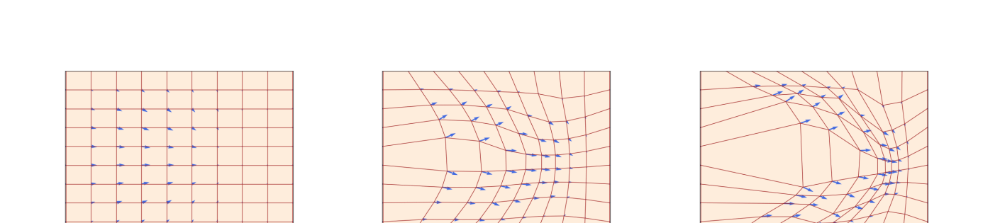
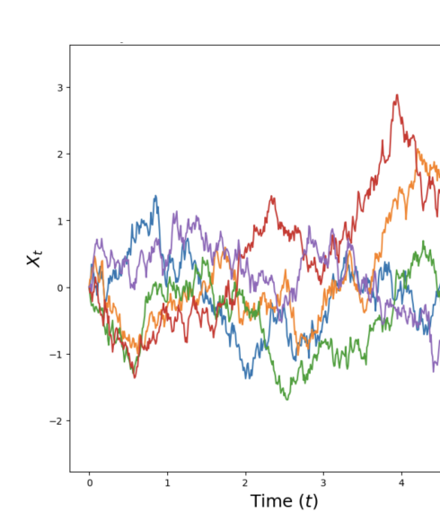
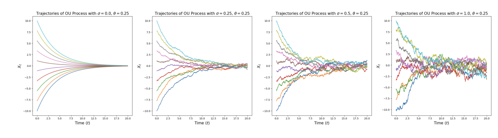

# 第 2 章 流与扩散模型（Flow and Diffusion Models）

> 原文：[*An Introduction to Flow Matching and Diffusion Models*](https://arxiv.org/abs/2506.02070) by Peter Holderrieth & Ezra Erives
> 章节页码：PDF p.7–13

---

上一节中，我们把生成式建模形式化为从一个数据分布 $p_{\text{data}}$ 中采样。同时我们也明确了自己的目标：构建一个生成模型——也就是一个返回 $z \sim p_{\text{data}}$ 样本的算法。本节将描述如何把一个**生成模型**建立为对某个精心构造的**微分方程**的数值模拟。例如，**流匹配（flow matching）**与**扩散模型（diffusion models）**分别涉及对**常微分方程（ODE, ordinary differential equation）**与**随机微分方程（SDE, stochastic differential equation）**的模拟。因此本节的目标就是定义并构造这些将在本讲义余下部分反复使用的生成模型。具体地，我们先定义 ODE 与 SDE，并讨论它们的数值模拟；然后再描述如何用深度神经网络参数化一个 ODE/SDE，这便引出了**流模型（flow model）**与**扩散模型（diffusion model）**的定义，以及从这些模型中采样的基本算法。在后续章节里，我们再进一步研究如何训练这些模型。

## 2.1 流模型（Flow Models）

我们从**常微分方程（ODE）**的定义开始。ODE 的解由**轨迹（trajectory）**——即形如下式的函数来定义：

$$X : [0,1] \to \mathbb{R}^d,\quad t \mapsto X_t$$

它把时间 $t$ 映射到空间 $\mathbb{R}^d$ 中的一个位置。每个 ODE 由一个**向量场（vector field）** $u$ 给出，也就是形如

$$u : \mathbb{R}^d \times [0,1] \to \mathbb{R}^d,\quad (x,t) \mapsto u_t(x)$$

的函数。也就是说，对任意时刻 $t$ 与位置 $x$，我们都得到一个向量 $u_t(x) \in \mathbb{R}^d$，用以指明空间中的速度（参见图 1）。ODE 对轨迹施加如下条件：我们希望某条轨迹 $X$「沿着」向量场 $u_t$ 的方向运动，并从 $x_0$ 这一点出发。这样的轨迹可被形式化为下面方程的解：

$$
\begin{aligned}
\tfrac{\mathrm{d}}{\mathrm{d}t} X_t &= u_t(X_t) \quad &\blacktriangleright\ \text{ODE} ^{ (1a) } \\
X_0 &= x_0 \quad &\blacktriangleright\ \text{初始条件} ^{ (1b) }
\end{aligned}
$$

式 (1a) 要求 $X_t$ 的导数等于 $u_t$ 所指明的方向；式 (1b) 要求我们在 $t=0$ 时从 $x_0$ 出发。现在我们自然会问：从 $X_0 = x_0$ 出发，到时刻 $t$ 时我们身处何处（即 $X_t$ 是多少）？这个问题由一个被称为**流（flow）**的函数来回答，它是下面 ODE 的解：

$$
\begin{aligned}
\psi &:\ \mathbb{R}^d \times [0,1] \to \mathbb{R}^d,\quad (x_0, t) \mapsto \psi_t(x_0) ^{ (2a) } \\
\tfrac{\mathrm{d}}{\mathrm{d}t} \psi_t(x_0) &= u_t(\psi_t(x_0)) \quad &\blacktriangleright\ \text{flow ODE} ^{ (2b) } \\
\psi_0(x_0) &= x_0 \quad &\blacktriangleright\ \text{flow 初始条件} ^{ (2c) }
\end{aligned}
$$

对于给定的初始条件 $X_0 = x_0$，ODE 的轨迹可由 $X_t = \psi_t(X_0)$ 恢复。因此，直观上看，**向量场、ODE 与流**是同一个对象的三种等价描述：向量场定义出 ODE，而 ODE 的解就是流。和对待每个方程一样，我们也要追问：解**是否存在**？**是否唯一**？数学上有一个基本结论告诉我们：只要对 $u_t$ 施加非常温和的条件，**两者都成立**！

**图 1**：流 $\psi_t: \mathbb{R}^d \to \mathbb{R}^d$（红色方格）由速度场 $u_t: \mathbb{R}^d \to \mathbb{R}^d$（蓝色箭头）定义，速度场描述了空间各点处的瞬时运动方向（此处 $d=2$）。图示了三个不同时刻 $t$ 的情形。可以看到，流是一个把空间「扭曲」开来的**微分同胚（diffeomorphism）**。图片来源 [26]。

> **定理 3（Flow existence and uniqueness / 流的存在唯一性）**
>
> 若 $u : \mathbb{R}^d \times [0,1] \to \mathbb{R}^d$ 是**连续可微**且具有**有界导数**的，那么式 (2) 中的 ODE 存在唯一由流 $\psi_t$ 给出的解。在这种情况下，$\psi_t$ 对所有 $t$ 都是**微分同胚（diffeomorphism）**，即 $\psi_t$ 连续可微且其逆 $\psi_t^{-1}$ 也连续可微。

请注意，流的解存在唯一性所要求的条件在机器学习中几乎总是自动满足的——因为我们用神经网络来参数化 $u_t(x)$，而神经网络的导数总是有界的。因此，**定理 3 不应让你担心，而应是一个好消息：在我们关心的所有情形下，ODE 的解都存在且唯一**。完整证明可见 [32, 9]。

> **例 4（Linear Vector Fields / 线性向量场）**
>
> 考虑一个简单的向量场 $u_t(x)$，它对 $x$ 是简单的线性函数，即 $u_t(x) = -\theta x$（其中 $\theta > 0$）。那么
>
> $$\psi_t(x_0) = \exp(-\theta t)\, x_0 ^{ (3) }$$
>
> 定义了一个流 $\psi$，它满足式 (2) 中的 ODE。你可以通过检验 $\psi_0(x_0) = x_0$ 并计算
>
> $$\frac{\mathrm{d}}{\mathrm{d}t} \psi_t(x_0) \stackrel{(3)}{=} \frac{\mathrm{d}}{\mathrm{d}t}\bigl(\exp(-\theta t)\, x_0\bigr) \stackrel{(i)}{=} -\theta \exp(-\theta t)\, x_0 \stackrel{(3)}{=} -\theta \psi_t(x_0) = u_t(\psi_t(x_0))$$
>
> 来验证这一点，其中在 (i) 处用到了链式法则。在**图 3** 中，我们可视化了一个这种形式的流，它以指数速度收敛到 $0$。

**Simulating an ODE（模拟一个 ODE）**。一般而言，当 $u_t$ 不像上面的例子那样简单时，我们**无法**显式地求出流 $\psi_t$。在这些情况下，我们使用**数值方法（numerical methods）**来模拟 ODE。所幸这是数值分析中一个经典且被研究得非常透彻的主题，已有一大批强有力的方法 [21]。最简单且最直观的方法之一就是 **Euler method（欧拉法）**。在欧拉法中，我们以 $X_0 = x_0$ 初始化，并按如下方式更新：

$$X_{t+h} = X_t + h\, u_t(X_t) \quad (t = 0, h, 2h, 3h, \ldots, 1-h) ^{ (4) }$$

其中 $h = n^{-1} > 0$ 是**步长（step size）**，$n \in \mathbb{N}$ 是模拟步数。在本课程中，欧拉法已经足够。为了让你对更复杂的方法有些概念，我们来考察 **Heun's method（休恩法）**，其更新规则为

$$
\begin{aligned}
X'_{t+h} &= X_t + h\, u_t(X_t) &&\blacktriangleright\ \text{新状态的初始猜测（同 Euler 步）} \\
X_{t+h} &= X_t + \tfrac{h}{2}\bigl(u_t(X_t) + u_{t+h}(X'_{t+h})\bigr) &&\blacktriangleright\ \text{用当前状态与猜测状态处的 $u$ 的平均做更新}
\end{aligned}
$$

直观上，Heun 法的思路如下：先给下一步做一个初步猜测 $X'_{t+h}$，再用一个更新后的猜测**修正**最初选取的方向。

**Flow models（流模型）**。到此我们便可以借由 ODE 来构造一个生成模型：把向量场替换为一个**神经网络向量场（neural network vector field）** $u_t^\theta$。眼下我们只是指 $u_t^\theta$ 是一个参数化函数 $u_t^\theta : \mathbb{R}^d \times [0,1] \to \mathbb{R}^d$，其参数为 $\theta$。稍后我们再讨论具体的神经网络架构选择。请记住，我们的目标是从某个分布 $p_{\text{data}}$ 中生成样本 $z \sim p_{\text{data}}$。特别地，这些样本必须是**随机的（random）**。然而，ODE 本身是**确定性**而非随机的。为了注入随机性，我们只需让初始条件 $X_0$ 变得随机。具体地，我们选取一个**初始分布（initial distribution）** $p_{\text{init}}$。在大多数情形下，我们取 $p_{\text{init}} = \mathcal{N}(0, I_d)$，即一个简单的标准高斯分布。最重要的是，无论你选什么分布，它都必须是我们在**推理时**能够方便采样的。一个**流模型（flow model）**便由如下 ODE 描述：

$$
\begin{aligned}
X_0 &\sim p_{\text{init}} &&\blacktriangleright\ \text{随机初始化} \\
\tfrac{\mathrm{d}}{\mathrm{d}t} X_t &= u_t^\theta(X_t) &&\blacktriangleright\ \text{ODE}
\end{aligned}
$$

我们的目标是让轨迹的**终点** $X_1$ 服从分布 $p_{\text{data}}$，即

$$X_1 \sim p_{\text{data}} \quad \Leftrightarrow \quad \psi_1^\theta(X_0) \sim p_{\text{data}}$$

其中 $\psi_t^\theta$ 表示由 $u_t^\theta$ 诱导出的流。需要特别指出：尽管它叫作「流模型」，神经网络所参数化的其实是**向量场** $u_t^\theta$，**而不是流**。要计算流，我们仍然需要**模拟**这个 ODE。在**算法 1** 中，我们总结了从一个流模型中采样的过程。

> **算法 1 Sampling from a Flow Model with Euler method（用欧拉法从流模型中采样）**
>
> **Require:** 神经网络向量场 $u_t^\theta$，步数 $n$
>
> 1. 令 $t = 0$
> 2. 令步长 $h = \tfrac{1}{n}$
> 3. 抽取样本 $X_0 \sim p_{\text{init}}$
> 4. **for** $i = 1, \ldots, n$ **do**
> 5. $\quad X_{t+h} = X_t + h\, u_t^\theta(X_t)$
> 6. $\quad$ 更新 $t \leftarrow t + h$
> 7. **end for**
> 8. **return** $X_1$

## 2.2 扩散模型（Diffusion Models）

**随机微分方程（SDE, stochastic differential equation）**将 ODE 的确定性轨迹推广为**带随机性**的轨迹。一条随机轨迹通常被称为**随机过程（stochastic process）** $(X_t)_{0 \leq t \leq 1}$，它满足

$$X_t \text{ 是随机变量}\ (0 \leq t \leq 1)$$

$$X : [0,1] \to \mathbb{R}^d,\quad t \mapsto X_t \text{ 是对 $X$ 的每次抽样对应的一条随机轨迹}$$

特别地，当我们把同一个随机过程模拟两次时，可能会得到不同的结果——因为动力学本身就是随机的。

**Brownian Motion（布朗运动）**。SDE 是通过**布朗运动（Brownian motion）**——一种源自物理扩散过程研究的基础随机过程——构造出来的。你可以把布朗运动理解为**连续的随机游走**。让我们给出它的定义：一个**布朗运动** $W = (W_t)_{0 \leq t \leq 1}$ 是一个随机过程，满足 $W_0 = 0$、轨迹 $t \mapsto W_t$ 连续，并满足下面两个条件：

1. **正态增量（Normal increments）**：$W_t - W_s \sim \mathcal{N}(0, (t-s) I_d)$ 对所有 $0 \leq s < t$，即增量服从一个**方差随时间线性增长**的高斯分布（$I_d$ 是单位矩阵）。
2. **独立增量（Independent increments）**：对任意 $0 \leq t_0 < t_1 < \cdots < t_n \leq 1$，增量 $W_{t_1} - W_{t_0}, \ldots, W_{t_n} - W_{t_{n-1}}$ 均为**独立**的随机变量。

布朗运动也被称为**维纳过程（Wiener process）**，这正是我们用「$W$」来记它的原因[^1]。当步长 $h > 0$ 时，我们可以很方便地**近似**模拟一条布朗运动：设 $W_0 = 0$，并按

$$W_{t+h} = W_t + \sqrt{h}\, \epsilon_t,\quad \epsilon_t \sim \mathcal{N}(0, I_d) \quad (t = 0, h, 2h, \ldots, 1-h) ^{ (5) }$$

进行更新。在**图 2** 中，我们展示了几条布朗运动的样本轨迹。布朗运动在随机过程中的地位**如同**高斯分布在概率分布中的地位——它是最基础也最核心的。从金融到统计物理再到流行病学，布朗运动的研究在机器学习之外也有着深远的影响。例如在金融领域，布朗运动被用来对复杂金融工具的价格建模。单纯作为一个数学构造，布朗运动也极具魅力：例如，尽管布朗运动的路径是**连续**的（你可以一笔画完），但它的路径**长度却是无穷**的（你永远都画不完）。

**图 2**：布朗运动 $W$ 在 $d=1$ 维下用式 (5) 模拟的样本轨迹。

**From ODEs to SDEs（从 ODE 到 SDE）**。SDE 的思想是把 ODE 的确定性动力学**加上**由布朗运动驱动的随机动力学。由于一切都是随机的，我们不能再像式 (1a) 中那样取导数。因此我们需要为 ODE 找到一种**不依赖导数**的等价表述。为此，我们把 ODE 的轨迹 $(X_t)_{0 \leq t \leq 1}$ 改写为：

$$
\begin{aligned}
\tfrac{\mathrm{d}}{\mathrm{d}t} X_t &= u_t(X_t) &&\blacktriangleright\ \text{用导数表示} \\
\stackrel{(i)}{\Leftrightarrow}\ \frac{1}{h}(X_{t+h} - X_t) &= u_t(X_t) + R_t(h) \\
\Leftrightarrow\ X_{t+h} &= X_t + h\, u_t(X_t) + h\, R_t(h) &&\blacktriangleright\ \text{用无穷小步长更新表示}
\end{aligned}
$$

其中 $R_t(h)$ 描述一个在 $h$ 很小时可以忽略的函数，即 $\lim_{h \to 0} R_t(h) = 0$；在 (i) 处我们用到了导数的定义。上面的推导只是把我们已经知道的事实重新表述一遍：ODE 的轨迹 $(X_t)_{0 \leq t \leq 1}$ 在**每一步**都沿 $u_t(X_t)$ 方向迈出微小的一步。我们现在把上式**最后一行**改造成**随机**版本：SDE 的轨迹 $(X_t)_{0 \leq t \leq 1}$ 在**每一步**都沿 $u_t(X_t)$ 方向迈出微小的一步，**再加上**一个来自布朗运动的贡献：

$$
\begin{aligned}
X_{t+h} &= \underbrace{X_t + h\, u_t(X_t)}_{\text{确定性项}} + \underbrace{\sigma_t(W_{t+h} - W_t)}_{\text{随机项}} + \underbrace{h\, R_t(h)}_{\text{误差项}} ^{ (6) }
\end{aligned}
$$

其中 $\sigma_t \geq 0$ 描述**扩散系数（diffusion coefficient）**，$R_t(h)$ 是一个随机误差项，其标准差 $\mathbb{E}[\|R_t(h)\|^2]^{1/2}$ 在 $h \to 0$ 时趋于 $0$。上式就描述了一个**随机微分方程（SDE）**。通常把它写成下面的符号化记法：

$$
\begin{aligned}
\mathrm{d}X_t &= u_t(X_t)\,\mathrm{d}t + \sigma_t\, \mathrm{d}W_t \quad &\blacktriangleright\ \text{SDE} ^{ (7a) } \\
X_0 &= x_0 \quad &\blacktriangleright\ \text{初始条件} ^{ (7b) }
\end{aligned}
$$

不过请始终牢记，上面「$\mathrm{d}X_t$」的记法只是式 (6) 的一种**非正式**记号。

可惜的是，SDE 不再拥有流映射 $\phi_t$ 了。这是因为 $X_t$ 不能再由 $X_0$ 唯一确定——演化过程本身就是随机的。然而，与 ODE 一样，我们有下面的存在唯一性定理：

> **定理 5（SDE Solution Existence and Uniqueness / SDE 解的存在唯一性）**
>
> 若 $u : \mathbb{R}^d \times [0,1] \to \mathbb{R}^d$ 连续可微且具有有界导数，且 $\sigma$ 连续，那么式 (7) 中的 SDE 存在一个由唯一随机过程 $(X_t)_{0 \leq t \leq 1}$ 给出的解，满足式 (6)。

如果这是一门随机微积分课，我们会用好几讲来证明这个定理，并以完整的数学严格性构造 SDE——即从第一性原理构造出布朗运动，并通过随机积分构造出过程 $X_t$。由于本课程聚焦于机器学习，我们推荐读者参考 [29] 以获得更技术化的讲解。最后请注意：**每个 ODE 也是 SDE**——只要令扩散系数 $\sigma_t = 0$ 即可。因此，在本课程余下部分中，当我们讨论 SDE 时，ODE 被视为一种特殊情形。

> **例 6（Ornstein-Uhlenbeck Process / Ornstein-Uhlenbeck 过程）**
>
> 考虑一个**常扩散系数** $\sigma_t = \sigma_0 \geq 0$ 和一个**常线性漂移** $u_t(x) = -\theta x$（其中 $\theta > 0$），从而得到 SDE
>
> $$\mathrm{d}X_t = -\theta X_t\, \mathrm{d}t + \sigma\, \mathrm{d}W_t ^{ (8) }$$
>
> 上述 SDE 的解 $(X_t)_{0 \leq t \leq 1}$ 被称为 **Ornstein-Uhlenbeck 过程（OU 过程）**。我们在**图 3** 中对它进行了可视化。向量场 $-\theta x$ 把过程拉回到中心 $0$（因为漂移总指向当前位置的反方向），而扩散系数 $\sigma$ 不断加入噪声。当 $t \to \infty$ 时，该过程收敛到高斯分布 $\mathcal{N}(0, \sigma^2 / (2\theta))$。注意，当 $\sigma = 0$ 时，我们得到式 (3) 中研究的具有线性向量场的流。

**图 3**：一维 Ornstein-Uhlenbeck 过程（式 (8)）的图示，$\theta = 0.25$，$\sigma$ 取不同值（从左到右依次增大）。当 $\sigma = 0$ 时，我们回到一个**流**（光滑、确定性的轨迹），且当 $t \to \infty$ 时收敛到原点。当 $\sigma > 0$ 时是随机路径，且当 $t \to \infty$ 时收敛到高斯分布 $\mathcal{N}(0, \sigma^2 / (2\theta))$。

**Simulating an SDE（模拟 SDE）**。如果你对 SDE 抽象的定义感到困扰，不必担心。一个更直观的理解 SDE 的方式是回答这样一个问题：**我们要怎么模拟一个 SDE？**最简单的方法称为 **Euler-Maruyama method（欧拉-丸山法）**，它对 SDE 的地位相当于欧拉法对 ODE 的地位。使用欧拉-丸山法，我们以 $X_0 = x_0$ 初始化，并通过下面的迭代做更新：

$$X_{t+h} = X_t + h\, u_t(X_t) + \sqrt{h}\, \sigma_t\, \epsilon_t,\quad \epsilon_t \sim \mathcal{N}(0, I_d) ^{ (9) }$$

其中 $h = n^{-1} > 0$ 是一个步长超参数，$n \in \mathbb{N}$。换句话说，用欧拉-丸山法模拟时，我们在 $u_t(X_t)$ 的方向上迈出一小步，同时加入一个大小为 $\sqrt{h}\sigma_t$ 的高斯噪声。在本课程中模拟 SDE 时（比如在配套实验中），我们将通常使用欧拉-丸山法。

**Diffusion Models（扩散模型）**。至此我们便可以通过 SDE 构造一个生成模型，做法和 ODE 情形完全一样。记住，我们的目标是把一个简单的分布 $p_{\text{init}}$「变成」复杂的分布 $p_{\text{data}}$。和 ODE 一样，对一个以 $X_0 \sim p_{\text{init}}$ 随机初始化的 SDE 进行模拟，就是这种变换的自然选择。要参数化这个 SDE，我们只需参数化它的核心要素——向量场 $u_t$——即可，方法是把它替换为神经网络 $u_t^\theta$。于是**扩散模型（diffusion model）**定义为：

$$
\begin{aligned}
X_0 &\sim p_{\text{init}} &&\blacktriangleright\ \text{随机初始化} \\
\mathrm{d}X_t &= u_t^\theta(X_t)\,\mathrm{d}t + \sigma_t\, \mathrm{d}W_t &&\blacktriangleright\ \text{SDE}
\end{aligned}
$$

在**算法 2** 中，我们描述了用欧拉-丸山法从扩散模型中采样的过程。我们把本节的结果总结如下。

> **算法 2 Sampling from a Diffusion Model（从扩散模型中采样，Euler-Maruyama method）**
>
> **Require:** 神经网络 $u_t^\theta$，步数 $n$，扩散系数 $\sigma_t$
>
> 1. 令 $t = 0$
> 2. 令步长 $h = \tfrac{1}{n}$
> 3. 抽取样本 $X_0 \sim p_{\text{init}}$
> 4. **for** $i = 1, \ldots, n$ **do**
> 5. $\quad$ 抽取样本 $\epsilon \sim \mathcal{N}(0, I_d)$
> 6. $\quad X_{t+h} = X_t + h\, u_t^\theta(X_t) + \sigma_t \sqrt{h}\, \epsilon$
> 7. $\quad$ 更新 $t \leftarrow t + h$
> 8. **end for**
> 9. **return** $X_1$

> **总结 7（SDE generative model / SDE 生成模型）**
>
> 在本讲义中，一个**扩散模型（diffusion model）** 由一个参数为 $\theta$ 的神经网络 $u_t^\theta$（用于参数化向量场）和一个固定的扩散系数 $\sigma_t$ 共同构成：
>
> $$\textbf{神经网络：}\ u^\theta : \mathbb{R}^d \times [0,1] \to \mathbb{R}^d,\ (x,t) \mapsto u_t^\theta(x),\ \text{参数为}\ \theta$$
>
> $$\textbf{固定：}\ \sigma_t : [0,1] \to [0, \infty),\ t \mapsto \sigma_t$$
>
> 要从我们的 SDE 模型中获取样本（即生成对象），过程如下：
>
> $$\textbf{初始化：}\ X_0 \sim p_{\text{init}} \quad \blacktriangleright\ \text{用简单分布初始化，例如一个高斯}$$
>
> $$\textbf{模拟：}\ \mathrm{d}X_t = u_t^\theta(X_t)\,\mathrm{d}t + \sigma_t\, \mathrm{d}W_t \quad \blacktriangleright\ \text{从 0 到 1 模拟 SDE}$$
>
> $$\textbf{目标：}\ X_1 \sim p_{\text{data}} \quad \blacktriangleright\ \text{目标是让 $X_1$ 服从分布 $p_{\text{data}}$}$$
>
> 扩散模型在 $\sigma_t = 0$ 时退化为流模型。

---

[^1]: Norbert Wiener 是一位著名的数学家，曾在 MIT 任教。你仍能在 MIT 数学系看到他的肖像。
