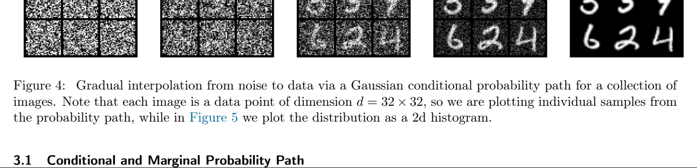
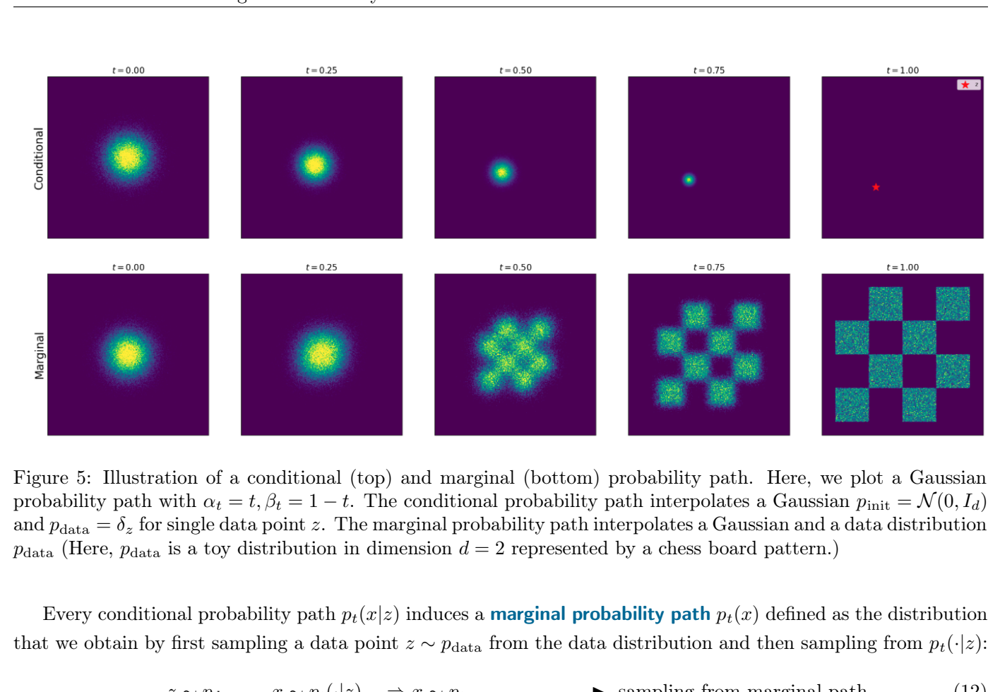
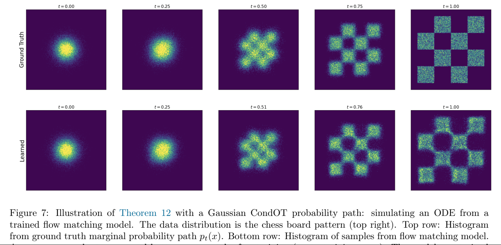

# 第 3 章 流匹配（Flow Matching）

> 原文：[*An Introduction to Flow Matching and Diffusion Models*](https://arxiv.org/abs/2506.02070) by Peter Holderrieth & Ezra Erives
> 章节页码：PDF p.14–23

---

上一节中，我们把流模型和扩散模型构造为由神经网络向量场 $u_t^\theta$ 参数化的生成模型。但我们还没有讨论如何**训练**它们——也就是说，如何优化参数 $\theta$，使得生成模型能够输出有意义的东西，比如一张漂亮的图像或一段激动人心的视频。接下来我们讨论**流匹配（flow matching）** [25, 1, 27]，它是一种简单、可扩展、并代表当前最先进水平（state-of-the-art）的 $u_t^\theta$ 训练算法。

在本节中，我们仅讨论**流模型（flow model）**——也就是说，我们有一个神经网络 $u_t^\theta$，通过对如下 ODE 进行数值模拟来获得生成模型的样本：

$$
\begin{aligned}
X_0 &\sim p_{\text{init}}, \quad \mathrm{d}X_t = u_t^\theta(X_t)\,\mathrm{d}t \quad &\blacktriangleright\ \text{Flow model} ^{ (10) }
\end{aligned}
$$

并把 $t=1$ 时刻的端点 $X_1$ 用作样本。正如我们已经讨论过的，我们的目标是让 $X_1$ 按照数据分布 $p_{\text{data}}$ 分布，即 $X_1 \sim p_{\text{data}}$。因此，"如何训练"神经网络这个问题可以真正表述为下面的问题：

> **我们应当如何优化 $\theta$，使得对式 (10) 中的流模型进行数值模拟后得到的样本服从数据分布 $X_1 \sim p_{\text{data}}$？**

**图 4**：经由高斯条件概率路径，从噪声到数据点的渐进式插值。这里展示的是一组图像的示例。请注意，每张图像都是一个 $d = 32 \times 32$ 维的数据点，因此我们画出的是概率路径的**单个样本**；而 Figure 5 则把分布画为二维直方图。

## 3.1 条件概率路径与边缘概率路径（Conditional and Marginal Probability Path）

流匹配的第一步是指定一个**概率路径（probability path）**。直观上，概率路径指定了一条从噪声 $p_{\text{init}}$ 到数据 $p_{\text{data}}$ 的渐进式插值（参见 Figure 4）。那么我们为什么需要它呢？回想一下，我们期望的 ODE 轨迹满足 $X_0 \sim p_{\text{init}}$（当 $t=0$）和 $X_1 \sim p_{\text{data}}$（当 $t=1$）。但 $0 < t < 1$ 这些"夹在中间"的时刻上会发生什么呢？事实上，我们有一定的自由来选择"中间发生了什么"，而这一点正是被"概率路径"在数学上形式化地刻画的对象。

下面，对于一个数据点 $z \in \mathbb{R}^d$，我们用 $\delta_z$ 表示 **Dirac delta** "分布"。它是我们能想到的最简单的分布：从 $\delta_z$ 中采样总是返回 $z$（即它是确定性的）。一组**条件（插值型）概率路径（conditional (interpolating) probability path）**指的是 $\mathbb{R}^d$ 上的一族分布 $p_t(\cdot | z)$，满足：

$$
p_0(\cdot | z) = p_{\text{init}}, \quad p_1(\cdot | z) = \delta_z \quad \text{for all } z \in \mathbb{R}^d. ^{ (11) }
$$

换言之，条件概率路径**逐步地**将初始分布 $p_{\text{init}}$ 转化为**单一**数据点（参见 Figure 4）。你可以把概率路径想象成是分布在"分布空间"中的轨迹。

**图 5**：条件概率路径（上）与边缘概率路径（下）的示意图。这里我们画出的是 $\alpha_t = t$、$\beta_t = 1 - t$ 的高斯概率路径。条件概率路径在 $p_{\text{init}} = \mathcal{N}(0, I_d)$ 和单个数据点 $p_{\text{data}} = \delta_z$ 之间插值。边缘概率路径在高斯和数据分布 $p_{\text{data}}$ 之间插值（这里 $p_{\text{data}}$ 是一个 $d=2$ 维的玩具分布，由棋盘格模式表示）。

每个条件概率路径 $p_t(x | z)$ 都诱导出一个**边缘概率路径（marginal probability path）** $p_t(x)$，其定义为：先从数据分布中采一个数据点 $z \sim p_{\text{data}}$，再从 $p_t(\cdot | z)$ 中采样，所得到的分布：

$$
\begin{aligned}
z \sim p_{\text{data}}, \quad x \sim p_t(\cdot | z) \quad &\Rightarrow \quad x \sim p_t \quad &\blacktriangleright\ \text{sampling from marginal path} ^{ (12) } \\
p_t(x) = \int p_t(x | z)\, p_{\text{data}}(z)\, \mathrm{d}z \quad &\blacktriangleright\ \text{density of marginal path} ^{ (13) }
\end{aligned}
$$

注意，**我们知道如何从 $p_t$ 中采样**，但**我们不知道 $p_t(x)$ 的密度值**——因为该积分难以处理（intractable，即我们实际可以计算式 (12)，但无法计算式 (13)）。请你自己验证一下：因为 $p_t(\cdot | z)$ 满足式 (11) 中的条件，边缘概率路径 $p_t$ 在 $p_{\text{init}}$ 和 $p_{\text{data}}$ 之间插值：

$$
p_0 = p_{\text{init}} \quad \text{and} \quad p_1 = p_{\text{data}}. \quad &\blacktriangleright\ \text{noise-data interpolation} ^{ (14) }
$$

到目前为止，最重要的一类概率路径是**高斯概率路径（Gaussian probability path）**——因此，我们强烈建议你认真阅读下一个例子。

> **例 8（Gaussian Conditional Probability Path / 高斯条件概率路径）**
>
> 一个特别常用的概率路径是**高斯概率路径**。它是**当前最先进模型**所使用的概率路径。设 $\alpha_t, \beta_t$ 为**噪声调度器（noise schedulers）**：两个连续可微、单调的函数，且 $\alpha_0 = \beta_1 = 0$、$\alpha_1 = \beta_0 = 1$。我们据此定义条件概率路径：
>
> $$p_t(\cdot | z) = \mathcal{N}(\alpha_t z,\ \beta_t^2 I_d) \quad &\blacktriangleright\ \text{Gaussian conditional path} ^{ (15) }$$
>
> 由我们对 $\alpha_t$、$\beta_t$ 施加的条件：
>
> $$
> \begin{aligned}
> p_0(\cdot | z) = \mathcal{N}(\alpha_0 z, \beta_0^2 I_d) = \mathcal{N}(0, I_d), \\
> p_1(\cdot | z) = \mathcal{N}(\alpha_1 z, \beta_1^2 I_d) = \delta_z
> \end{aligned}
> $$
>
> 其中我们用到了"均值为 $z$、方差为 $0$ 的正态分布就是 $\delta_z$"这一事实。因此，这种 $p_t(x | z)$ 的选择对 $p_{\text{init}} = \mathcal{N}(0, I_d)$ 满足式 (11)，从而是一个合法的条件插值路径。在 Figure 4 中，我们把它在一张图像上的应用做了可视化。我们可以把"从边缘路径 $p_t$ 中采样"表达为：
>
> $$z \sim p_{\text{data}}, \quad \epsilon \sim p_{\text{init}} = \mathcal{N}(0, I_d) \quad \Rightarrow \quad x = \alpha_t z + \beta_t \epsilon \sim p_t \quad &\blacktriangleright\ \text{sampling from marginal Gaussian path} ^{ (16) }$$
>
> 直观地，上述过程对低 $t$ 加入更多噪声，直到 $t=0$ 时只剩纯噪声；在 $t=1$ 时则没有噪声（见 Figure 5）。

## 3.2 条件向量场与边缘向量场（Conditional and Marginal Vector Fields）

一个概率路径 $(p_t)_{0 \leq t \leq 1}$ 指定了沿某条轨迹上的点 $X_t$ 应当服从的分布 $X_t \sim p_t$。到目前为止，这还只是我们"希望"成立的事情。但是，**我们如何找到一个向量场，使得轨迹 $X_t$ 真正服从这条概率路径？** 流匹配方法显式地构造了这样一个向量场——**边缘向量场（marginal vector field）**——我们将在本节中加以说明。

对每个数据点 $z \in \mathbb{R}^d$，我们令 $u_t^{\text{target}}(x | z)$ 表示一个**条件向量场（conditional vector field）**。它可以是任何向量场，只要对应的 ODE 能产生条件概率路径 $p_t(\cdot | z)$，即满足：

$$
X_0 \sim p_{\text{init}}, \quad \mathrm{d}X_t = u_t^{\text{target}}(X_t | z)\, \mathrm{d}t \quad \Rightarrow \quad X_t \sim p_t(\cdot | z) \quad (0 \leq t \leq 1). ^{ (17) }
$$

我们通常可以**手动**（即只需做一些代数推导）解析地求出条件向量场 $u_t^{\text{target}}(\cdot | z)$。在 Example 10 中，我们就为运行示例中的高斯概率路径推导出条件向量场 $u_t(x | z)$。

初看之下，条件向量场似乎毫无用处——因为 ODE 的所有端点 $X_1$ 都会塌缩成 $X_1 = z$，换句话说我们只是在重新生成已知的数据点 $z$。然而，条件向量场是构造**真正从 $p_{\text{data}}$ 中生成新样本**的向量场的**基础构件**。

> **定理 9（Marginalization Trick / 边缘化技巧）**
>
> 设 $u_t^{\text{target}}(x | z)$ 是一个条件向量场（如式 (17) 所定义）。则由下式定义的**边缘向量场（marginal vector field）** $u_t^{\text{target}}(x)$
>
> $$u_t^{\text{target}}(x) = \int u_t^{\text{target}}(x | z)\, \frac{p_t(x | z)\, p_{\text{data}}(z)}{p_t(x)}\, \mathrm{d}z, ^{ (18) }$$
>
> 沿着边缘概率路径走，即：
>
> $$X_0 \sim p_{\text{init}}, \quad \mathrm{d}X_t = u_t^{\text{target}}(X_t)\, \mathrm{d}t \quad \Rightarrow \quad X_t \sim p_t \quad (0 \leq t \leq 1). ^{ (19) }$$
>
> 特别地，对该 ODE 而言 $X_1 \sim p_{\text{data}}$，所以我们可以说"$u_t^{\text{target}}$ **将噪声 $p_{\text{init}}$ 转化为数据 $p_{\text{data}}$**"。

**图 6**：定理 9 的示意图——用 ODE 模拟概率路径。蓝色背景表示数据分布 $p_{\text{data}}$，红色背景表示高斯 $p_{\text{init}}$。上排：条件概率路径。左：从条件路径 $p_t(\cdot | z)$ 中采样的真值样本。中：随时间演化的 ODE 样本。右：用式 (20) 中的 $u_t^{\text{target}}(x | z)$ 模拟 ODE 所得的轨迹。下排：模拟一个边缘概率路径。左：从 $p_t$ 中采样的真值样本。中：随时间演化的 ODE 样本。右：用边缘向量场 $u_t^{\text{flow}}(x)$ 模拟 ODE 所得的轨迹。可以看到，条件向量场跟随条件概率路径，边缘向量场跟随边缘概率路径。

> **例 10（Target ODE for Gaussian probability paths / 高斯概率路径的目标 ODE）**
>
> 和之前一样，设 $p_t(\cdot | z) = \mathcal{N}(\alpha_t z, \beta_t^2 I_d)$，其中 $\alpha_t$、$\beta_t$ 为噪声调度器（见式 (15)）。令 $\dot{\alpha}_t = \partial_t \alpha_t$、$\dot{\beta}_t = \partial_t \beta_t$ 分别表示 $\alpha_t$ 和 $\beta_t$ 的时间导数。下面我们要说明，下面给定的**条件高斯向量场（conditional Gaussian vector field）**
>
> $$u_t^{\text{target}}(x | z) = \left( \dot{\alpha}_t - \frac{\dot{\beta}_t}{\beta_t} \alpha_t \right) z + \frac{\dot{\beta}_t}{\beta_t}\, x ^{ (20) }$$
>
> 在定理 9 的意义下是一个合法的条件向量场模型：其 ODE 轨迹 $X_t$ 在 $X_0 \sim \mathcal{N}(0, I_d)$ 时满足 $X_t \sim p_t(\cdot | z) = \mathcal{N}(\alpha_t z, \beta_t^2 I_d)$。在 Figure 6 中，我们通过把从条件概率路径（真值）采出的样本与从该流模拟的 ODE 轨迹的样本做对比，可视化地确认了这一点——可以看到，二者的分布是匹配的。下面我们给出证明。
>
> ***证明***：我们先通过定义
>
> $$\psi_t^{\text{target}}(x | z) = \alpha_t z + \beta_t x ^{ (21) }$$
>
> 构造一个条件流模型 $\psi_t^{\text{target}}$。若 $X_t$ 是 $\psi_t^{\text{target}}(\cdot | z)$ 在 $X_0 \sim p_{\text{init}} = \mathcal{N}(0, I_d)$ 下的 ODE 轨迹，则由定义有
>
> $$X_t = \psi_t^{\text{target}}(X_0 | z) = \alpha_t z + \beta_t X_0 \sim \mathcal{N}(\alpha_t z, \beta_t^2 I_d) = p_t(\cdot | z).$$
>
> 于是我们知道，轨迹按条件概率路径分布（即式 (17) 成立）。剩下要做的是从 $\psi_t^{\text{target}}(x | z)$ 提取向量场 $u_t^{\text{target}}(x | z)$。由流（式 (2b)）的定义，对所有 $x, z \in \mathbb{R}^d$ 都有：
>
> $$\begin{aligned}
> \tfrac{\mathrm{d}}{\mathrm{d}t} \psi_t^{\text{target}}(x | z) &= u_t^{\text{target}}(\psi_t^{\text{target}}(x | z) | z) \quad \text{for all } x, z \in \mathbb{R}^d \\
> \overset{(i)}{\Leftrightarrow} \dot{\alpha}_t z + \dot{\beta}_t x &= u_t^{\text{target}}(\alpha_t z + \beta_t x | z) \quad \text{for all } x, z \in \mathbb{R}^d \\
> \overset{(ii)}{\Leftrightarrow} \dot{\alpha}_t z + \dot{\beta}_t \tfrac{x - \alpha_t z}{\beta_t} &= u_t^{\text{target}}(x | z) \quad \text{for all } x, z \in \mathbb{R}^d \\
> \overset{(iii)}{\Leftrightarrow} \left( \dot{\alpha}_t - \tfrac{\dot{\beta}_t}{\beta_t} \alpha_t \right) z + \tfrac{\dot{\beta}_t}{\beta_t} x &= u_t^{\text{target}}(x | z) \quad \text{for all } x, z \in \mathbb{R}^d
> \end{aligned}$$
>
> 其中 $(i)$ 用到了 $\psi_t^{\text{target}}(x | z)$ 的定义（式 (21)），$(ii)$ 中我们对 $x$ 做了替换 $x \to (x - \alpha_t z)/\beta_t$，$(iii)$ 仅仅是一些代数化简。注意最后一个方程正是在式 (20) 中定义的条件高斯向量场。证明完毕。[^proof-cfm] [^footnote]
>
> 参见 Figure 6 来看定理 9 的图示。下面我们为边缘向量场建立一些直觉。统计学中的**贝叶斯定理**指出：
>
> $$\frac{p_t(x | z)\, p_{\text{data}}(z)}{p_t(x)} = \text{"posterior over data points } z \text{ given noisy data } x"$$
>
> 其中 $p_{\text{data}}(z)$ 是先验分布。于是，边缘向量场其实就是一个**加权平均**：对每个可能的数据点 $z$，它先取速度 $u_t(x | z)$——即"把 $x$ 推向 $z$ 所需的方向"——然后按"我们有多相信 $x$ 来自 $z$"为这个速度加权。在所有数据点上做平均，就得到边缘向量场。
>
> 本节余下部分会把这种直觉变得严格，并证明定理 9。我们用的主要数学工具是**连续性方程（continuity equation）**——它在数学与物理中都是一条基本方程。首先定义**散度算子** $\mathrm{div}$：
>
> $$\mathrm{div}(v_t)(x) = \sum_{i=1}^{d} \frac{\partial v_t^i(x)}{\partial x^i} ^{ (22) }$$
>
> 其中 $v_t^i$ 是 $v_t$ 的第 $i$ 个坐标。

> **定理 11（Continuity Equation / 连续性方程）**
>
> 考虑一个流模型，其向量场为 $u_t^{\text{target}}$，且 $X_0 \sim p_{\text{init}} = p_0$。则对所有 $0 \leq t \leq 1$，当且仅当
>
> $$\partial_t p_t(x) = -\mathrm{div}\bigl(p_t\, u_t^{\text{target}}\bigr)(x) \quad \text{for all } x \in \mathbb{R}^d,\ 0 \leq t \leq 1, ^{ (23) }$$
>
> 成立时，才有 $X_t \sim p_t$。其中 $\partial_t p_t(x) = \frac{\mathrm{d} p_t(x)}{\mathrm{d}t}$ 表示 $p_t(x)$ 的时间导数。式 (23) 即所谓的**连续性方程**。
>
> 面向更偏数学的读者，我们在第 B 节中给出了连续性方程的自洽证明。
>
> 在我们继续之前，先来直观地理解一下连续性方程。左侧 $\partial_t p_t(x)$ 描述的是：$x$ 处的概率密度 $p_t(x)$ 随时间变化的程度。直观上，这种变化应当对应于**概率质量的净流入**。对于流模型，一个粒子 $X_t$ 沿向量场 $u_t^{\text{target}}$ 运动。回忆一下物理中的知识，**散度衡量的是向量场的"净流出"**，因此**负散度衡量"净流入"**。再乘以当前位置 $x$ 处的总概率质量 $p_t$，得到 $-\mathrm{div}(p_t\, u_t)$——也就是当前位置 $x$ 处的"总流入概率质量"。由于概率质量守恒（永远积分为 1），方程左右两侧应当相等。下面我们来证明定理 9 中的边缘化技巧。
>
> ***定理 9 的证明***：由定理 11，我们只要证明按式 (18) 定义的边缘向量场 $u_t^{\text{target}}$ 满足连续性方程即可。直接计算可得：
>
> $$
> \begin{aligned}
> \partial_t p_t(x) &\overset{(i)}{=} \partial_t \int p_t(x | z)\, p_{\text{data}}(z)\, \mathrm{d}z = \int \partial_t p_t(x | z)\, p_{\text{data}}(z)\, \mathrm{d}z \\
> &\overset{(ii)}{=} \int -\mathrm{div}\bigl(p_t(\cdot | z)\, u_t^{\text{target}}(\cdot | z)\bigr)(x)\, p_{\text{data}}(z)\, \mathrm{d}z \\
> &\overset{(iii)}{=} -\mathrm{div} \int p_t(x | z)\, u_t^{\text{target}}(x | z)\, p_{\text{data}}(z)\, \mathrm{d}z \\
> &\overset{(iv)}{=} -\mathrm{div}\!\left( p_t(x)\, \int u_t^{\text{target}}(x | z)\, \frac{p_t(x | z)\, p_{\text{data}}(z)}{p_t(x)}\, \mathrm{d}z \right) \\
> &\overset{(v)}{=} -\mathrm{div}\!\left( p_t\, u_t^{\text{target}} \right)(x),
> \end{aligned}
> $$
>
> 其中 $(i)$ 用到了 $p_t(x)$ 在式 (12) 中的定义；$(ii)$ 用到了条件概率路径 $p_t(\cdot | z)$ 的连续性方程；$(iii)$ 中我们利用了式 (22) 把积分和散度算子交换；$(iv)$ 中我们乘上 $p_t(x)$ 再除以 $p_t(x)$；$(v)$ 用到了式 (18)。上述等式链的**首尾两端**说明连续性方程对 $u_t^{\text{target}}$ 成立。再由定理 11，这就足以推出式 (19)，证明完毕。

## 3.3 学习边缘向量场（Learning the Marginal Vector Field）

现在我们已准备好介绍训练算法。**流匹配（flow matching）** 的目标是训练神经网络 $u_t^\theta$，使其等于边缘向量场 $u_t^{\text{target}}$。如果这一点成立，由定理 9 我们就知道端点 $X_1 \sim p_{\text{data}}$ 具有我们想要的分布。下面我们用 $\mathrm{Unif}_{[0,1]}$ 表示 $[0,1]$ 区间上的均匀分布，用 $\mathbb{E}$ 表示对随机变量求期望。

获得 $u_t^\theta \approx u_t^{\text{target}}$ 的一个直观方法是使用**均方误差（mean-squared error）**，即使用如下**流匹配损失（flow matching loss）**：

$$
\begin{aligned}
\mathcal{L}_{\text{FM}}(\theta) &= \mathbb{E}_{t \sim \mathrm{Unif},\ x \sim p_t} \bigl[\, \| u_t^\theta(x) - u_t^{\text{target}}(x) \|^2 \,\bigr] ^{ (24) } \\
&\overset{(i)}{=} \mathbb{E}_{t \sim \mathrm{Unif},\ z \sim p_{\text{data}},\ x \sim p_t(\cdot | z)} \bigl[\, \| u_t^\theta(x) - u_t^{\text{target}}(x) \|^2 \,\bigr], ^{ (25) }
\end{aligned}
$$

其中 $p_t(x) = \int p_t(x | z)\, p_{\text{data}}(z)\, \mathrm{d}z$ 是边缘概率路径，$(i)$ 中我们用到了式 (12) 给出的采样过程。直观上，这个损失的意思是：首先随机采一个时刻 $t \in [0,1]$；再从数据集采一个数据点 $z$，从 $p_t(\cdot | z)$ 中采一个样本（例如通过加一些噪声），并计算 $u_t^\theta(x)$；最后计算神经网络输出与边缘向量场 $u_t^{\text{target}}(x)$ 之间的均方误差。

然而我们还没有真正完成——虽然我们已经通过定理 9 知道了 $u_t^{\text{target}}$ 的表达式，但**我们不能高效地计算它**，因为其中那个积分不可解。我们将利用条件向量场 $u_t^{\text{target}}(x | z)$ 实际上是**可解**的这一事实。为此，我们定义**条件流匹配损失（conditional flow matching loss）**：

$$
\mathcal{L}_{\text{CFM}}(\theta) = \mathbb{E}_{t \sim \mathrm{Unif},\ z \sim p_{\text{data}},\ x \sim p_t(\cdot | z)} \bigl[\, \| u_t^\theta(x) - u_t^{\text{target}}(x | z) \|^2 \,\bigr]. ^{ (26) }
$$

注意它与式 (24) 的区别：我们用的是条件向量场 $u_t^{\text{target}}(x | z)$ 而非边缘向量场 $u_t^{\text{target}}(x)$。由于 $u_t^{\text{target}}(x | z)$ 有解析表达式，我们能轻松地最小化上述损失。但是，等等：我们要回归的目标明明是边缘向量场，对条件向量场做回归有什么意义呢？事实证明，**对那个"好算"的条件向量场做显式回归，等价于对那个"算不出来"的边缘向量场做隐式回归**。下面这条定理让这一直觉变得严格。

> **定理 12**
>
> 边缘流匹配损失等于条件流匹配损失加一个常数。也就是说，
>
> $$\mathcal{L}_{\text{FM}}(\theta) = \mathcal{L}_{\text{CFM}}(\theta) + C,$$
>
> 其中 $C$ 不依赖于 $\theta$。因此，它们的梯度相同：
>
> $$\nabla_\theta \mathcal{L}_{\text{FM}}(\theta) = \nabla_\theta \mathcal{L}_{\text{CFM}}(\theta).$$
>
> 所以，**用随机梯度下降（SGD）等方式最小化 $\mathcal{L}_{\text{CFM}}(\theta)$，等价于以同样方式最小化 $\mathcal{L}_{\text{FM}}(\theta)$**。特别地，对 $\mathcal{L}_{\text{CFM}}$ 的最小化子 $\theta^*$，将成立 $u_t^{\theta^*} = u_t^{\text{target}}$，即神经网络等于边缘向量场（假设参数化具有无穷表达能力）。
>
> ***直接证明***：证明思路是把均方误差拆成三项并去掉常数：
>
> $$
> \begin{aligned}
> \mathcal{L}_{\text{FM}}(\theta) &\overset{(i)}{=} \mathbb{E}_{t \sim \mathrm{Unif},\ x \sim p_t} \bigl[\, \| u_t^\theta(x) - u_t^{\text{target}}(x) \|^2 \,\bigr] \\
> &\overset{(ii)}{=} \mathbb{E}_{t \sim \mathrm{Unif},\ x \sim p_t} \bigl[\, \| u_t^\theta(x) \|^2 - 2\, u_t^\theta(x)^\top u_t^{\text{target}}(x) + \| u_t^{\text{target}}(x) \|^2 \,\bigr] \\
> &\overset{(iii)}{=} \mathbb{E}_{t \sim \mathrm{Unif},\ x \sim p_t} \bigl[\, \| u_t^\theta(x) \|^2 \,\bigr] - 2\, \mathbb{E}_{t \sim \mathrm{Unif},\ x \sim p_t} \bigl[\, u_t^\theta(x)^\top u_t^{\text{target}}(x) \,\bigr] + \underbrace{\mathbb{E}_{t \sim \mathrm{Unif}_{[0,1]},\ x \sim p_t} \bigl[\, \| u_t^{\text{target}}(x) \|^2 \,\bigr]}_{=:C_1} \\
> &\overset{(iv)}{=} \mathbb{E}_{t \sim \mathrm{Unif},\ z \sim p_{\text{data}},\ x \sim p_t(\cdot | z)} \bigl[\, \| u_t^\theta(x) \|^2 \,\bigr] - 2\, \mathbb{E}_{t \sim \mathrm{Unif},\ x \sim p_t} \bigl[\, u_t^\theta(x)^\top u_t^{\text{target}}(x) \,\bigr] + C_1
> \end{aligned}
> $$
>
> 其中 $(i)$ 由定义直接成立；$(ii)$ 利用了 $\| a - b \|^2 = \| a \|^2 - 2 a^\top b + \| b \|^2$；$(iii)$ 中我们定义了一个常数 $C_1$；$(iv)$ 用到了由式 (12) 给出的 $p_t$ 的采样过程。重新表达第二项：
>
> $$
> \begin{aligned}
> \mathbb{E}_{t \sim \mathrm{Unif},\ x \sim p_t} \bigl[\, u_t^\theta(x)^\top u_t^{\text{target}}(x) \,\bigr] &\overset{(i)}{=} \int_0^1 \!\! \int p_t(x)\, u_t^\theta(x)^\top u_t^{\text{target}}(x)\, \mathrm{d}x\, \mathrm{d}t \\
> &\overset{(ii)}{=} \int_0^1 \!\! \int p_t(x)\, u_t^\theta(x)^\top \left( \int u_t^{\text{target}}(x | z)\, \frac{p_t(x | z)\, p_{\text{data}}(z)}{p_t(x)}\, \mathrm{d}z \right) \mathrm{d}x\, \mathrm{d}t \\
> &\overset{(iii)}{=} \int_0^1 \!\! \int \!\! \int u_t^\theta(x)^\top u_t^{\text{target}}(x | z)\, p_t(x | z)\, p_{\text{data}}(z)\, \mathrm{d}z\, \mathrm{d}x\, \mathrm{d}t \\
> &\overset{(iv)}{=} \mathbb{E}_{t \sim \mathrm{Unif},\ z \sim p_{\text{data}},\ x \sim p_t(\cdot | z)} \bigl[\, u_t^\theta(x)^\top u_t^{\text{target}}(x | z) \,\bigr]
> \end{aligned}
> $$
>
> 其中 $(i)$ 中我们把期望表达为积分；$(ii)$ 用到了式 (18)；$(iii)$ 中我们利用了积分的线性性；$(iv)$ 中我们又把积分表达为期望。**这才是证明中最关键的一步**：等式最左端用的是边缘向量场 $u_t^{\text{target}}(x)$，而最右端用的则是条件向量场 $u_t^{\text{target}}(x | z)$。把它代回 $\mathcal{L}_{\text{FM}}$ 的表达式得：
>
> $$
> \begin{aligned}
> \mathcal{L}_{\text{FM}}(\theta) &\overset{(i)}{=} \mathbb{E}_{t \sim \mathrm{Unif},\ z \sim p_{\text{data}},\ x \sim p_t(\cdot | z)} \bigl[\, \| u_t^\theta(x) \|^2 \,\bigr] - 2\, \mathbb{E}_{t \sim \mathrm{Unif},\ z \sim p_{\text{data}},\ x \sim p_t(\cdot | z)} \bigl[\, u_t^\theta(x)^\top u_t^{\text{target}}(x | z) \,\bigr] + C_1 \\
> &\overset{(ii)}{=} \mathbb{E}_{t \sim \mathrm{Unif},\ z \sim p_{\text{data}},\ x \sim p_t(\cdot | z)} \bigl[\, \| u_t^\theta(x) \|^2 - 2\, u_t^\theta(x)^\top u_t^{\text{target}}(x | z) + \| u_t^{\text{target}}(x | z) \|^2 - \| u_t^{\text{target}}(x | z) \|^2 \,\bigr] + C_1 \\
> &\overset{(iii)}{=} \mathbb{E}_{t \sim \mathrm{Unif},\ z \sim p_{\text{data}},\ x \sim p_t(\cdot | z)} \bigl[\, \| u_t^\theta(x) - u_t^{\text{target}}(x | z) \|^2 \,\bigr] + \underbrace{\mathbb{E}_{t \sim \mathrm{Unif},\ z \sim p_{\text{data}},\ x \sim p_t(\cdot | z)} \bigl[\, -\| u_t^{\text{target}}(x | z) \|^2 \,\bigr]}_{C_2} + C_1 \\
> &\overset{(iv)}{=} \mathcal{L}_{\text{CFM}}(\theta) + \underbrace{C_2 + C_1}_{=:C}
> \end{aligned}
> $$
>
> 其中 $(i)$ 中我们把上面的推导代入；$(ii)$ 中我们同时加减了同一个量；$(iii)$ 中我们再次利用了 $\| a - b \|^2 = \| a \|^2 - 2 a^\top b + \| b \|^2$；$(iv)$ 中我们定义了一个与 $\theta$ 无关的常数 $C$。证明完毕。
>
> 因此，**流匹配训练等价于最小化条件流匹配损失**。训练过程见 **Algorithm 3**，可视化见 **Figure 7**。值得注意的是这个算法的几个突出优点：**第一**，训练中我们**完全不需要**模拟 ODE——人们称这个特性为 **simulation-free（无模拟）**。这让训练极其廉价，因为我们不必在训练中展开 ODE 的轨迹（那需要很多步）。**第二**，训练就是简单的回归问题——我们只不过是在对 $u_t^{\text{target}}(x | z)$ 做回归。所以它和监督学习没有本质区别。**第三**，这个算法极为简洁——很难再想出一个比它更简单的训练目标了。所有这些都使流匹配成为大规模机器学习模型极具吸引力的方法。训练好 $u_t^\theta$ 之后，我们就可以用例如 **Algorithm 1** 来模拟流模型
>
> $$\mathrm{d}X_t = u_t^\theta(X_t)\, \mathrm{d}t,\quad X_0 \sim p_{\text{init}} ^{ (27) }$$
>
> 从而得到样本 $X_1 \sim p_{\text{data}}$。这整套流程在文献 [25, 27, 1, 26] 中被称为**流匹配（flow matching）**。下面我们把条件流匹配损失具体化到高斯概率路径的情形。

> **算法 3（Flow Matching Training Procedure / 流匹配训练流程；用于高斯 CondOT 路径 $p_t(\cdot | z) = \mathcal{N}(tz, (1-t)^2)$）**
>
> **输入**：数据样本集 $z \sim p_{\text{data}}$、神经网络 $u_t^\theta$
>
> 1. 对每个 mini-batch： $\mathcal{B} \sim p_{\text{data}}$
> 2. 从数据集中采一个样本 $z$
> 3. 采一个随机时刻 $t \sim \mathrm{Unif}_{[0,1]}$
> 4. 采一个噪声 $\epsilon \sim \mathcal{N}(0, I_d)$
> 5. 设置 $x = tz + (1 - t)\epsilon$　　（一般情形：$x \sim p_t(\cdot | z)$）
> 6. 计算损失 $\mathcal{L}(\theta) = \| u_t^\theta(x) - (z - \epsilon) \|^2$　　（一般情形：$\mathcal{L} = \| u_t^\theta(x) - u_t^{\text{target}}(x | z) \|^2$）
> 7. 更新 $\theta \leftarrow \mathrm{grad\_update}(\mathcal{L}(\theta))$
> 8. 结束本次迭代
>
> （注：在 CondOT 情形下，$u_t^{\text{target}}(x | z) = z - \epsilon$，这是因为 $\alpha_t = t$、$\beta_t = 1 - t$，代入式 (20) 可得。）

> **例 13（Flow Matching for Gaussian Conditional Probability Paths / 高斯条件概率路径的流匹配）**
>
> 让我们回到高斯概率路径的例子 $p_t(\cdot | z) = \mathcal{N}(\alpha_t z, \beta_t^2 I_d)$，其中可以通过下式从条件路径中采样：
>
> $$\epsilon \sim \mathcal{N}(0, I_d) \quad \Rightarrow \quad x = \alpha_t z + \beta_t \epsilon \sim \mathcal{N}(\alpha_t z, \beta_t^2 I_d) = p_t(\cdot | z). ^{ (28) }$$
>
> 正如我们在式 (20) 中推导的那样，条件向量场 $u_t^{\text{target}}(x | z)$ 为
>
> $$u_t^{\text{target}}(x | z) = \left( \dot{\alpha}_t - \frac{\dot{\beta}_t}{\beta_t} \alpha_t \right) z + \frac{\dot{\beta}_t}{\beta_t}\, x, ^{ (29) }$$
>
> 其中 $\dot{\alpha}_t = \partial_t \alpha_t$、$\dot{\beta}_t = \partial_t \beta_t$ 分别是时间导数。把该表达式代入，条件流匹配损失变成：
>
> $$
> \begin{aligned}
> \mathcal{L}_{\text{CFM}}(\theta) &= \mathbb{E}_{t \sim \mathrm{Unif},\ z \sim p_{\text{data}},\ x \sim \mathcal{N}(\alpha_t z, \beta_t^2 I_d)} \left[ \left\| u_t^\theta(x) - \left( \dot{\alpha}_t - \frac{\dot{\beta}_t}{\beta_t} \alpha_t \right) z - \frac{\dot{\beta}_t}{\beta_t}\, x \right\|^2 \right] ^{ (30) } \\
> &\overset{(i)}{=} \mathbb{E}_{t \sim \mathrm{Unif},\ z \sim p_{\text{data}},\ \epsilon \sim \mathcal{N}(0, I_d)} \bigl[\, \| u_t^\theta(\alpha_t z + \beta_t \epsilon) - (\dot{\alpha}_t z + \dot{\beta}_t \epsilon) \|^2 \,\bigr]. ^{ (31) }
> \end{aligned}
> $$
>
> 其中 $(i)$ 中我们代入了式 (28)，并把 $x$ 替换为 $\alpha_t z + \beta_t \epsilon$。注意 $\mathcal{L}_{\text{CFM}}$ 是多么简洁：我们采样一个数据点 $z$、采样一些噪声 $\epsilon$，然后做一个均方误差即可。把它再具体化到 $\alpha_t = t$、$\beta_t = 1 - t$ 这一特殊情形，对应的概率路径
>
> $$p_t(\cdot | z) = \mathcal{N}(tz,\ (1 - t)^2)$$
>
> 通常被称为**（高斯）CondOT 概率路径**。这时有 $\dot{\alpha}_t = 1$、$\dot{\beta}_t = -1$，于是
>
> $$\mathcal{L}_{\text{cfm}}(\theta) = \mathbb{E}_{t \sim \mathrm{Unif},\ z \sim p_{\text{data}},\ \epsilon \sim \mathcal{N}(0, I_d)} \bigl[\, \| u_t^\theta(tz + (1 - t)\epsilon) - (z - \epsilon) \|^2 \,\bigr].$$
>
> 许多著名的、最先进的模型就是用这样简洁而有效的方法训练出来的，例如 Stable Diffusion 3、Meta 的 Movie Gen Video，以及大量未公开的专有模型。在 Figure 7 中，我们用一个简单的例子展示其效果，并在 Algorithm 3 中总结了训练流程。

[^proof-cfm]: 也可以通过把它代入稍后本节中介绍的**连续性方程**来再次验证这一点。

[^footnote]: 一种解释是直接代入：$\alpha_t = t$、$\beta_t = 1 - t$，则 $\dot{\alpha}_t - (\dot{\beta}_t/\beta_t) \alpha_t = 1 - (-1/(1 - t)) \cdot t = (1 - t + t)/(1 - t) = 1/(1 - t)$，$\dot{\beta}_t/\beta_t = -1/(1 - t)$，所以 $u_t^{\text{target}}(x | z) = z/(1-t) - x/(1-t) = (z - x)/(1-t) = (z - (tz + (1 - t)\epsilon))/(1 - t) = (z - tz - (1 - t)\epsilon)/(1 - t) = ((1 - t)(z - \epsilon))/(1 - t) = z - \epsilon$。在 CondOT 情形下，回归目标正是 $z - \epsilon$。

**图 7**：定理 12 的示意图——使用高斯 CondOT 概率路径，从一个已训练好的流匹配模型模拟 ODE。数据分布是棋盘格模式（右上角）。上排：来自真值边缘概率路径 $p_t(x)$ 的直方图。下排：流匹配模型所生成样本的直方图。可以看到，训练后两排直方图（在训练误差范围内）相吻合。模型是按 Algorithm 3 训练的。

下面我们对本节结果做一个小结。

> **Summary 14（Flow Matching / 流匹配）**
>
> **流匹配训练本质上就是学习边缘向量场 $u_t^{\text{target}}$**。要构造它，我们先选择一个满足 $p_0(\cdot | z) = p_{\text{init}}$、$p_1(\cdot | z) = \delta_z$ 的**条件概率路径** $p_t(x | z)$。然后，我们找一个**条件向量场** $u_t^{\text{target}}(x | z)$，使得其对应的流 $\psi_t^{\text{target}}(x | z)$ 满足
>
> $$X_0 \sim p_{\text{init}} \quad \Rightarrow \quad X_t = \psi_t^{\text{target}}(X_0 | z) \sim p_t(\cdot | z),$$
>
> 或者等价地，$u_t^{\text{target}}$ 满足连续性方程。接下来，由
>
> $$u_t^{\text{target}}(x) = \int u_t^{\text{target}}(x | z)\, \frac{p_t(x | z)\, p_{\text{data}}(z)}{p_t(x)}\, \mathrm{d}z ^{ (32) }$$
>
> 定义的**边缘向量场**就沿边缘概率路径走，即
>
> $$X_0 \sim p_{\text{init}}, \quad \mathrm{d}X_t = u_t^{\text{target}}(X_t)\, \mathrm{d}t \quad \Rightarrow \quad X_t \sim p_t \quad (0 \leq t \leq 1). ^{ (33) }$$
>
> 特别地，对该 ODE 而言 $X_1 \sim p_{\text{data}}$，因此 $u_t^{\text{target}}$ 真正做到了**"把噪声转化为数据"**。为了学到它，我们最小化**条件流匹配损失**：
>
> $$\mathcal{L}_{\text{CFM}}(\theta) = \mathbb{E}_{t \sim \mathrm{Unif},\ z \sim p_{\text{data}},\ x \sim p_t(\cdot | z)} \bigl[\, \| u_t^\theta(x) - u_t^{\text{target}}(x | z) \|^2 \,\bigr]. ^{ (34) }$$
