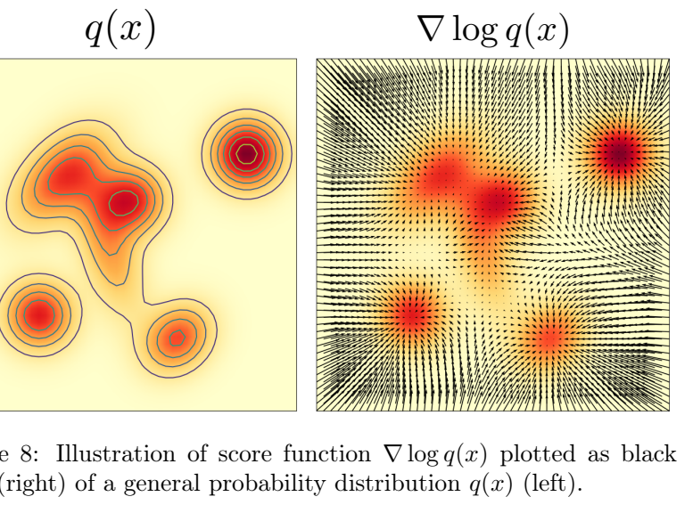
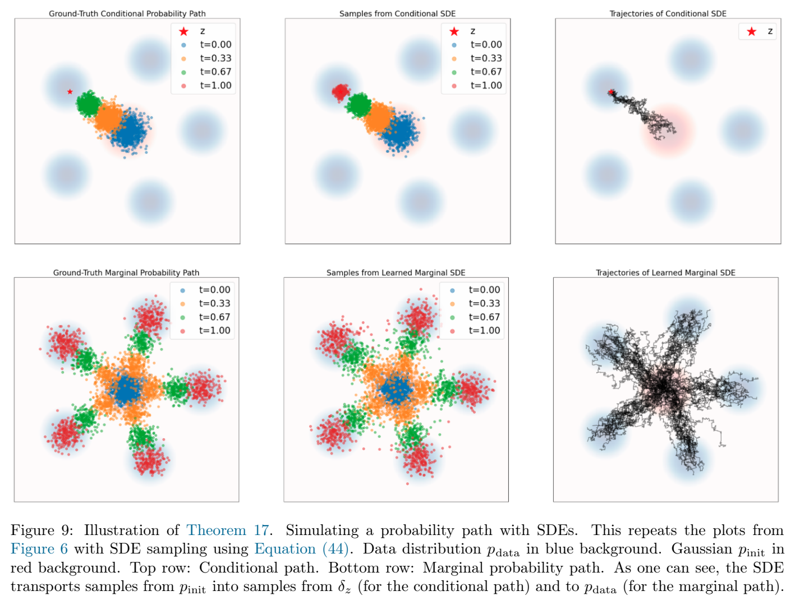
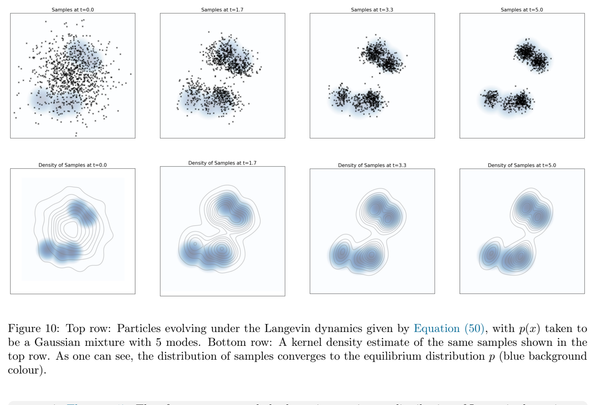

# 第 4 章 分数函数与分数匹配（Score Functions and Score Matching）

> 原文：[*An Introduction to Flow Matching and Diffusion Models*](https://arxiv.org/abs/2506.02070) by Peter Holderrieth & Ezra Erives
> 章节页码：PDF p.25–33
> 本章把第 3 章用「向量场」语言建立的内容改写为「分数函数」语言，从而把流模型（ODE）推广到扩散模型（SDE），并给出学习分数函数的方法——分数匹配与去噪分数匹配。

---

在上一节中，我们展示了如何用流匹配来训练一个流模型。在本节中，我们将讨论扩散模型，并演示如何用分数匹配来训练它们。

## 4.1 条件分数函数与边缘分数函数（Conditional and Marginal Score Functions）

到目前为止，我们研究的核心对象是向量场 $u_t(x)$。扩散模型 [45, 44] 采取了一种不同的视角，其核心是分数函数（score function）。因此，在本节中，我们将在分数函数的语言下重新表述前面学到的内容——提供一个全新的视角。

设 $q(x)$ 是一个任意的概率分布。那么 $q$ 的**分数函数（score function）**定义为
$$
\nabla \log q(x),
$$
也就是 $q$ 的对数似然关于 $x$ 的梯度。分数有一个直观的含义：$\nabla \log q(x)$ 是对数似然在 $x$ 处上升最快的方向。图 8 展示了这一概念。

让我们回到第 3 节中条件概率路径 $p_t(x\mid z)$ 与边缘概率路径 $p_t(x)$ 的设定。那么我们等价地可以定义**条件分数函数**为 $\nabla \log p_t(x\mid z)$，**边缘分数函数**为 $\nabla \log p_t(x)$。类似于式 (18)，边缘分数可以通过条件分数函数 $\nabla \log p_t(x\mid z)$ 表示为
$$
\nabla \log p_t(x) = \int \nabla \log p_t(x\mid z) \frac{p_t(x\mid z)\,p_{\text{data}}(z)}{p_t(x)} \, \mathrm{d}z. ^{ (38) }
$$

因此，条件分数与边缘分数之间的关系，类似于条件向量场与边缘向量场之间的关系。请注意，我们可以通过如下推导证明式 (38)：
$$
\nabla \log p_t(x) = \frac{\nabla p_t(x)}{p_t(x)} = \frac{\nabla \int p_t(x\mid z)\,p_{\text{data}}(z)\,\mathrm{d}z}{p_t(x)} = \int \nabla \log p_t(x\mid z) \frac{p_t(x\mid z)\,p_{\text{data}}(z)}{p_t(x)} \, \mathrm{d}z, ^{ (39) }
$$
其中我们用到了 $\partial \log y = 1/y$（其中 $y$ 不依赖求导变量时的链式法则）的组合规则，链式法则应用了两次。

> **Example 15（高斯概率路径的分数函数）**
>
> 对于高斯路径 $p_t(x\mid z) = \mathcal{N}(x;\,\alpha_t z,\,\beta_t^2 I_d)$，我们可以利用高斯概率密度的形式（见式 (97)）得到
> $$
> \nabla \log p_t(x\mid z) = \nabla \log \mathcal{N}(x;\,\alpha_t z,\,\beta_t^2 I_d) = -\frac{x - \alpha_t z}{\beta_t^2}. ^{ (40) }
> $$

注意，高斯概率路径的分数函数是 $x$ 和 $z$ 的线性函数。条件向量场 $u_t(x\mid z)$ 也具有同样的性质（见式 (20)）。因此两者可以互相转换，下面的命题就说明了这一点。

> **Proposition 1（高斯概率路径的转换公式）**
>
> 对于高斯概率路径 $p_t(x\mid z) = \mathcal{N}(\alpha_t z,\,\beta_t^2 I_d)$，条件（相应地，边缘）向量场与条件（相应地，边缘）分数由下式关联：
> $$
> u_t^{\text{target}}(x\mid z) = a_t \nabla \log p_t(x\mid z) + b_t x, \quad a_t = \frac{\beta_t^2}{\dot{\alpha}_t - \dot{\beta}_t \beta_t} \frac{\dot{\alpha}_t}{\alpha_t}, \quad b_t = \frac{\dot{\alpha}_t}{\alpha_t}. ^{ (41) }
> $$
> $$
> u_t^{\text{target}}(x) = a_t \nabla \log p_t(x) + b_t x. ^{ (42) }
> $$
>
> 特别地，条件（相应地，边缘）向量场可以从条件（相应地，边缘）分数恢复，反之亦然。
>
> **证明。** 对条件向量场和条件分数，我们可以推导：
> $$
> \begin{aligned}
> u_t^{\text{target}}(x\mid z)
> &= \left(\frac{\dot{\alpha}_t}{\alpha_t} - \frac{\dot{\beta}_t}{\beta_t}\right)\alpha_t z + \frac{\dot{\beta}_t}{\beta_t} x \\
> &\stackrel{(i)}{=} \left(\frac{\beta_t^2}{\alpha_t} \cdot \frac{\dot{\alpha}_t - \dot{\beta}_t\beta_t}{\beta_t^2}\right) \nabla \log p_t(x\mid z) + \frac{\dot{\alpha}_t}{\alpha_t} x \\
> &= \left(\frac{\beta_t^2}{\alpha_t}\frac{\dot{\alpha}_t - \dot{\beta}_t\beta_t}{\beta_t^2}\right) \nabla \log p_t(x\mid z) + \frac{\dot{\alpha}_t}{\alpha_t} x \\
> &= a_t \nabla \log p_t(x\mid z) + b_t x,
> \end{aligned}
> $$
> 其中 $(i)$ 处我们只做了一些代数化简。通过对 $z$ 求积分，同样的恒等式对边缘流向量场和边缘分数函数也成立：
> $$
> \begin{aligned}
> u_t^{\text{target}}(x) &= \int u_t^{\text{target}}(x\mid z) \frac{p_t(x\mid z)\,p_{\text{data}}(z)}{p_t(x)} \,\mathrm{d}z \\
> &= \int \left[a_t \nabla \log p_t(x\mid z) + b_t x\right] \frac{p_t(x\mid z)\,p_{\text{data}}(z)}{p_t(x)} \,\mathrm{d}z \\
> &\stackrel{(i)}{=} a_t \nabla \log p_t(x) + b_t x,
> \end{aligned}
> $$
> 其中 $(i)$ 处我们用了式 (38)，以及后验密度积分等于 1 的事实。$\blacksquare$

命题 1 令人惊讶之处在于：一旦我们学到了 $u_t^{\text{target}}$，我们也学到了分数函数 $\nabla \log p_t(x)$，反之亦然。因此，许多扩散模型通过神经网络学习分数函数 $\nabla \log p_t(x)$ 来代替直接学习向量场。我们将在 4.3 节讨论这一点。

> **Remark 16（分数的重新参数化）**
>
> 高斯概率路径在式 (41) 中的重新参数化之所以成立，是因为条件向量场和条件分数都是 $x$ 和 $z$ 的线性函数。一旦我们对 $z$ 边缘化（得到边缘向量场和边缘分数），两边都只是后验均值 $\mathbb{E}[z\mid x]$ 的线性重新参数化。
> 由此推出，任何能恢复 $\mathbb{E}[z\mid x]$ 的量，都可用来恢复无条件向量场与分数。而且，从数值/训练稳定性的角度，这么做甚至常常更可取。
> 一种常见的选择是直接用后验均值本身，它常被称为**去噪器（denoiser）**。形式上，我们定义条件去噪器与边缘去噪器为
> $$
> D_t(x\mid z) = z, \quad D_t(x) = \int z\,p_t(x\mid z)\,p_{\text{data}}(z)\,\mathrm{d}z \stackrel{(i)}{=} \frac{1}{\dot{\alpha}_t} \left(\beta_t u_t^{\text{target}}(x) - \frac{\dot{\beta}_t}{\beta_t} x\right). ^{ (43) }
> $$
>
> 其中 $(i)$ 由与命题 1 中类似的推导得出。去噪器有一个非常直观的解释：它是在给定被加噪数据 $x$ 的条件下，对干净数据 $z$ 的期望值。a 人们常把这类学习 $D_t$ 的模型称为**去噪扩散模型**，因为学习 $D_t$ 与学习 $u_t^{\text{target}}$ 在理论上是等价的。
>
> a 思考题：去噪器是否总是会输出一个「干净的」数据点？是或不是取决于什么？

## 4.2 用 SDE 采样（Sampling with SDEs）

到目前为止，我们已经演示了如何构造一个 ODE 轨迹 $X_t$，使其沿某个边缘向量场 $u_t^{\text{target}}$ 跟踪给定的概率路径 $p_t$。但这种方法只适用于流模型。扩散模型又该如何呢？利用分数函数，我们现在把上述结论推广到 SDE 上。

> **Theorem 17（SDE 扩展技巧，SDE Extension Trick）**
>
> 如前定义条件与边缘向量场 $u_t^{\text{target}}(x\mid z)$ 和 $u_t^{\text{target}}(x)$。那么，对任意扩散系数 $\sigma_t \geq 0$，我们可以通过在原 ODE 的动力学上加入随机动力学，按如下方式构造一条 SDE：
> $$
> \begin{aligned}
> X_0 &\sim p_{\text{init}}, \\
> \mathrm{d}X_t &= u_t^{\text{target}}(X_t)\,\mathrm{d}t + \tfrac{\sigma_t^2}{2} \nabla \log p_t(X_t)\,\mathrm{d}t + \sigma_t \,\mathrm{d}W_t \\
> &= \left( u_t^{\text{target}}(X_t) + \tfrac{\sigma_t^2}{2} \nabla \log p_t(X_t) \right) \mathrm{d}t + \sigma_t \,\mathrm{d}W_t, \\
> &\Rightarrow X_t \sim p_t \quad (0 \leq t \leq 1).
> \end{aligned} ^{ (44) }
> $$
> $$
> \Rightarrow \quad X_1 \sim p_{\text{data}}. ^{ (45) }
> $$
>
> 特别地，这条 SDE 的 $X_t$ 服从 $p_t$。注意，这些随机动力学与朗之万动力学密切相关，可以理解为：在保留边缘分布 $p_t$ 的同时注入噪声。我们将在注 20 中简要讨论朗之万动力学。

我们在图 9 中展示了定理 17 描述的动力学。可以看到，轨迹现在呈锯齿状，体现了 SDE 演化的随机性。但由定理 17 仍可知道，边缘 $p_t$ 保持不变。请注意，上述结果有一个惊人的地方：在**网络训练完成之后**，我们仍可以自由地选取任意扩散系数 $\sigma_t$。理论上，定理 17 对任何 $\sigma_t$ 的选取都成立。然而在实践中，我们同时受制于训练误差（神经网络并不能完美逼近边缘向量场和分数）以及模拟误差（例如当 $\sigma_t \gg 0$ 时，算法 2 中需要取极小的步长）。实际上，对于一个固定训练好的模型，存在一个经验上可确定的最优 $\sigma_t \geq 0$ [23, 1, 28]。2

> 2 再次强调，「最优 $\sigma_t$」的存在是模型不完美、算力有限的人为产物，而非连续极限下关于动力学的理论论断。

对于高斯概率路径，我们可以在学过边缘向量场后顺带免费得到分数函数。

> **Example 18（高斯情形的 SDE 扩展技巧）**
>
> 由命题 1，对高斯概率路径，定理 17 中的 SDE 可以只用分数函数表达为
> $$
> X_0 \sim p_{\text{init}}, \quad \mathrm{d}X_t = \left( a_t + \tfrac{\sigma_t^2}{2} \right) \nabla \log p_t(X_t) + b_t X_t \,\mathrm{d}t + \sigma_t \,\mathrm{d}W_t ^{ (46) }
> $$
> $$
> \Rightarrow \quad X_t \sim p_t \quad (0 \leq t \leq 1), ^{ (47) }
> $$
> 其中 $a_t$、$b_t$ 的定义同命题 1。

在本节余下的部分，我们将借由 Fokker-Planck 方程证明定理 17。Fokker-Planck 方程把连续性方程从 ODE 推广到 SDE。为此，我们先定义 Laplace 算子 $\Delta$：
$$
\Delta w_t(x) = \sum_{i=1}^{d} \frac{\partial^2 w_t(x)}{\partial x_i^2} = \mathrm{div}(\nabla w_t)(x), ^{ (48) }
$$
其中 $w_t : \mathbb{R}^d \to \mathbb{R}$ 是一个标量场。

> **Theorem 19（Fokker-Planck 方程）**
>
> 设 $p_t$ 是一条概率路径，考虑如下 SDE
> $$
> X_0 \sim p_{\text{init}}, \quad \mathrm{d}X_t = u_t(X_t)\,\mathrm{d}t + \sigma_t \,\mathrm{d}W_t.
> $$
> 则 $X_t$ 对所有 $0 \leq t \leq 1$ 的分布为 $p_t$，当且仅当 Fokker-Planck 方程成立：
> $$
> \partial_t p_t(x) = -\mathrm{div}(p_t u_t)(x) + \tfrac{\sigma_t^2}{2} \Delta p_t(x) \quad \text{对所有 } x \in \mathbb{R}^d,\ 0 \leq t \leq 1. ^{ (49) }
> $$
>
> Fokker-Planck 方程的完整证明见附录 B。注意，当 $\sigma_t = 0$ 时，定理 11 可以从 Fokker-Planck 方程中恢复。附加的 $\Delta p_t$ 项初看可能不太好理解。熟悉物理的读者会注意到，同样的项也出现在热传导方程中（它实际上是 Fokker-Planck 方程的一个特例）。热量通过介质扩散；我们现在也加入了一个扩散过程（不是物理上的，而是数学上的），因此会引入这个附加的 Laplace 项。现在，我们用 Fokker-Planck 方程来证明定理 17。

> **定理 17 的证明。** 由定理 19，我们需要证明式 (44) 定义的 SDE 满足 $p_t$ 的 Fokker-Planck 方程。我们通过直接计算来证：
> $$
> \begin{aligned}
> \partial_t p_t(x) &\stackrel{(i)}{=} -\mathrm{div}(p_t u_t^{\text{target}})(x) \\
> &\stackrel{(ii)}{=} -\mathrm{div}(p_t u_t^{\text{target}})(x) - \tfrac{\sigma_t^2}{2}\Delta p_t(x) + \tfrac{\sigma_t^2}{2}\Delta p_t(x) \\
> &\stackrel{(iii)}{=} -\mathrm{div}(p_t u_t^{\text{target}})(x) - \mathrm{div}\!\left( \tfrac{\sigma_t^2}{2} \nabla p_t\right)(x) + \tfrac{\sigma_t^2}{2}\Delta p_t(x) \\
> &\stackrel{(iv)}{=} -\mathrm{div}(p_t u_t^{\text{target}})(x) - \mathrm{div}\!\left( p_t \cdot \tfrac{\sigma_t^2}{2} \nabla \log p_t \right)(x) + \tfrac{\sigma_t^2}{2}\Delta p_t(x) \\
> &\stackrel{(v)}{=} -\mathrm{div}\!\left( p_t \left( u_t^{\text{target}} + \tfrac{\sigma_t^2}{2} \nabla \log p_t \right) \right)(x) + \tfrac{\sigma_t^2}{2}\Delta p_t(x),
> \end{aligned}
> $$
> 其中在 $(i)$ 处我们用了定理 11；在 $(ii)$ 处我们加、减了同一项；在 $(iii)$ 处我们用了 Laplace 算子的定义（式 (48)）；在 $(iv)$ 处我们用了 $\nabla \log p_t = \nabla p_t / p_t$；在 $(v)$ 处我们用了散度算子的线性性。上述推导表明，式 (44) 定义的 SDE 满足 $p_t$ 的 Fokker-Planck 方程。由定理 19，这就推出 $X_t \sim p_t$ 对 $0 \leq t \leq 1$ 成立，正是我们想要的结果。$\blacksquare$

> **Remark 20（可选：朗之万动力学，Langevin Dynamics）**
>
> 上述构造有一个著名的特殊情形：当概率路径为常值时，即 $p_t = p$ 对某个固定分布 $p$ 成立。这时我们取 $u_t^{\text{target}} = 0$，就得到 SDE
> $$
> \mathrm{d}X_t = \tfrac{\sigma_t^2}{2} \nabla \log p(X_t) \,\mathrm{d}t + \sigma_t \,\mathrm{d}W_t, ^{ (50) }
> $$
> 这就是著名的**朗之万动力学**。$p_t$ 为常值意味着 $\partial_t p_t(x) = 0$。由定理 17 立即可得，这些动力学满足静态路径 $p_t = p$ 的 Fokker-Planck 方程。因此，我们可以得出结论：$p$ 是朗之万动力学的**平稳分布**：
> $$
> X_0 \sim p \;\Rightarrow\; X_t \sim p \quad (t \geq 0).
> $$
> 与许多马尔可夫过程一样，这些动力学在相当一般的条件下会收敛到平稳分布 $p$。也就是说，如果我们取 $X_0 \sim p' \neq p$，那么 $X_t \sim p_t$，并在温和条件下 $p_t \to p$。

这一事实使朗之万动力学极其有用，并因此成为例如分子动力学模拟以及贝叶斯统计与自然科学中众多马尔可夫链蒙特卡洛（MCMC）方法的基础。特别地，Ornstein-Uhlenbeck 过程就是 $p$ 为高斯分布时朗之万动力学的特例，也是早期扩散模型构造的基础。

> **Remark 21（可选：GLASS Flows——用 ODE 实现随机演化）**
>
> 与 ODE 相比，SDE 采样最显著的性质是演化变成了随机的，也就是说初始点 $X_0$ 不再完全决定 $t > 0$ 时的 $X_t$。出人意料的是，仅凭 ODE 也可以通过一个叫 **GLASS Flows** [20] 的小采样技巧获得同样的随机转移。这让我们既可以利用 SDE 的随机性（例如借助搜索算法），又能保留 ODE 的高效率。

## 4.3 分数匹配（Score Matching）

接下来我们要说明如何学习边缘分数函数 $\nabla \log p_t(x)$。显然，对于高斯概率路径，借助命题 1 我们只要把 $u_t^{\text{target}}(x)$ 做个线性变换即可。但一般情形下该怎么办？事实上我们也可以直接学习边缘分数函数。为了逼近边缘分数 $\nabla \log p_t$，我们使用一个**分数网络（score network）** $s_t^\theta : \mathbb{R}^d \times [0,1] \to \mathbb{R}^d$。和之前一样，我们可以设计分数匹配损失与去噪分数匹配损失：
$$
\begin{aligned}
\mathcal{L}_{\text{SM}}(\theta) &= \mathbb{E}_{t \sim \text{Unif},\, z \sim p_{\text{data}},\, x \sim p_t(\cdot \mid z)} \Big[\, \big\| s_t^\theta(x) - \nabla \log p_t(x) \big\|^2 \,\Big] \quad &\text{▶ score matching loss} \\
\mathcal{L}_{\text{CSM}}(\theta) &= \mathbb{E}_{t \sim \text{Unif},\, z \sim p_{\text{data}},\, x \sim p_t(\cdot \mid z)} \Big[\, \big\| s_t^\theta(x) - \nabla \log p_t(x\mid z) \big\|^2 \,\Big] \quad &\text{▶ conditional score matching loss}
\end{aligned}
$$

其中关键区别是用边缘分数 $\nabla \log p_t(x)$ 还是用条件分数 $\nabla \log p_t(x\mid z)$。和之前一样，理想情况下我们想去极小化分数匹配损失，但由于不知道 $\nabla \log p_t(x)$，这无法实现。但与之前类似，去噪分数匹配损失是一个可处理的替代：

> **Theorem 22**
>
> 分数匹配损失与去噪分数匹配损失在差一个常数意义下相等：
> $$
> \mathcal{L}_{\text{SM}}(\theta) = \mathcal{L}_{\text{CSM}}(\theta) + C,
> $$
> 其中 $C$ 与参数 $\theta$ 无关。因此它们的梯度一致：
> $$
> \nabla_\theta \mathcal{L}_{\text{SM}}(\theta) = \nabla_\theta \mathcal{L}_{\text{CSM}}(\theta).
> $$
> 特别地，对极小值点 $\theta^\star$ 必有 $s_t^{\theta^\star} = \nabla \log p_t$。
>
> **证明。** 注意 $\nabla \log p_t$ 的公式（式 (38)）和 $u_t^{\text{target}}$ 的公式（式 (18)）形式完全相同。因此，把定理 12 的证明中把 $u_t^{\text{target}}$ 替换为 $\nabla \log p_t$，证明就完全一样。$\blacksquare$

> **Example 23（去噪扩散模型：高斯概率路径的分数匹配）**
>
> 让我们把去噪分数匹配损失具体地实例化到 $p_t(x\mid z) = \mathcal{N}(\alpha_t z,\,\beta_t^2 I_d)$ 的情形。由式 (40)，条件分数 $\nabla \log p_t(x\mid z)$ 的公式为
> $$
> \nabla \log p_t(x\mid z) = -\frac{x - \alpha_t z}{\beta_t^2}. ^{ (51) }
> $$
>
> 代入此公式，条件分数匹配损失变为：
> $$
> \begin{aligned}
> \mathcal{L}_{\text{CSM}}(\theta) &= \mathbb{E}_{t \sim \text{Unif},\, z \sim p_{\text{data}},\, x \sim p_t(\cdot \mid z)} \left[ \left\| s_t^\theta(x) + \frac{x - \alpha_t z}{\beta_t^2} \right\|^2 \right] \\
> &\stackrel{(i)}{=} \mathbb{E}_{t \sim \text{Unif},\, z \sim p_{\text{data}},\, \epsilon \sim \mathcal{N}(0, I_d)} \left[ \left\| s_t^\theta(\alpha_t z + \beta_t \epsilon) + \frac{\epsilon}{\beta_t} \right\|^2 \right] \\
> &= \mathbb{E}_{t \sim \text{Unif},\, z \sim p_{\text{data}},\, \epsilon \sim \mathcal{N}(0, I_d)} \left[ \beta_t^2 \left\| \beta_t s_t^\theta(\alpha_t z + \beta_t \epsilon) + \epsilon \right\|^2 \right]
> \end{aligned}
> $$
> 其中 $(i)$ 处我们代入式 (28)，把 $x$ 替换为 $\alpha_t z + \beta_t \epsilon$。注意，网络 $s_t^\theta$ 本质上在学预测用于加噪一个数据样本 $z$ 的噪声。这解释了为什么上述训练损失叫**去噪分数匹配**。很快人们就意识到，当 $\beta_t \approx 0$ 时（也就是只加很少噪声时）该损失在数值上不稳定（去噪分数匹配只在加足够噪声时才稳定）。因此，在一些关于去噪扩散模型的早期工作（参见 *Denoising Diffusion Probabilistic Models* [17]）中，建议把损失里的 $1/\beta_t^2$ 系数去掉，并把 $s_t^\theta$ 重新参数化为一个噪声预测网络 $\epsilon_t^\theta : \mathbb{R}^d \times [0,1] \to \mathbb{R}^d$：
> $$
> -\beta_t s_t^\theta(x) = \epsilon_t^\theta(x) \quad \Rightarrow \quad \mathcal{L}_{\text{DDPM}}(\theta) = \mathbb{E}_{t \sim \text{Unif},\, z \sim p_{\text{data}},\, \epsilon \sim \mathcal{N}(0, I_d)} \big[\, \big\| \epsilon_t^\theta(\alpha_t z + \beta_t \epsilon) - \epsilon \big\|^2 \,\big].
> $$
> 同理，网络 $\epsilon_t^\theta$ 本质上也在学预测用于加噪一个数据样本 $z$ 的噪声。算法 4 总结了训练流程。

> **Algorithm 4（高斯概率路径的分数匹配训练流程）**
>
> **输入：** 来自 $p_{\text{data}}$ 的样本集 $\{z\}$，分数网络 $s_t^\theta$ 或噪声预测网络 $\epsilon_t^\theta$。
>
> 1. `for` 数据的小批量 $\mathcal{B} \sim p_{\text{data}}$ `do`
> 2. &nbsp;&nbsp;&nbsp;&nbsp;从数据集中采样一个数据样本 $z$。
> 3. &nbsp;&nbsp;&nbsp;&nbsp;采样随机时间 $t \sim \text{Unif}[0,1]$。
> 4. &nbsp;&nbsp;&nbsp;&nbsp;采样噪声 $\epsilon \sim \mathcal{N}(0, I_d)$。
> 5. &nbsp;&nbsp;&nbsp;&nbsp;设置 $x_t = \alpha_t z + \beta_t \epsilon$（一般情形：$x_t \sim p_t(\cdot \mid z)$）。
> 6. &nbsp;&nbsp;&nbsp;&nbsp;计算损失
> $$
> \begin{aligned}
> \mathcal{L}(\theta) &= \left\| s_t^\theta(x_t) + \frac{\epsilon}{\beta_t} \right\|^2 \\
&\quad \text{（一般情形：} \mathcal{L}(\theta) = \| s_t^\theta(x_t) - \nabla \log p_t(x_t \mid z) \|^2 \text{）}
> \end{aligned}
> $$
> &nbsp;&nbsp;&nbsp;&nbsp;&nbsp;&nbsp;&nbsp;&nbsp;**或者等价地：** $\mathcal{L}(\theta) = \| \epsilon_t^\theta(x_t) - \epsilon \|^2$。
> 7. &nbsp;&nbsp;&nbsp;&nbsp;用梯度下降对 $\mathcal{L}(\theta)$ 更新模型参数 $\theta$。
> 8. `end for`

下面我们总结本节的关键结果。

> **Summary 24（分数函数、分数匹配与随机采样）**
>
> 设 $p_t(x\mid z)$、$p_t(x)$ 是条件与边缘概率路径。条件分数函数为 $\nabla \log p_t(x\mid z)$，边缘分数函数为 $\nabla \log p_t(x)$。对任意扩散系数 $\sigma_t \geq 0$，下面 SDE 的轨迹沿着这条概率路径：
> $$
> X_0 \sim p_{\text{init}}, \quad \mathrm{d}X_t = \left( u_t^{\text{target}}(X_t) + \tfrac{\sigma_t^2}{2} \nabla \log p_t(X_t) \right) \mathrm{d}t + \sigma_t \,\mathrm{d}W_t ^{ (52) }
> $$
> $$
> \Rightarrow \quad X_t \sim p_t \quad (0 \leq t \leq 1), ^{ (53) }
> $$
> 其中 $u_t^{\text{target}}(x)$ 是和之前一样的边缘向量场（见式 (18)）。
>
> **分数匹配。** 为了学习边缘分数函数 $\nabla \log p_t(x)$，我们用一个分数网络 $s_t^\theta$，并通过去噪分数匹配训练它：
> $$
> \mathcal{L}_{\text{CSM}}(\theta) = \mathbb{E}_{z \sim p_{\text{data}},\, t \sim \text{Unif},\, x \sim p_t(\cdot \mid z)} \big[\, \big\| s_t^\theta(x) - \nabla \log p_t(x\mid z) \big\|^2 \,\big] \quad \text{(denoising score matching loss)} ^{ (54) }
> $$
>
> **高斯概率路径。** 对于最常用的高斯概率路径 $p_t(x\mid z) = \mathcal{N}(x;\, \alpha_t z,\, \beta_t^2 I_d)$，我们不必分别训练 $s_t^\theta$ 和 $u_t^\theta$，因为可以用下面的公式相互转换：
> $$
> u_t^\theta(x) = a_t s_t^\theta(x) + b_t x, \quad a_t = \frac{\beta_t^2}{\alpha_t} \frac{\dot{\alpha}_t - \dot{\beta}_t \beta_t}{\beta_t^2}, \quad b_t = \frac{\dot{\alpha}_t}{\alpha_t}.
> $$
> 训练完成后，我们就可以对如下 SDE 进行模拟：
> $$
> X_0 \sim p_{\text{init}}, \quad \mathrm{d}X_t = \left( 1 + \tfrac{\sigma_t^2}{2 a_t} \right) u_t^\theta(X_t) - \tfrac{\sigma_t^2 b_t}{2 a_t} X_t \,\mathrm{d}t + \sigma_t \,\mathrm{d}W_t ^{ (55) }
> $$
> $$
> = \left( a_t + \tfrac{\sigma_t^2}{2} \right) s_t^\theta(X_t) + b_t X_t \,\mathrm{d}t + \sigma_t \,\mathrm{d}W_t ^{ (56) }
> $$
> 选取任意扩散系数 $\sigma_t \geq 0$，就可以得到近似样本 $X_1 \sim p_{\text{data}}$。最优的 $\sigma_t \geq 0$ 可以凭经验确定。
