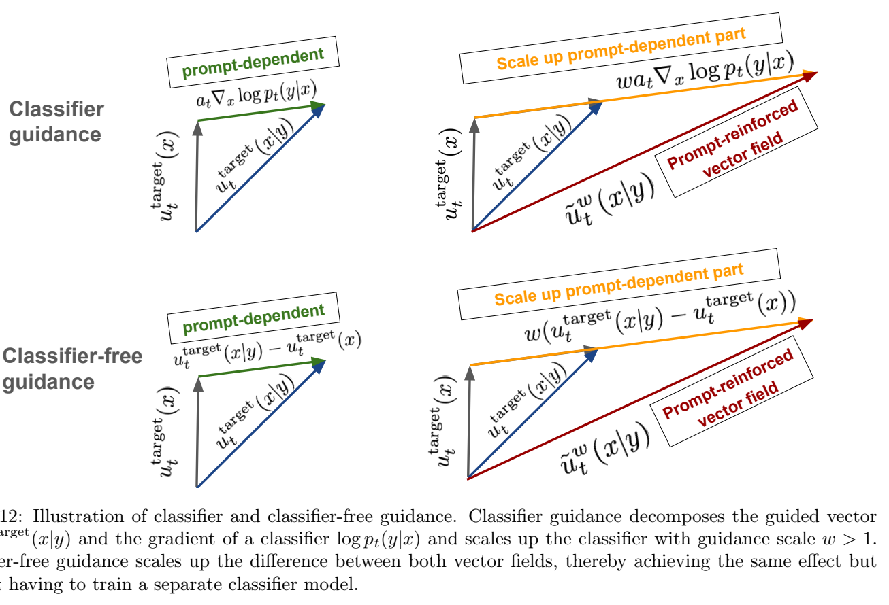
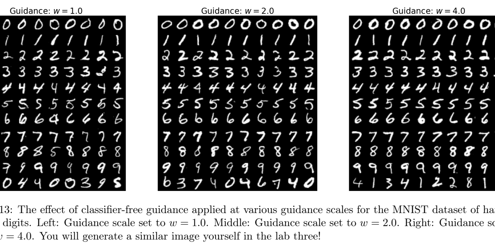

# 第 5 章 引导（Guidance）：如何对提示词进行条件生成

> 原文：[*An Introduction to Flow Matching and Diffusion Models*](https://arxiv.org/abs/2506.02070) by Peter Holderrieth & Ezra Erives
> 章节页码：PDF p.34–39
> 本章讨论引导（guidance）问题：如何让无条件数据分布 $p_{\text{data}}(z)$ 的生成模型，转而从条件分布 $p_{\text{data}}(z \mid y)$ 采样，$y$ 可能是文本提示、类别标签等。

---

到目前为止，我们讨论的生成模型都是**无引导（unguided）**的，例如一个图像模型只是「生成一张图像」。用数学的话说，这意味着我们的模型返回的是无条件数据分布 $p_{\text{data}}(z)$ 的样本。然而在大多数情况下，我们的目标不是仅仅生成某个对象，而是要**在某些额外信息条件下**生成对象。换言之，我们希望引导模型生成某一类对象。例如，可以设想一个图像生成模型接受一段文本提示 $y$，然后生成一张与该文本提示匹配的图像 $x$。正如第 1 节所讨论的，这意味着我们想从 $p_{\text{data}}(z \mid y)$，即**以 $y$ 为条件的引导数据分布**中采样。我们将在本节讨论这一点。

> **Remark 25（术语说明）**
>
> 为了避免与「以 $z \sim p_{\text{data}}$ 为条件」（条件概率路径/向量场）一词发生符号和术语上的冲突，我们特意使用「**引导（guided）**」一词，特指以 $y$（如文本提示）为条件的情形。

## 5.1 朴素引导（Vanilla Guidance）

首先，我们讨论构建一个引导生成模型的「标准」做法。简短的回答是：**在训练和推理时把提示 $y$ 一并喂给网络**，其它一切照旧。下面我们把它形式化。设条件变量或提示 $y$ 取值于某个空间 $\mathcal{Y}$。当 $y$ 是文本提示时，$\mathcal{Y}$ 就是所有文本的空间；当 $y$ 是某个离散的类别标签时，$\mathcal{Y}$ 就是离散的。我们对 $\mathcal{Y}$ 没有任何约束。

我们定义一个**引导扩散模型**由一个由神经网络参数化的引导向量场 $u_t^\theta(\cdot \mid y)$，以及一个时变扩散系数 $\sigma_t$ 共同组成：

$$
\begin{aligned}
\text{神经网络:}\quad & u_t^\theta : \mathbb{R}^d \times \mathcal{Y} \times [0,1] \to \mathbb{R}^d,\quad (x, y, t) \mapsto u_t^\theta(x \mid y) \\
\text{固定:}\quad & \sigma_t : [0,1] \to [0, \infty),\quad t \mapsto \sigma_t
\end{aligned}
$$

注意它与 Summary 7 的区别：这里我们**额外地**用输入 $y$ 来引导 $u_t^\theta$。对任意这样的 $y \in \mathcal{Y}$，可按下述方式从该模型中采样：

$$
\begin{array}{rl}
\text{初始化: } & X_0 \sim p_{\text{init}} \qquad \blacktriangleright \text{用简单分布（如高斯）初始化} \\
\text{模拟: } & \mathrm{d}X_t = u_t^\theta(X_t \mid y)\,\mathrm{d}t + \sigma_t\,\mathrm{d}W_t \qquad \blacktriangleright \text{从 } t=0 \text{ 到 } t=1 \text{ 模拟 SDE} \\
\text{目标: } & X_1 \sim p_{\text{data}}(\cdot \mid y) \qquad \blacktriangleright \text{目标是让 } X_1 \text{ 的分布为 } p_{\text{data}}(\cdot \mid y)
\end{array}
$$

当 $\sigma_t = 0$ 时，我们称这样的模型为**引导流模型（guided flow model）**。在下文中，为简洁起见我们只关注流匹配与流模型；不过所有内容对一般情形同样成立。

接下来要问的是：如何训练一个引导流模型 $u_t^\theta(x \mid y)$？一个朴素的思路是：固定 $y$ 的某个取值，把数据分布直接取为 $p_{\text{data}}(\cdot \mid y)$。这样我们就回到了无引导的生成问题，可以用条件流匹配目标构造生成模型：
$$
\mathbb{E}_{z \sim p_{\text{data}}(\cdot \mid y),\, x \sim p_t(\cdot \mid z)} \big[\, \big\| u_t^\theta(x \mid y) - u_t^{\text{target}}(x \mid z) \big\|^2 \,\big]. ^{ (57) }
$$

请注意，标签 $y$ 并不影响条件概率路径 $p_t(\cdot \mid z)$ 或条件向量场 $u_t^{\text{target}}(x \mid z)$（原则上可以让它依赖 $y$，但这里不这么做）。把上面的期望按所有可能的 $y$ 展开，我们便得到一个**引导条件流匹配目标**：
$$
\mathcal{L}_{\text{CFM}}^{\text{guided}}(\theta) = \mathbb{E}_{(z, y) \sim p_{\text{data}}(z, y),\, t \sim \text{Unif}[0,1],\, x \sim p_t(\cdot \mid z)} \big[\, \big\| u_t^\theta(x \mid y) - u_t^{\text{target}}(x \mid z) \big\|^2 \,\big]. ^{ (58) }
$$

式 (58) 给出的引导目标与式 (26) 中的无引导目标的主要区别是：这里我们采样的是 $(z, y) \sim p_{\text{data}}$ 而不仅仅是 $z \sim p_{\text{data}}$。原因在于：原则上我们的数据分布是关于「图像 $z$ 与文本提示 $y$」的联合分布。在实践中，这意味着对式 (58) 的 PyTorch 实现会用一个能同时返回 $z$ 和 $y$ 批次的 dataloader。

## 5.2 无分类器引导（Classifier-Free Guidance）

理论上，朴素引导应当能给出对 $p_{\text{data}}(\cdot \mid y)$ 的忠实采样。但人们很快从经验上发现，用这种方式生成的图像样本与期望的标签 $y$ 契合得不够好（见图 11）。这有多种可能的原因：模型可能欠拟合（即我们实际上没有学到真实的边缘向量场），或者数据本身就不完美（例如来自万维网的文本-图像对存在大量错误）。因此，要想真正生成与提示更契合的样本，必须找到一种方式**人为地强化提示变量 $y$**。实现这一目标的主流技术叫做**无分类器引导（classifier-free guidance）**，它被最前沿的扩散模型广泛使用，我们将在下文介绍。

![图 11：以 $y =$「corgi dog」为提示/类别的图像生成。**左**：用朴素引导生成的样本，图像与提示契合得不好。**右**：用分类器引导（classifier guidance）以 $w = 4$ 生成的样本。可见无分类器引导提升了对提示的契合度。引自 [18]。](assets/fig_05_11.png)

**分类器引导。** 为简洁起见，我们把讨论集中在高斯概率路径上。由式 (15)，高斯条件概率路径为 $p_t(\cdot \mid z) = \mathcal{N}(\alpha_t z,\, \beta_t^2 I_d)$，其中噪声调度 $\alpha_t$、$\beta_t$ 连续可微、单调，且满足 $\alpha_0 = \beta_1 = 0$、$\alpha_1 = \beta_0 = 1$。进一步由命题 1，可以把引导向量场 $u_t^{\text{target}}(x \mid y)$ 用引导分数函数 $\nabla \log p_t(x \mid y)$ 表示为
$$
u_t^{\text{target}}(x \mid y) = a_t \nabla \log p_t(x \mid y) + b_t x. ^{ (59) }
$$

下一步，注意 $p_t(x \mid y)$ 是一个条件密度。因此用贝叶斯公式可把引导分数改写为
$$
p_t(x \mid y) = \frac{p_t(x)\,p_t(y \mid x)}{p_t(y)}, ^{ (60) }
$$
$$
\nabla \log p_t(x \mid y) = \nabla \log \left( \frac{p_t(x)\,p_t(y \mid x)}{p_t(y)} \right) = \nabla \log p_t(x) + \nabla \log p_t(y \mid x), ^{ (61) }
$$

其中我们用了梯度是关于 $x$ 求的，所以 $\nabla \log p_t(y) = 0$。于是我们可以改写为
$$
u_t^{\text{target}}(x \mid y) = b_t x + a_t \big( \nabla \log p_t(x) + \nabla \log p_t(y \mid x) \big) = u_t^{\text{target}}(x) + a_t \nabla \log p_t(y \mid x).
$$

注意上述等式的形式：**引导向量场 $u_t^{\text{target}}(x \mid y)$ 等于无引导向量场 $u_t^{\text{target}}(x)$ 加上引导变量 $y$ 的似然 $p_t(y \mid x)$ 的梯度**。人们观察到生成的图像与提示 $y$ 契合得不够好，最自然的想法就是把 $\nabla \log p_t(y \mid x)$ 这一项的贡献放大，得到
$$
\tilde{u}_t^w(x \mid y) = u_t^{\text{target}}(x) + w\, a_t \nabla \log p_t(y \mid x) \quad \text{(classifier guidance)} ^{ (62) }
$$

其中 $w > 1$ 称为**引导强度（guidance scale）**。那 $\nabla \log p_t(y \mid x)$ 怎么学呢？注意它可以视为某种对**带噪数据**的分类器（即它在给定 $x$ 时输出 $y$ 的对数似然）。因此只要用监督学习就能学出来。这便引出了**分类器引导（classifier guidance）** [11, 43]（见图 12）。分类器引导后来基本被无分类器引导取代，所以这里不再深入讨论。但它正是下面要讲的无分类器引导的基础。最后请注意：$w=1$ 时，$\tilde{u}_t^w(x \mid y) = u_t^{\text{target}}(x \mid y)$，即**并不**等于「真正的」引导向量场；式 (62) 本质上是一个启发式（heuristic）。

**无分类器引导。** 分类器引导原则上是可行的，但有两个明显的不便：一是我们得在流/扩散模型之外再训练一个分类器，也就是从 1 个网络变成 2 个网络；二是当 $y$ 维度很高时（例如是一段文本提示而非简单类别），$p_t(y \mid x)$ 可能非常难学，$\nabla \log p_t(y \mid x)$ 也很难求。正因如此，文献中引入了**无分类器引导** [18]。它在理论效果上与分类器引导等价，但**不需要单独训练一个分类器**。

为此，我们再次利用恒等式
$$
\nabla \log p_t(x \mid y) = \nabla \log p_t(x) + \nabla \log p_t(y \mid x)
$$
来推导：
$$
\begin{aligned}
\tilde{u}_t^w(x \mid y) &= u_t^{\text{target}}(x) + w\, a_t \nabla \log p_t(y \mid x) \\
&= u_t^{\text{target}}(x) + w\, a_t \big( \nabla \log p_t(x \mid y) - \nabla \log p_t(x) \big) \\
&= u_t^{\text{target}}(x) - (w\, b_t x + w\, a_t \nabla \log p_t(x)) + (w\, b_t x + w\, a_t \nabla \log p_t(x \mid y)) \\
&= (1 - w) u_t^{\text{target}}(x) + w\, u_t^{\text{target}}(x \mid y).
\end{aligned}
$$

于是我们可以把缩放后的引导向量场 $\tilde{u}_t^w(x \mid y)$ 表达为无引导向量场 $u_t^{\text{target}}(x)$ 和引导向量场 $u_t^{\text{target}}(x \mid y)$ 的线性组合。一种很自然的想法是：分别训练一个无引导的 $u_t^{\text{target}}(x)$（用式 (26)）和一个引导的 $u_t^{\text{target}}(x \mid y)$（用式 (58)），然后在推理时把它们组合得到 $\tilde{u}_t^w(x \mid y)$。「可是！」你也许会问：「那岂不是要训练两个模型？」事实是我们可以**只用一个模型**完成：把标签集扩充一个**额外的空标签 $\varnothing$**，用它表示「没有条件」。于是 $u_t^{\text{target}}(x) = u_t^{\text{target}}(x \mid \varnothing)$。这样就**不必再单独训练一个模型来强化某个假想分类器的效果**。这种在一个模型里同时训练条件与无条件模型（并在之后强化条件效果）的方法，就叫**无分类器引导（CFG, classifier-free guidance）** [18]（见图 12）。

> **Remark 26（对一般概率路径的推导）**
>
> 注意如下构造
> $$
> \tilde{u}_t^w(x \mid y) = (1 - w) u_t^{\text{target}}(x) + w\, u_t^{\text{target}}(x \mid y)
> $$
> 对**任何**概率路径都成立，不只是高斯路径。$w=1$ 时显然有 $\tilde{u}_t^w(x \mid y) = u_t^{\text{target}}(x \mid y)$。我们用高斯路径来推导只是为了直观地展示这个构造背后的想法，特别是它放大了某个假想「分类器」贡献的机制。

**训练与无分类器引导。** 现在我们必须修改式 (58) 中的引导条件流匹配目标，以兼容 $y = \varnothing$ 的可能性。难点在于：当从 $(z, y) \sim p_{\text{data}}$ 采样时，永远取不到 $y = \varnothing$。因此我们必须人为地引入 $y = \varnothing$ 的可能。具体的做法是：引入一个超参数 $\eta$，表示把原标签 $y$ 丢弃并替换为 $\varnothing$ 的概率。由此得到 CFG 条件流匹配训练目标：
$$
\mathcal{L}_{\text{CFM}}^{\text{CFG}}(\theta) = \mathbb{E}_{\square} \big[\, \big\| u_t^\theta(x \mid y) - u_t^{\text{target}}(x \mid z) \big\|^2 \,\big], ^{ (63) }
$$
$$
\square = (z, y) \sim p_{\text{data}}(z, y),\; t \sim \text{Unif}[0,1],\; x \sim p_t(\cdot \mid z),\; \text{以概率 } \eta \text{ 把 } y \text{ 替换为 } \varnothing. ^{ (64) }
$$

> **Algorithm 5（高斯概率路径的无分类器引导训练，$p_t(x \mid z) = \mathcal{N}(x; \alpha_t z, \beta_t^2 I_d)$）**
>
> **输入：** 配对数据集 $(z, y) \sim p_{\text{data}}$，神经网络 $u_t^\theta$。
>
> 1. `for` 数据的小批量 `do`
> 2. &nbsp;&nbsp;&nbsp;&nbsp;从数据集中采样一个数据样本 $(z, y)$。
> 3. &nbsp;&nbsp;&nbsp;&nbsp;采样随机时间 $t \sim \text{Unif}[0,1]$。
> 4. &nbsp;&nbsp;&nbsp;&nbsp;采样噪声 $\epsilon \sim \mathcal{N}(0, I_d)$。
> 5. &nbsp;&nbsp;&nbsp;&nbsp;设置 $x = \alpha_t z + \beta_t \epsilon$。
> 6. &nbsp;&nbsp;&nbsp;&nbsp;以概率 $\eta$ 把标签丢掉：$y \leftarrow \varnothing$。
> 7. &nbsp;&nbsp;&nbsp;&nbsp;计算损失
> $$
> \mathcal{L}(\theta) = \big\| u_t^\theta(x \mid y) - (\dot{\alpha}_t z + \dot{\beta}_t \epsilon) \big\|^2.
> $$
> 8. &nbsp;&nbsp;&nbsp;&nbsp;用梯度下降对 $\mathcal{L}(\theta)$ 更新模型参数 $\theta$。
> 9. `end for`

下面我们给出本节的小结。

> **Summary 27（流模型的无分类器引导）**
>
> 给定无引导的边缘向量场 $u_t^{\text{target}}(x \mid \varnothing)$、引导的边缘向量场 $u_t^{\text{target}}(x \mid y)$，以及引导强度 $w > 1$，我们定义**无分类器引导向量场**为
> $$
> \tilde{u}_t^w(x \mid y) = (1 - w)\, u_t^{\text{target}}(x \mid \varnothing) + w\, u_t^{\text{target}}(x \mid y). ^{ (65) }
> $$
>
> 用**同一个**神经网络去逼近 $u_t^{\text{target}}(x \mid \varnothing)$ 和 $u_t^{\text{target}}(x \mid y)$，就得到下面的无分类器引导 CFM（CFG-CFM）目标：
> $$
> \mathcal{L}_{\text{CFM}}^{\text{CFG}}(\theta) = \mathbb{E}_{\square} \big[\, \big\| u_t^\theta(x \mid y) - u_t^{\text{target}}(x \mid z) \big\|^2 \,\big], ^{ (66) }
> $$
> $$
> \square = (z, y) \sim p_{\text{data}}(z, y),\; t \sim \text{Unif}[0,1],\; x \sim p_t(\cdot \mid z),\; \text{以概率 } \eta \text{ 把 } y \text{ 替换为 } \varnothing. ^{ (67) }
> $$

用大白话说，$\mathcal{L}_{\text{CFM}}^{\text{CFG}}$ 可以按如下方式近似：

$$
\begin{array}{rl}
(z, y) \sim p_{\text{data}}(z, y) & \blacktriangleright \text{从数据分布中采样 } (z, y)。\\
t \sim \text{Unif}[0, 1) & \blacktriangleright \text{在 } [0, 1) \text{ 上均匀采样 } t。\\
x \sim p_t(x \mid z) & \blacktriangleright \text{从条件概率路径 } p_t(x \mid z) \text{ 中采样 } x。\\
\text{以概率 } \eta,\; y \leftarrow \varnothing & \blacktriangleright \text{以概率 } \eta \text{ 把 } y \text{ 替换为 } \varnothing。\\
\widehat{\mathcal{L}_{\text{CFM}}^{\text{CFG}}}(\theta) = \| u_t^\theta(x \mid y) - u_t^{\text{target}}(x \mid z) \|^2 & \blacktriangleright \text{把模型回归到条件向量场。}
\end{array}
$$

推理时，对一个固定 $y$，可以这样采样：

$$
\begin{array}{rl}
\textbf{初始化:} & X_0 \sim p_{\text{init}}(x) \qquad \blacktriangleright \text{用简单分布（如高斯）初始化} \\
\textbf{模拟:} & \mathrm{d}X_t = \tilde{u}_t^\theta(X_t \mid y)\,\mathrm{d}t \qquad \blacktriangleright \text{从 } t=0 \text{ 到 } t=1 \text{ 模拟 ODE} \\
\textbf{样本:} & X_1 \qquad \blacktriangleright \text{目标是让 } X_1 \text{ 契合引导变量 } y
\end{array}
$$

> 请注意：当我们用 $w > 1$ 时，$X_1$ 的分布未必与 $p_{\text{data}}(\cdot \mid y)$ 一致。但在经验上，这种做法能更好地契合条件。**因此无分类器引导本质上是一个启发式（heuristic）**，它的合理性主要来自其卓越的实证效果。事实上，现在你看到的几乎所有 AI 生成的图像或视频都重度依赖 $w \geq 4$ 的无分类器引导。

在图 11 中，我们展示了在 128×128 ImageNet 上基于类别的无分类器引导，如 [18] 中所示。类似地，在图 13 中，我们可视化了对 MNIST 数据集应用无分类器引导时，不同 $w$ 下的采样效果。
