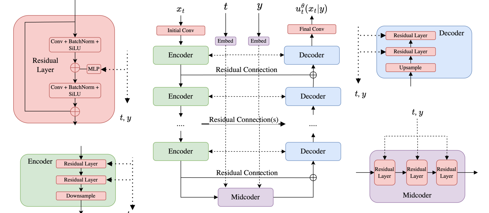

# 第 6 章 构建大规模图像或视频生成器（Large-Scale Generators）

> 原文：[*An Introduction to Flow Matching and Diffusion Models*](https://arxiv.org/abs/2506.02070) by Peter Holderrieth & Ezra Erives
> 章节页码：PDF p.41–53
> 本章讨论如何把前面章节的理论付诸实践，构建一个能生成图像和视频的大规模生产级模型。我们将讨论神经网络架构选择（U-Net、DiT）、潜空间（latent space）、以及两个案例研究（Stable Diffusion 3 与 Meta Movie Gen Video）。

---

在前面的章节中，我们学习了如何训练一个流匹配（flow matching）或扩散模型来从分布 $p_{\text{data}}(x)$ 中采样。该方法是通用的，可以应用于各种不同的数据类型和应用场景。在本节中，我们将深入研究大规模图像和视频生成的特殊情况，包括诸如 FLUX 2.0、Stable Diffusion 3、Nano Banana、VEO-3 以及 Meta Movie Gen Video 等知名模型。最后，我们将在实验中把迄今为止学到的内容付诸实践，从零开始构建我们自己版本的此类模型！本节大致安排如下：

1. **神经网络架构**：我们首先讨论如何将原始的调节输入（包括时间 $t$ 和引导变量 $y$（即离散类别标签或原始文本））转换或嵌入为向量形式，以便模型 $u^\theta(x_t \mid y)$ 能够消化。然后我们讨论 $u^\theta(x_t \mid y)$ 的流行架构选择，包括 U-Net 和扩散 Transformer（diffusion transformer）。
2. **潜在空间（latent space）**：我们讨论变分自编码器（variational autoencoder），它允许在更低维度的潜在空间中进行生成建模，从而实现超高分辨率的图像生成。
3. **案例研究**：最后，我们将深入研究上述两个最先进的图像和视频模型 —— Stable Diffusion 和 Meta Movie Gen —— 让大家一窥大规模是如何做到的。

## 6.1 神经网络架构

让我们首先关注针对类图像模态（如图像和视频）的流和扩散模型的可扩展神经网络架构设计。具体来说，我们将探讨（引导的）向量场 $u^\theta(x_t \mid y)$（参数为 $\theta$）在实践中是如何实现的。请注意，该神经网络必须具有 3 个输入：一个向量 $x \in \mathbb{R}^d$、一个调节变量 $y \in \mathcal{Y}$ 和一个时间值 $t \in [0,1]$，以及一个输出，一个向量 $u^\theta(x_t \mid y) \in \mathbb{R}^d$。对于低维分布（例如我们在前面章节看到的玩具分布），将 $u^\theta(x_t \mid y)$ 参数化为多层感知机（multi-layer perceptron, MLP）就足够了，MLP 也被称为全连接神经网络。即，在这种简单设置中，通过 $u^\theta(x_t \mid y)$ 的前向传播就是将输入 $x$、$y$ 和 $t$ 拼接起来然后通过一个 MLP。然而，对于复杂的高维分布，例如图像、视频和蛋白质等分布，MLP 可能不够用，通常会使用专门的、与应用相关的架构。在本小节的余下部分，我们将考虑图像（以及视频的扩展）的情况。首先，我们将考虑原始的调节信息 —— 时间 $t$ 和调节变量 $y$ —— 是如何被嵌入为实际模型可以消化的向量形式的。其次，我们将考虑这种模型常用的两种架构选择：U-Net [38, 17, 22, 11] 和扩散 Transformer（diffusion transformer, DiT）[12, 30, 28]。

### 6.1.1 嵌入调节变量

**时间嵌入（Embedding Time）**。对于简单的玩具模型，将 $t$ 的原始值与输入拼接就足以训练一个性能尚可的网络。在实践中，标量时间通常使用傅里叶特征（Fourier features）被嵌入到更高维的空间中，从而使模型能够更忠实地捕捉高频时间依赖 [46]。具体而言，特征化方式为

$$
\text{TimeEmb}(t) = \left[ \cos(2\pi w_1 t), \cdots, \cos(2\pi w_{d/2} t), \sin(2\pi w_1 t), \cdots, \sin(2\pi w_{d/2} t) \right]^{\top}, ^{ (68) }
$$

其中频率 $w_i$ 按以下方式设置：

$$
w_i = w_{\min} \left( \frac{w_{\max}}{w_{\min}} \right)^{\frac{i-1}{d/2-1}}, \quad i = 1, \ldots, d/2. ^{ (69) }
$$

这种 $\text{TimeEmb}$ 的选择是标准的选择，但这个具体形式并不是严格必需的。上述方法只是一种获取维度为 $d$ 的归一化嵌入的便捷方式，即 $\|\text{TimeEmb}(t)\| = 1$（因为 $\sin^2 + \cos^2 = 1$）。

**类别标签嵌入（Embedding Class Labels）**。当 $y_{\text{raw}} \triangleq \{0, \ldots, N\}$ 仅是一个类别标签时，最简单的方法通常是为 $y_{\text{raw}}$ 的 $N+1$ 个可能值中的每一个分别学习一个嵌入向量，并将 $y$ 设置为该嵌入向量。我们应该将这些嵌入的参数视为包含在 $u^\theta(x_t \mid y)$ 的参数中，因此会在训练中学习它们。

**文本输入的嵌入（Embedding Textual Input）**。当 $y_{\text{raw}}$ 是一个文本提示（text prompt）时，情况更为复杂，方法在很大程度上依赖于冻结的、预训练的模型。这些模型被训练来将离散文本输入嵌入到捕获相关信息的连续向量中。其中一个这样的模型被称为 CLIP（Contrastive Language-Image Pre-training，对比语言-图像预训练）。CLIP 被训练来学习图像和文本提示的共享嵌入空间，使用一种训练损失来鼓励图像嵌入与其对应的提示接近，同时远离其他图像和提示的嵌入 [34]。因此，我们可能会取 $y = \text{CLIP}(y_{\text{raw}}) \in \mathbb{R}^{d_{\text{CLIP}}}$ 作为冻结的、预训练的 CLIP 模型产生的嵌入。在某些情况下，将整个序列压缩为单一表示可能是不合需要的。在这种情况下，我们还可以考虑使用预训练的 Transformer 来嵌入提示，从而获得一系列嵌入。在条件化时，将多个这样的预训练嵌入组合起来以同时利用每个模型的优势也是常见的做法 [14, 33]。对于我们的目的，我们可以简单地假设在应用了这样一个模型之后，提示嵌入的形状为

$$
\text{PromptEmbed}(y_{\text{raw}}) \in \mathbb{R}^{S \times k}.
$$

### 6.1.2 扩散 Transformer

在我们深入研究这些架构的具体细节之前，让我们回顾一下导论中提到的内容，图像就是一个向量 $x \in \mathbb{R}^{C_{\text{image}} \times H \times W}$。这里 $C_{\text{image}}$ 表示通道数（RGB 图像通常有 $C_{\text{image}} = 3$ 个颜色通道），$H$ 和 $W$ 分别表示图像的像素高度和宽度。一类特别突出的架构是所谓的扩散 Transformer（diffusion transformer, DiT）及其变体，它们使用注意力机制来构建网络 [49, 30, 28]。扩散 Transformer 有不同的风格。我们在这里解释一种通用设计，并指出 DiT 的具体实例可能会因模型和应用而异。在本节的余下部分，我们将使用 $d$ 表示隐藏维度，$L$ 表示 Transformer 层数，$h$ 表示每层的头数。扩散 Transformer 基于视觉 Transformer（vision transformer, ViT），其主要思想本质上是将图像划分为若干块（patches），将块嵌入以获得一系列 token，然后通过标准的注意力机制处理得到的 token [13]。最后应用一个去块化（depatchification）操作来恢复正确形状的图像。初始的块化操作只是图像张量 $x \in \mathbb{R}^{C \times H \times W}$ 的一个重塑：

$$
\text{Patchify}(x) \in \mathbb{R}^{N \times C'},
$$

其中 $C' = C \cdot P^2$，$N = (H/P) \cdot (W/P)$，$P$ 是块大小。接下来，我们对输出施加一个线性变换，从而得到最终的块嵌入：

$$
\text{PatchEmb}(x) = \text{Patchify}(x) W \in \mathbb{R}^{N \times d},
$$

其中 $W \in \mathbb{R}^{C' \times d}$ 是可学习的权重矩阵。扩散 Transformer 的输入随后是时间嵌入、提示嵌入以及由上述给出的块化图像张量（参见 6.1.1 节）：

$$
\begin{aligned}
\tilde{t} &= \text{TimeEmb}(t) \in \mathbb{R}^{d}, \\
\tilde{y} &= \text{PromptEmbed}(y) \in \mathbb{R}^{S \times d}, \\
\tilde{x}_0 &= \text{PatchEmb}(x) \in \mathbb{R}^{N \times d}.
\end{aligned}
$$

请注意，所有元素现在都具有 Transformer 所需的隐藏维度。扩散 Transformer 然后通过 DiTBlock（关于细节请参见备注 29）中的 Transformer 层迭代更新 $\tilde{z}$，对 $i = 0, \ldots, L-1$：

$$
\tilde{x}_{i+1} = \text{DiTBlock}(\tilde{x}_i, \tilde{t}, \tilde{y}) \in \mathbb{R}^{N \times d}, \quad (i = 0, \ldots, L-1). ^{ (70) }
$$

其中 $L$ 是层数。最后，一个最终操作施加去块化操作，将 DiT 输出映射回所需的输出形状：

$$
u = \text{Depatchify}(\tilde{x}_N \tilde{W}) \in \mathbb{R}^{C \times H \times W},
$$

其中 $\tilde{W} \in \mathbb{R}^{d \times C'}$。最终张量 $u$ 然后作为模型的输出，作为预测的速度 $u^\theta(x_t \mid y)$。

![图 14：左：扩散 Transformer 架构概览，摘自 [30]。右：对比 CLIP 损失的示意图，其中学习了一个共享的图像-文本嵌入空间，摘自 [34]。](assets/fig_06_14.png)

![图 16：在 [14] 中提出的多模态扩散 Transformer（MM-DiT）的架构。](assets/fig_06_16.png)

**Figure 16**：MM-DiT 架构，左侧为整体流程，右侧为单个 DiT 块内部细节。文本提示通过 CLIP-G/14、CLIP-L/14 和 T5-XXL 三种编码器联合嵌入，得到 77 + 77 个 token 的序列表示；含噪潜变量经 Patching 和 Linear 投影后与位置编码相加进入 $d$ 个 MM-DiT 块；右侧详细展示了每个块内的 Layernorm + Modulation、自注意力和交叉注意力机制。

### 6.3.2 Meta Movie Gen Video

接下来，我们讨论 Meta 的视频生成器 Movie Gen Video（<https://ai.meta.com/research/movie-gen/>）。由于数据不是图像而是视频，数据 $x$ 处于空间 $\mathbb{R}^{T \times C \times H \times W}$ 中，其中 $T$ 表示新的时间维度（即帧数）。正如我们将看到的，在这个视频设置中做出的许多设计选择可以看作是将现有技术（例如自编码器、扩散 Transformer 等）从图像设置调整以处理这个额外的时间维度。

Movie Gen Video 使用条件流匹配目标，采用与之前相同的直线调度器 $\alpha_t = t$，$\sigma_t = 1 - t$。与 Stable Diffusion 3 一样，Movie Gen Video 也在冻结的、预训练自编码器的潜在空间中运行。请注意，对于视频来说，用于减少内存消耗的自编码器比图像更为重要 —— 这就是为什么目前大多数视频生成器在生成视频的长度上都相当有限。具体而言，作者建议通过引入一个时间自编码器（temporal autoencoder, TAE）来处理新增的时间维度，该 TAE 将原始视频 $x'_t \in \mathbb{R}^{T' \times 3 \times H \times W}$ 映射到潜变量 $x_t \in \mathbb{R}^{T \times C \times H \times W}$，其中 $T'/T = H'/H = W'/W = 8$ [33]。为了适应长视频，作者提出了一种时间平铺（temporal tiling）程序，将视频切成片段，每段单独编码，然后将潜变量拼接在一起 [33]。模型本身 —— 即 $u^\theta_t(x_t)$ —— 由一个 DiT 类的主干网络给出，其中 $x_t$ 沿时间和空间维度进行块化。然后这些图像块通过一个 Transformer 进行处理，该 Transformer 既使用图像块之间的自注意力，又使用与语言模型嵌入的交叉注意力，类似于 Stable Diffusion 3 所采用的 MM-DiT。对于文本调节，Movie Gen Video 采用了三种类型的文本嵌入：UL2 嵌入用于细粒度的、基于文本的推理 [47]；ByT5 嵌入用于关注字符级细节（例如，提示明确要求出现特定文本）[50]；以及 MetaCLIP 嵌入，在共享的文本-图像嵌入空间中训练 [24, 33]。他们最终的、最大模型拥有 300 亿个参数。为了更详细和更广泛的处理，我们鼓励读者查阅 Movie Gen 技术报告本身 [33]。

---

[^3]: Midcoder 是一个完全非标准的术语，这里用来指代 U-Net 堆栈的最底部部分，类比于编码器和解码器。

[^4]: 在他们的工作中，他们使用不同的符号约定对噪声进行调节。但这仅仅是符号上的区别，算法是相同的。
