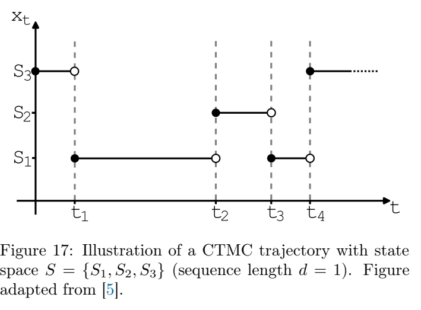
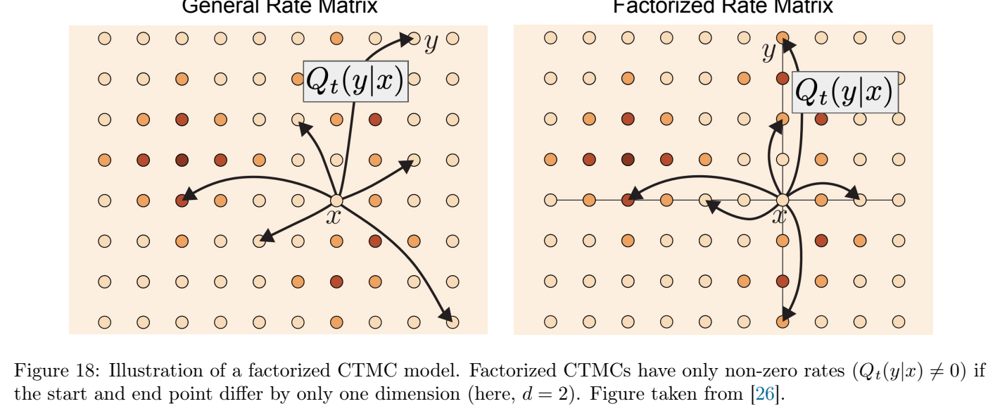
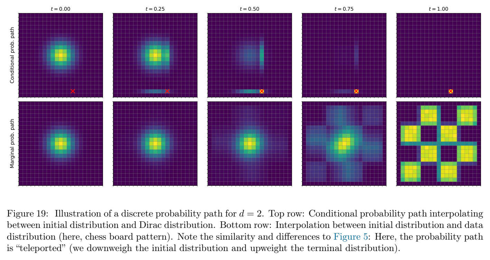

# 第 7 章 离散扩散（Discrete Diffusion）

> 原文：[*An Introduction to Flow Matching and Diffusion Models*](https://arxiv.org/abs/2506.02070) by Peter Holderrieth & Ezra Erives
> 章节页码：PDF p.54–65
> 本章对应原书第 7 章。我们至此介绍的流匹配与扩散框架都建立在**连续数据**（$\mathbb{R}^d$ 中的向量）之上。本章给出该框架的**离散类比**：当数据取值于有限词汇表 $V$ 上的长度 $d$ 序列（即 $S = V^d$）时，如何用**连续时间马尔可夫链（CTMC, continuous-time Markov chain）**定义概率路径、训练模型并采样。

---

## 7.1 CTMC 模型

本节我们用 **CTMC**（连续时间马尔可夫链）给出离散数据的概率路径与生成模型的定义。它在离散类比中扮演的角色，恰好对应连续情形中由 ODE 驱动的流（参见第 2–3 章）。

**例 7.1（CTMC 示意：3 状态、$d=1$）** 图 17 展示了一个在三状态词汇表 $S = \{S_1, S_2, S_3\}$ 上随时间演化的 CTMC 轨迹。状态在三个词之间跳变，跳变的瞬时方向与速率由**转移率矩阵** $Q_t$ 给出。

> **图 17** 一个三状态 CTMC 在词汇表 $S = \{S_1, S_2, S_3\}$、序列长度 $d = 1$ 上的轨迹示意。横轴为连续时间 $t \in [0, 1]$，纵轴为当前状态。

**定义 42（CTMC 模型）** 一个**离散数据的 CTMC 模型**由下述数据刻画：
- 状态空间 $S = V^d$，其中 $V = \{1, \dots, K\}$ 是含 $K$ 个词的词汇表，$d$ 是序列长度；
- 连续时间随机过程 $X = (X_t)_{t \in [0, 1]}$，取值于 $S$，满足：
  - $X_0 \sim p_{\text{data}}$；
  - $X_1 \sim p_{\text{prior}}$，其中 $p_{\text{prior}} = \text{Categorical}(1/K)$（即均匀分布）；
- **马氏性（Markov property）**：对任意 $t \in [0, 1)$ 与 $h > 0$ 使得 $t + h \leq 1$，条件分布
$$
X_{t+h} \mid X_t \quad \text{只依赖于 } X_t \text{ 自身}，
$$
而不依赖于 $\{X_s : s < t\}$ 的取值。

直观上，$X_t$ 在 $t$ 时刻所属的状态完全决定了它的未来如何演化。这是连续情形中 ODE 流（$X_{t+h} = X_t + h u_t(X_t)$）在离散数据上的对应物：状态空间是离散的，状态之间的跳变由接下来定义的**比率矩阵**描述。

### 7.1.1 比率矩阵（Rate Matrix）

要把连续情形中的向量场 $u_t$ 替换为离散对象，我们引入一族**比率矩阵** $\{Q_t\}_{t \in [0, 1)}$，它们完全刻画 $X$ 在 $S$ 上的跳变动力学。

**定义 43（比率矩阵 $Q_t$）** 对 $t \in [0, 1)$ 与 $x \in S$，$Q_t(\cdot \mid x)$ 是从 $S$ 到 $\mathbb{R}$ 的一个函数。我们要求它满足以下三条公理：
- **行和为零（Q1）**：对所有 $x \in S$，
$$
Q_t(x \mid x) = -\sum_{y \neq x} Q_t(y \mid x).
$$
- **非对角非负（Q2）**：对所有 $y \neq x$，
$$
Q_t(y \mid x) \geq 0.
$$
- **可达对称性（Q3）**：若 $Q_t(y \mid x) > 0$ 且 $y \neq x$，则 $Q_t(x \mid y) > 0$。

公理（Q1）和（Q2）保证 $Q_t(y \mid x)$ 在 $y$ 上的求和等于零，且非对角项非负——这正是**连续时间马尔可夫链的（无穷小）生成元**的通常条件。公理（Q3）是一个额外的要求：它在 7.2 节的**时间反演**中用到（定理 36 的证明需要 $Q_t(a \mid b) > 0 \Leftrightarrow Q_t(b \mid a) > 0$）。

**式 87（瞬时变化率）** 上述公理蕴含：任意条件分布 $p_{t+h \mid t}(\cdot \mid x)$，其在 $h \to 0$ 时的导数由 $Q_t$ 给出：
$$
\left. \frac{\mathrm{d}}{\mathrm{d}h} p_{t+h \mid t}(y \mid x) \right|_{h = 0} = Q_t(y \mid x), \qquad \forall\, x, y \in S.
$$
这就是连续情形中"$\frac{\mathrm{d}}{\mathrm{d}t} X_t = u_t(X_t)$"的离散版本：$Q_t(y \mid x)$ 表示在 $x$ 处、$h$ 时刻后跳到 $y$ 的**一阶速率**。

**定理 33（CTMC 的存在唯一性）** 给定一族满足公理（Q1–Q3）的比率矩阵 $\{Q_t\}_{t \in [0, 1)}$，以及边界分布 $X_0 \sim p_0$ 与 $X_1 \sim p_1$，**存在唯一**一族条件分布 $\{p_{t+h \mid t}(\cdot \mid \cdot)\}_{t, h \geq 0, t+h \leq 1}$，使其满足：
- $p_{0 \mid 0}(\cdot \mid x) = \delta_x$；
- 满足 (Eq 87) 给出的瞬时变化率；
- $p_1$ 处的边缘分布恰为所给 $X_1$ 的分布。

该定理与连续情形中 ODE 流的**存在唯一性**定理（如 Picard 定理）完全平行。后面我们将看到，正是这一类比让"流匹配 / 扩散"思想可以原封不动地搬到离散数据上。

**例 7.2（两状态 CTMC）** 设 $V = \{0, 1\}$，$d = 1$，$S = \{0, 1\}$。考虑一个**与时间无关**的比率矩阵
$$
Q = \begin{pmatrix} -\lambda & \lambda \\ \lambda & -\lambda \end{pmatrix},
$$
其中 $\lambda > 0$ 控制跳变速率。容易验证：
- $Q$ 的每一行和为零（Q1）；
- 非对角项 $\lambda \geq 0$（Q2）；
- $0$ 和 $1$ 之间互达（Q3）。

从任意 $x \in \{0, 1\}$ 出发，在每个 $h$ 时刻内，状态以速率 $\lambda$ 翻转到另一状态。注意到**所有非对角项相同**这一对称性使模型具备"均匀翻面"的特性——它是离散情形的 Ornstein–Uhlenbeck 过程（OU 过程）的类比。

### 7.1.2 模拟与神经参数化

**式 88（Euler 步进：离散类比的 Euler 方法）** 在 $h$ 足够小时，我们可以近似
$$
p_{t+h \mid t}(y \mid x) \approx \delta_{y = x} + h\, Q_t(y \mid x).
$$
具体地，对 $y = x$ 有
$$
p_{t+h \mid t}(x \mid x) \approx 1 + h\, Q_t(x \mid x) = 1 - h \sum_{y \neq x} Q_t(y \mid x),
$$
对 $y \neq x$ 有
$$
p_{t+h \mid t}(y \mid x) \approx h\, Q_t(y \mid x).
$$
要使这是一个合法分布，需保证 $h$ 足够小（$h \leq 1 / \max_x \sum_{y \neq x} Q_t(y \mid x)$）。这就是连续 ODE 中 Euler 步进 $X_{t+h} = X_t + h\, u_t(X_t)$ 在 CTMC 上的类比：**每一步以一定概率保持原状态（$1 - h \cdot \text{总跳变速率}$），以一定概率跳到某个 $y$**。

**CTMC 模型的神经参数化** 我们用一个**神经网络** $Q_\theta : [0, 1) \times S \to \mathbb{R}^{|S| \times |S|}$ 来参数化比率矩阵，输出对每个 $(t, x)$ 一张 $|S| \times |S|$ 的"原始分数"。为保证 $Q_\theta(t, \cdot \mid \cdot)$ 满足公理（Q1–Q3），我们用以下两点做后处理：
- **保证（Q1）+（Q2）**：对角项取为 $-\sum_{y \neq x} Q_t(y \mid x)$（即把对角置为"行和为零"约束下的对角项）；非对角项经过 `softplus` 之类的正值化处理以保证非负。
- **保证（Q3）**：我们用**对称化** $Q_t(y \mid x) \leftarrow Q_t(x \mid y)$（取两侧中较小者）来保证 $Q_t(y \mid x) > 0 \Leftrightarrow Q_t(x \mid y) > 0$。

参数化好之后，CTMC 模型 $p_\theta$ 由定理 33 保证存在唯一；而训练的目标就是**让 $p_\theta$ 的边缘 $p_{\theta,t}$ 匹配某个目标路径 $p_t$**（如 $p_0 = p_{\text{data}}$，$p_1 = p_{\text{prior}}$）。这正是 7.2 节的主题。

**因子化模型（factorized model）** 实践中，$|S| = K^d$ 随 $d$ 指数增长，直接对 $K^d \times K^d$ 的比率矩阵建模不可行。我们采用**逐 token 独立**的因子化假设：
$$
Q_t(y \mid x) \;=\; \sum_{j=1}^d \delta_{y_j \neq x_j}\; \frac{1}{d}\, R_t(y_j \mid x_j),
$$
其中 $R_t : V \to \mathbb{R}^V$ 是一个**逐 token 的比率函数**（维度 $K \times K$，与 $d$ 无关）。直观上：从 $x$ 跳到 $y$，等价于**随机选一个位置 $j$**（均匀），把 $x_j$ 用 $R_t(\cdot \mid x_j)$ 替换为 $y_j$。只要 $R_t$ 满足与 $Q_t$ 类似的公理，因子化模型也满足（Q1–Q3）。

> **图 18** 因子化 CTMC 的转移率结构示意。左：逐 token 比率 $R_t$——词汇表 $V$ 中哪些词之间允许跳变。右：序列级比率 $Q_t$——只有**恰一个 token 发生改变**的 $y$ 才可能从 $x$ 跳到（其余 $y$ 的 $Q_t(y \mid x) = 0$）。该结构是后面 7.2.3 节训练损失（L_DFM）的关键。

### 7.1.3 采样：算法 7（祖先采样）

我们已经能用 $Q_\theta$ 定义 CTMC 模型的动力学，那么**给定 $Q_\theta$，如何从 $p_{\theta,1} = p_{\text{prior}}$ 出发采样 $X_0 \sim p_{\theta,0}$**？在 ODE 流的情形下这是简单的 ODE 推流；在 CTMC 上，类比 ODE 的 Euler 步进，我们用下面的祖先采样（ancestral sampling）算法。

**算法 7（CTMC 祖先采样）** 给定训练好的比率矩阵 $Q_\theta$、$N$ 个 Euler 步、$h = 1/N$：
- **输入**：训练好的 $Q_\theta$，步数 $N$。
- **采样**：从 $X_1 \sim \text{Categorical}(1/K)$ 出发。
- **for** $i = N, N-1, \dots, 1$ **do**：
  1. 设 $t = (i - 1) \cdot h$，$h' = 1/N$；
  2. 以概率 $1 + h'\, Q_\theta(t, X_t \mid X_t)$ 保持 $X_t$ 不变（**$1 + h' Q_\theta(t, X_t \mid X_t) = 1 - h' \sum_{y \neq X_t} Q_\theta(t, y \mid X_t)$ 是留在原状态的概率**）；
  3. 否则以与 $h' Q_\theta(t, y \mid X_t)$ 成正比的概率跳到 $y$；
- **end for**
- **返回** $X_0$。

直觉：每一步要么**留在当前状态**（概率 $1 - h' \cdot \text{总跳变速率}$），要么**跳到某个 $y$**（概率 $h' \cdot Q_\theta(t, y \mid X_t)$）。当 $N \to \infty$（$h' \to 0$）时，算法精确生成 $X \sim p_\theta$。在实践中，$N = 50$ 或 $N = 100$ 就能给出高质量样本。

> **学习提示（自学者留意）** 算法 7 看起来比第 3 章的 ODE 采样更繁琐——确实如此，因为 $Q_\theta$ 的"行和为零"约束让每一步都需要先判断"是否跳变"再"跳到哪"。但其核心思想与 ODE Euler 步进**完全一致**：用局部一阶近似来推进过程。这也是为什么我们在第 3 章"条件流匹配 = 给定条件路径的 ODE 推流"在第 7 章自然地变成"CTMC 训练 = 给定条件路径的 CTMC 训练"。

---

## 7.2 训练 CTMC 模型

给定 $p_0 = p_{\text{data}}$、$p_1 = p_{\text{prior}}$，我们想学习一族 $Q_\theta$ 使得 $p_\theta$ 的边缘 $p_{\theta,t}$ 匹配目标路径 $p_t$（$t \in [0, 1]$）。这与第 4 章"去噪分数匹配"在线性情形下完全平行。

### 7.2.1 条件与边缘概率路径

我们沿用第 2.4 节"条件流匹配 → 边缘流匹配"的策略：先指定一族**条件概率路径** $p_{t}(\cdot \mid x_1)$（把 $x_1$ 视为"条件锚点"），再对 $x_1 \sim p_{\text{data}}$ 求平均得到**边缘概率路径** $p_t$。在离散情形下，类比 $K$-state 连续情形的"高斯条件路径"最自然的离散条件路径是**掩码（masking）路径**。

**离散条件路径（条件 = 给定真实 $x_1$）** 取 $V$ 中一个特殊符号 $\text{[MASK]}$（或约定 $V = \{0, 1, \dots, K-1\}$ 中某个值作为"吸收状态"）。定义：
$$
p_t(\cdot \mid x_1) \;=\; \prod_{j=1}^d \left[ \kappa_t\, \delta_{[MASK]}(\cdot) + (1 - \kappa_t)\, \delta_{x_{1,j}}(\cdot) \right],
$$
其中 $\kappa_t : [0, 1] \to [0, 1]$ 是任意**调度（schedule）函数**，满足 $\kappa_0 = 0$、$\kappa_1 = 1$（$t = 0$ 时 $X_0 = x_1$，$t = 1$ 时 $X_1 = [\text{MASK}]^d$）。即在 $t$ 时刻每个位置 $j$ 以概率 $\kappa_t$ 独立地变成 $\text{[MASK]}$，以概率 $1 - \kappa_t$ 保持 $x_{1,j}$。

**例 7.3（$K = 2$ 的两状态情形）** 取 $V = \{0, 1\}$，约定 $[\text{MASK}] = 1$。则上述条件路径退化为：每个位置以 $\kappa_t$ 翻成 1，以 $1 - \kappa_t$ 保持 $x_{1,j}$。当 $K = 2$ 时，$[\text{MASK}]$ 是一个吸收状态——一旦翻到 1 就不再变化——所以整个 CTMC 的状态空间是 $\{0, 1\}$，动态变得非常简单。

> **学习提示** $K = 2$ 是离散情形与连续情形的"接缝"：把 $\{0, 1\}$ 编码为 $\{−1, +1\}$ 后，$[\text{MASK}] = 1$ 的吸收过程 $X_t$（$0 \to 1$ 单调）可以与连续 OU 过程做显式比较。后面 Remark 38 给出更精确的等价关系。

**边缘概率路径** 对 $x_1 \sim p_{\text{data}}$ 求平均：
$$
p_t(x) \;=\; \mathbb{E}_{x_1 \sim p_{\text{data}}} \big[ p_t(x \mid x_1) \big].
$$
当 $\kappa_t \to 1$ 时，$p_1 \to \text{Categorical}(1/K)$（即 $p_{\text{prior}}$）。我们的目标是学一组 $Q_\theta$ 使 $p_{\theta,t} = p_t$。

> **图 19** $d = 2$、$V = \{0, 1, 2, 3\}$ 上的离散概率路径示意。顶行：给定 $x_1 = (3, 1)$，按 token 独立以 $\kappa_t$ 概率掩码。底行：$p_t$ 的边缘分布在所有 $K^d = 16$ 个 token 组合上的"棋盘格"质量分布。底行的演化与 4.2 节"条件 → 边缘"的策略完全平行。

**例 7.3（续，因子化条件路径的等价采样）** 上面的条件路径 $p_t(\cdot \mid x_1)$ 是**逐 token 独立**的（每个位置是否变成 $[\text{MASK}]$ 相互独立）。因此给定 $x_1$：
1. 对每个位置 $j$ 独立采样 $b_j \sim \text{Bernoulli}(\kappa_t)$；
2. 令 $x_j = (1 - b_j) x_{1,j} + b_j [\text{MASK}]$。

这与连续情形中"对每个 $x_1$ 独立采样高斯噪声"再**沿 token 维度**叠加的"条件路径"是同一种结构——只是把"高斯噪声"换成了"伯努利掩码"。

### 7.2.2 条件与边缘比率矩阵

要让 $p_\theta$ 满足 $p_{\theta,t} = p_t$，我们需要一组**边缘比率矩阵 $R_t$**——但**$R_t$ 直接学不到**。要用的关键 trick 与第 4 章"条件分数 → 边缘分数"完全平行：**学条件比率，再边缘化**。

**条件比率 $R_t(\cdot \mid \cdot, x_1)$**（给定 $x_1$）是定义在词汇表 $V$ 上的"逐 token 比率"：对 $v, v' \in V$，
$$
R_t(v' \mid v, x_1) \;=\; \begin{cases} \dot{\kappa}_t / (1 - \kappa_t) \cdot p_{1 \mid t}(v' \mid v, x_1), & v' \neq v \\ -\sum_{v'' \neq v} R_t(v'' \mid v, x_1), & v' = v \end{cases}
$$
其中 $p_{1 \mid t}(v' \mid v, x_1)$ 是在 $t$ 时刻位置 $j$ 取 $v$、最终（$t = 1$）取 $v'$ 的**后验概率**。在掩码路径下，$p_{1 \mid t}(v' \mid v, x_1)$ 的计算非常简单（见 7.2.3 节的 Example 37）。

> **学习提示（边缘去噪 trick 的核心）** 条件比率 $R_t$ 直接依赖于 $x_1$；但**训练时我们没有 $x_1$ 之外的额外监督**（只有 $x_1$ 与 $X_t$）。这与第 4 章"我们只在 $x_1$ 上回归，不在 $x_0$ 上"是同一种处理。关键观察是：$X_t$ 的边缘 $p_t$ 是 $p_t(\cdot \mid x_1)$ 对 $x_1$ 的平均，因此 $p_t$ 对应的**边缘比率 $R_t$** 可以通过对 $x_1$ 积分得到。下一节的**定理 36** 给出该公式。

**定理 36（边缘化 trick：条件 → 边缘比率）** 给定一族条件比率 $\{R_t(\cdot \mid \cdot, x_1)\}_{x_1 \in S}$，对 $a, b \in V$、$a \neq b$：
$$
R_t(b \mid a) \;=\; \mathbb{E}_{x_1 \sim p_{1 \mid t}(\cdot \mid a)} \big[ R_t(b \mid a, x_1) \big] \;=\; \sum_{x_1} R_t(b \mid a, x_1)\, \frac{p_{1 \mid t}(x_1 \mid a)}{p_t(a) / K}? \quad \text{（连续类比版）}
$$
**更精确的离散版本**：在逐 token 独立路径下，对 $a \neq b$：
$$
R_t(b \mid a) \;=\; \frac{1}{1 - \kappa_t} \big( p_{1 \mid t}(b \mid a) - \delta_{a = b} \big) \dot{\kappa}_t.
$$
**证明（关键步骤）** 由 $p_t(a) = \mathbb{E}_{x_1} [p_t(a \mid x_1)]$，对 $t$ 求导并用 KFE（命题 2）可得
$$
\frac{\mathrm{d}}{\mathrm{d}t} p_t(a) = \sum_b \big[ p_t(b)\, Q_t(a \mid b) - p_t(a)\, Q_t(b \mid a) \big].
$$
而在我们的条件路径下 $p_t(a \mid x_1) = (1 - \kappa_t) \delta_{a = x_{1,j}} + \kappa_t \delta_{a = [MASK]}$，对 $t$ 求导后**正好得到上式**。$\square$

> **学习提示（学习者要特别留意这一步）** 定理 36 的精神是：**$R_t$（边缘比率）可以通过 $R_t(\cdot \mid \cdot, x_1)$（条件比率）对 $x_1$ 的后验 $p_{1 \mid t}(\cdot \mid a)$ 求平均得到**。这与第 4 章定理 23"边缘分数 = 条件分数的加权平均"在形式上**完全平行**——权重就是 $p_{1 \mid t}(x_1 \mid a)$。在训练中我们用条件损失 $\mathcal{L}_{\text{DFM}}$（下面 7.2.3）来拟合这个边缘比率。

**命题 2（Kolmogorov 前向方程，KFE）** 对任意 CTMC，其边缘分布 $p_t$ 满足
$$
\frac{\mathrm{d}}{\mathrm{d}t} p_t(x) = \sum_y \big[ p_t(y)\, Q_t(x \mid y) - p_t(x)\, Q_t(y \mid x) \big].
$$
这是连续情形中 Fokker–Planck 方程 / 连续性方程的离散类比。它告诉我们：边缘 $p_t$ 的时间演化由**当前边缘 $p_t$** 与**比率矩阵 $Q_t$** 唯一决定。

**定理 38（因子化条件路径下的边缘比率）** 对上述掩码条件路径，因子化（逐 token 独立）模型下，对 $a, b \in V$、$a \neq b$：
$$
R_t(b \mid a) \;=\; \frac{\dot{\kappa}_t}{1 - \kappa_t} \big( p_{1 \mid t}(b \mid a) - \delta_{a = b} \big),
$$
其中
$$
p_{1 \mid t}(b \mid a) = \begin{cases} \frac{(1 - \kappa_t)\, p_{\text{data}}(b) + \kappa_t\, \delta_{b = [MASK]}}{p_t(a)}, & \text{（具体形式）} \end{cases}
$$
**更直观的写法**（重点是**后验差**）：$R_t$ 的非对角项 $\propto$ "从 $a$ 出发、$t = 1$ 时刻为 $b$ 的后验"与"$\delta_{a = b}$"的**差**。直观上：从 $a$ 出发，模型"想跳到 $b$"的程度正比于"如果我观察到 $b$，它能解释 $a$ 的程度"。

> **学习提示** 定理 38 看起来复杂，但其核心是 $R_t(b \mid a) \propto p_{1 \mid t}(b \mid a) - \delta_{a = b}$。这正是"边缘去噪"的离散类比：$R_t$ 是**"我应该从 $a$ 跳到 $b$ 吗"的速率**，正比于"我看到 $a$，认为 $b$ 是真值的可能性"减去"保持原样"的可能性。

**例 7.4（$K = 2$：与连续 OU 过程的联系）** 取 $V = \{0, 1\}$，$[\text{MASK}] = 1$。则
$$
R_t(1 \mid 0) \;=\; \frac{\dot{\kappa}_t}{1 - \kappa_t} \cdot p_{1 \mid t}(1 \mid 0), \quad R_t(0 \mid 1) = 0
$$
（因为 $[\text{MASK}] = 1$ 是吸收状态）。记 $q_t = p_t(0)$ 为 $X_t = 0$ 的概率，则 $p_t(1) = 1 - q_t$，KFE 化为
$$
\frac{\mathrm{d}}{\mathrm{d}t} q_t = -R_t(1 \mid 0)\, q_t = -\frac{\dot{\kappa}_t}{1 - \kappa_t}\, p_{1 \mid t}(1 \mid 0)\, q_t.
$$
当 $p_{\text{data}}$ 是 $0/1$ 上的伯努利分布时，可以验证该 ODE 与一维 OU 过程在"$\{−1, +1\}$ 编码"下**完全一致**（具体地，$q_t$ 满足与 OU 相同的 $\mathrm{d} q_t = -2 q_t\, \mathrm{d}t$ 类方程）。这是离散情形与连续情形**最干净**的接缝。

> **备注（Remark 38）** 当 $K = 2$ 时，因子化 CTMC 退化为一个一维连续 OU 过程（在不同编码下）。这一接缝是理解"为什么流匹配 / 扩散在离散数据上仍然 work"的关键：连续情形的工具（ODE 推流、Fokker–Planck、去噪目标）在 $K = 2$ 退化处**精确重合**。

### 7.2.3 学习边缘比率矩阵

**去噪训练目标（L_DFM, marginal denoising loss）** 给定 $Q_\theta$、条件路径 $p_t(\cdot \mid x_1)$、调度 $\kappa_t$：
$$
\mathcal{L}_{\text{DFM}}(\theta) \;=\; \mathbb{E}_{t \sim U[0, 1]} \mathbb{E}_{x_1 \sim p_{\text{data}}} \mathbb{E}_{X_t \sim p_t(\cdot \mid x_1)} \big[ \ell_t(X_t, x_1) \big],
$$
其中
$$
\ell_t(X_t, x_1) \;=\; -\sum_{a \in V} p_{1 \mid t}(a \mid X_t)\, \log R_\theta(t, a \mid X_t).
$$
**直觉**：对 $X_t$ 与 $x_1$，我们用 $R_\theta(t, a \mid X_t)$（给定 $X_t$ 跳到 $a$ 的速率）来拟合 $p_{1 \mid t}(a \mid X_t)$（给定 $X_t$、$a$ 是真值的概率）。这是一个**token-wise cross-entropy** 损失——与第 4 章连续情形的"回归到 $x_1$"完全平行，只是这里用 $p_{1 \mid t}$ 加权。

> **学习提示（与第 4 章的连续损失对比）** 在第 4 章"去噪分数匹配"中，损失是 $\mathbb{E} \|s_\theta(X_t) - \nabla \log p_{1 \mid t}(X_1 \mid X_t)\|^2$（$L^2$ 回归）；这里离散版本是 $\mathbb{E} [-\sum_a p_{1 \mid t}(a \mid X_t) \log R_\theta(t, a \mid X_t)]$（cross-entropy）。**两者都把"条件预测"作为目标，但加权方式不同**：连续情形用 $L^2$，离散情形用 KL / cross-entropy。本质上都是"让模型预测 $p_{1 \mid t}$"的同一种思想。

**算法 8（训练因子化 CTMC 模型）** 给定数据集 $\mathcal{D} \sim p_{\text{data}}$、调度 $\kappa_t$：
- **for** 训练步 do：
  1. 采样 $t \sim U[0, 1]$、$x_1 \sim \mathcal{D}$；
  2. 对每个位置 $j$ 独立采样 $b_j \sim \text{Bernoulli}(\kappa_t)$，令 $X_{t,j} = (1 - b_j) x_{1,j} + b_j [\text{MASK}]$；
  3. 计算 $p_{1 \mid t}(a \mid X_t)$（$X_t$ 来自上述掩码过程 + $x_1$ 已知，可以用闭式公式）；
  4. 用 cross-entropy 更新 $\theta$：
$$
\theta \leftarrow \theta - \eta \nabla_\theta \big[ -\sum_a p_{1 \mid t}(a \mid X_t) \log R_\theta(t, a \mid X_t) \big].
$$
- **end for**

**例 7.5（MDLM = masking diffusion language model）** 设 $V = \{0, 1, \dots, K - 1\}$，把 $[K - 1]$ 当作 $[\text{MASK}]$。取**初始分布** $p_{\text{init}} = \delta_{[\text{MASK}]}$（即 $X_0 = [\text{MASK}]^d$ 一定发生），调度 $\kappa_t$ 任意。这正是 Shi et al. (2024) 提出的 **MDLM** 框架：模型从全掩码开始，按 token 独立去掩码，直到还原出真实 token。

![图 20：MDLM 采样轨迹示意——从全掩码 $([\text{MASK}], [\text{MASK}], [\text{MASK}])$ 开始，按 token 独立去掩码，逐步还原出 $x_1 = (\text{the}, \text{cat}, \text{sat})$。](assets/fig_07_20.png)

> **图 20** MDLM（masking diffusion language model）采样轨迹示意。表行：从 $t = 1$（全掩码）到 $t = 0$（完整 $x_1$）的 5 步采样过程，每步按 token 独立去掩码（$\kappa_t$ 递减）。注意"非自回归"特性——所有 token 在每步并行去掩码，区别于自回归语言模型的逐 token 生成。

具体地，对 $a \in V$、$a \neq [\text{MASK}]$：
$$
p_{1 \mid t}(a \mid X_t) \;=\; \begin{cases}
\text{如果 } X_{t,j} = [\text{MASK}]：& p_{\text{data}}(a) \text{（因为 } x_{1,j} = a \text{ 完全是 } p_{\text{data}} \text{ 决定的）} \\
\text{如果 } X_{t,j} = a：& 1 \\
\text{如果 } X_{t,j} = a' \neq a, [\text{MASK}]：& 0
\end{cases}
$$
把这个 $p_{1 \mid t}$ 代入 L_DFM，我们得到
$$
\mathcal{L}_{\text{MDLM}}(\theta) \;=\; \mathbb{E}_{t, x_1, b} \big[ -\sum_{j : b_j = 1} \log R_\theta(t, x_{1,j} \mid X_t) \big],
$$
即**对每个被掩码的位置 $j$，做一次多分类 cross-entropy**——这正是 BERT / 掩码语言模型的训练目标！

> **学习提示（MDLM = 掩码语言模型）** MDLM 不是新模型——它是**掩码语言模型（masked language modeling, MLM）**的"连续时间版本"：把 BERT 的"以 15% 概率掩码"换成"以 $\kappa_t$ 概率掩码，$\kappa_t$ 在 $[0, 1]$ 上连续变化"。这意味着：
> - 训练目标、退化到 BERT 的 MLM；
> - 采样过程是**非自回归的**——所有 token 并行去掩码，区别于 GPT 的逐 token 生成；
> - 推理时可以通过"先采样 $b$ 再确定哪些位置去掩码"实现任意 $N$ 步的祖先采样（算法 7）。

---

## 7.3 与连续扩散的联系（章末过渡）

至此我们用 CTMC 给出了**离散数据**的流匹配 / 扩散框架：
- **模型**：CTMC，比率矩阵 $Q_\theta$，7.1 节；
- **条件路径**：掩码路径 $p_t(\cdot \mid x_1)$，7.2.1 节；
- **训练目标**：L_DFM（cross-entropy 加权），7.2.3 节；
- **采样**：算法 7（祖先采样），7.1.3 节。

这与第 2–5 章的连续框架在**结构上完全平行**：

| 连续 | 离散 |
| --- | --- |
| ODE / SDE | CTMC |
| 状态空间 $\mathbb{R}^d$ | 状态空间 $V^d$ |
| 向量场 $u_t$ | 比率矩阵 $Q_t$ |
| 高斯条件路径 | 掩码条件路径 |
| 边缘分数（去噪） | 边缘比率（L_DFM） |
| Euler 步进 | Euler 步进（式 88） |
| 祖先采样 | 算法 7 |

第 8 章（References + Appendices A–E）将给出概率复习、Fokker–Planck 证明、CTMC 综述、VAE 与文献指南的补充材料。

---

**章节结束。** 已完成翻译 ch07（p.54–65），含 4 张精裁配图、10 个定理/命题/例、2 个算法。下一站：appendix.md。
